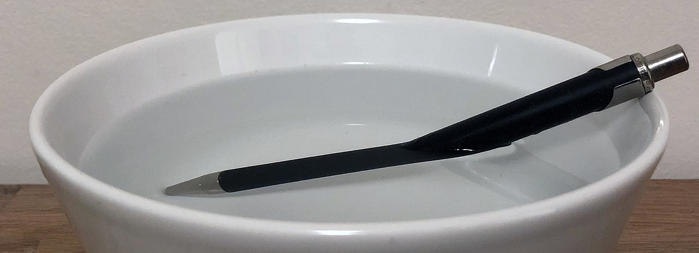
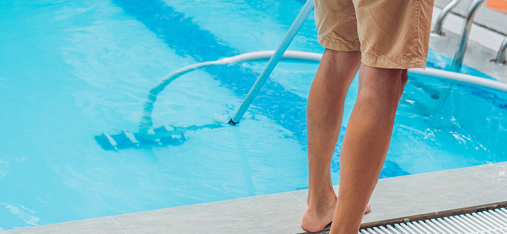
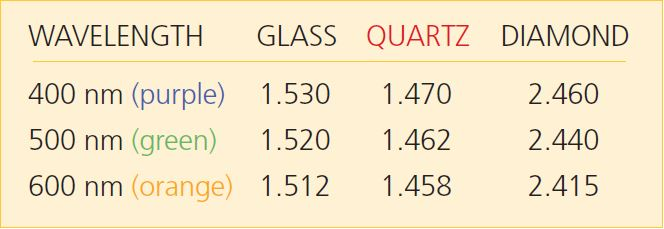
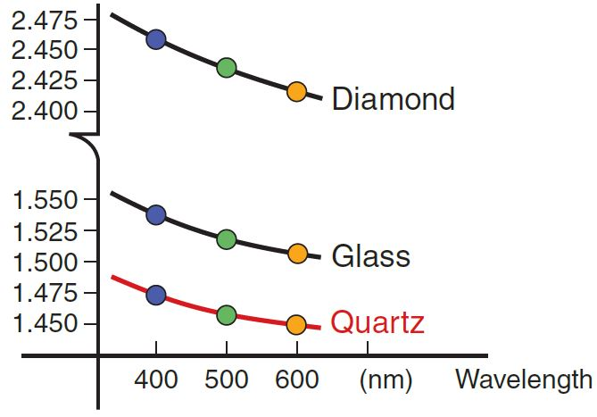
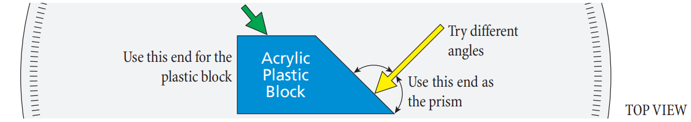
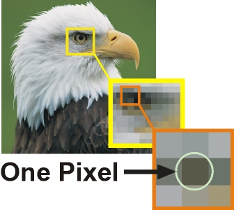

# Refraction 

:::Figure (pen|l|L)

:::

:::Figure (pool|l|R)

:::

When a ray of light crosses the boundary between two materials, its direction changes.  We say the ray has been *refracted* by the interface. 

Though its name may be unfamiliar, refraction is a phenomenon you actually have a lot of experience with.  It is the phenomenon that makes lenses work.  It makes rainbows happen.  It is why images on ocean-sprayed smart phones are distorted.  It is why a straw appears to bend where the air meets your drink and why the true position of a submerged object is hard to gauge from the side of a swimming pool .  

Today your mission is to investigate refraction *quantitatively*. You are **not** expected to know the currently accepted theory of refraction.  Quite the opposite.  This lab has been timed so as to precede your formal exposure to refraction in the lower-division physics curriculum.  The idea is to free you up to draw your own conclusions about the phenomenon.  

Your notes will be evaluated on how well they communicate your ability to 
1. observe the phenomenon of refraction both qualitatively and, especially, through measurement; 
2. extract a **simple**, mathematical description of the phenomenon from your measurements.  

<!-- ## The Index of Refraction and the Speed of Light
From last week's [Refresher Lab](?linkfile=lab0), you know that light travels in a vacuum at a speed $c\approx 3.00 \times 10^8  \text{ m s}^{-1}$, but, perhaps surprisingly, it travels *more slowly* within any other medium or material. Because, as we learned, light is an *Electromagnetic Wave*, light itself must interact with the electric and magnetic fields around it. These EM fields, which all matter creates, are far more dense in materials versus air versus a pure vacuum. The result is that light slows down significantly in crowded spaces, much like you would walk your bike or skateboard through a packed sidewalk.

As we will learn, the difference in the speed of light in two materials plays a critical role in optics. In particular, the ratio between these speeds is useful. We define the **index of refraction**  of a material, denoted by $n$, to be the ratio of the speed of light in a vacuum to the speed of light in that medium.

:::Equation (IOR| Index of Refraction)
$$
n = \frac{c}{v}
$$
:::
where $c$ is the speed of light in a vacuum and $v$ is the speed of light in the medium. If you know the medium’s index of refraction, you know the speed of light in that medium.

The index of refraction, however, does more than just tell you the speed of light in a material — it will actually tell you some very important information about the precise *path* that the light takes in that material, too.

## Interfaces and Snell's Law

The most interesting optical effects of materials often happen at their boundaries or **interfaces**. 

:::Definition (Interface)
An **interface** is a surface forming a common boundary of two bodies, spaces, or systems. For example, a full glass of water has a glass-air interface on the outside and bottom, a water-glass interface within the glass, and a water-air interface on the top.  
:::
:::Figure (bend|m|R)

:::
The bending of the light at the interface is due to fact that light travels at different speeds in the two materials. This explanation is naturally unsatisfying, since it doesn't answer *what* about the change in speed leads to a change in propagation direction. Why can't the light just move slower in the same direction?

The easiest way to answer this is to return to the wave picture of light in an illustration. In , we show a wave representation of light approaching an angled interface. The interface is angled so that the bottom of the light wave hits first, and emerges on the other side moving slower. The top of the light wave hits the interface last. This results in an overall change of angle in the direction of propagation [fn]We are glossing over some things like interference and Huygens's principle here[/fn]. 

The final result is that if we track the center of the light wave, what we usually refer to in the **ray optics** limit, the outgoing ray leaves at an angle compared to the incoming ray. The rotation the light ray experiences is not that different that the rotation you would experience if you were running with a foot on different treadmills going at different speeds.

The important thing to know is that, while it appears complicated, the bending of light can be quantified very simply in terms of the difference in the materials’ indexes of refraction. We call this relationship **Snell's Law**

:::Equation (snell|Snell's Law)
$$
n_1\sin(\theta_1) = n_2\sin(\theta_2),
$$
:::
where $\theta_1$ is the angle of incidence and $\theta_2$ is the angle of refraction. Let's now apply this to some labeled images.

:::Figure (refrac|xl)

 
:::
:::Note (|8 C)
All angles are measured from the *perpendicular to the interface* to the ray. Thus, a small angle means the ray is nearly perpendicular to the boundary, and a large angle means the ray is nearly tangent to the interface. Note that all angles are less than 90 ̊. 
:::
 above shows beams of light being emitted from the blue semicircle at the bottom left. There are some important features to observe:
- The rays travel through a medium having an index of refraction of $n_1$, toward the interface of that medium with a second medium having an index of refraction of $n_2$. 
- The beams in the lower region are the *incident* beams. 
- The beams in the upper region are the *refracted* beams. 
- When light reaches the interface, some of it is reflected back into the first medium, but most of it is refracted into the second medium. 
- Note that two of the exiting beams, B and C, are bent (*refracted*) away from the normal [fn]Ray D is also bent away from the normal, but represents a special case, which we will see later in this lab.[/fn]. 
- When a beam is perpendicular to the interface boundary, as is beam A, it is said to be *normal* to the interface. Normal rays are undeflected. 
  
 This figure could represent light coming from water and going into air. 

:::Note (|6 C)
The indexes of refraction are properties of the two mediums.
:::

:::Exercise (|1 Point)
Look at  to answer the following:

1. Light ray A is normal to the interface.  What is the angle of incidence $\theta_1$ for this ray? According to Snell's law, what is the angle of refraction $\theta_2$? 

2. Is the angle of the refracted light beam B larger or smaller than the angle of incidence? What about light beam C? According to Snell's Law, what does the relative magnitude of the angles (*i.e.*, $\theta_2/\theta_1$) tell us about the relative magnitude of the indexes $n_1$ and $n_2$?

:::

:::Exercise (snell-rearranged|2 Points)
In our experiment, we will want to calculate the index of refraction of a prism by measuring the angle of incidence and angle of refraction at the interface between the prism and air. Without loss of generality, assume that we are making these measurements such that the light is *leaving* the prism and *entering the air* at this interface.
1. Based on the interface we are studying, do you think $\theta_1$ or $\theta_2$ should be larger? Defend your answer
2. Starting from , derive an expression that gives the value of $n_1$ in terms of $\theta_1$, $\theta_2$ and $n_2$  
3. Given that one of the interfaces is *air*, can you make a substitution in your answer to part (b) that simplifies your equation? If so, write the simpler equation. If not, explain why.
:::
## The Critical Angle and Total Internal Reflection
When the angle of incidence reaches a certain value (ray D in ), light no longer gets refracted into the second medium; instead it is fully reflected back. The **critical angle** is the incident angle at which no light gets transmitted, but all the light is reflected back into the first medium.

:::Definition (Critical Angle)
 The **critical angle** is the *greatest* angle at which a ray of light, travelling in one transparent medium, can strike the interface between that medium and a second of *lower refractive index* without being totally reflected within the first medium.
:::

The critical angle is the angle of incidence that corresponds to an angle of refraction of 90°. For any angle greater than the critical angle, *total internal reflection* occurs. A necessary condition for the critical angle to exist is that the index $n_1$ of the first medium has to be greater than the index $n_2$ of the second medium.

::::::Simulation (mystery_critical)
:::center

:::
<iframe src="https://phet.colorado.edu/sims/html/bending-light/latest/bending-light_en.html?screens=1" width="100%" height="600px" allowfullscreen="1" frameborder="0"></iframe>
<button onclick='emergency_reload_iframes()'> Click Here to Reload if Stuck</button>
::::::

:::Quiz (refract_critical| About 0°--- Go back and reread Part I |About 25° --- Correct! The refracted beam disappears around 25°| About 45° --- Careful! You found the place where the incident and reflected beams have 90° separation, not where the angle of refraction is 90° | 90°--- Go back and reread Part I )
Open . Set the upper material to Mystery A and the lower material to air. Moving around the laser pointer, and using the protractor provided, what is the critical angle? 
:::

:::Exercise (find|1 Point)
Change the top material to air and the bottom material to Mystery B in .
1. Using any angle of incidence you'd like, calculate index of refraction, $n$ for the material "Mystery B?" Show your work.
2. Now swap the  materials so that the top is "Mystery B" and the bottom is air. What is the critical angle? ;;;The simulation is hard to get just right — give your best guess at the lower bound;;;
3. Calculate $n$ using the critical angle you found.
4. Do you think that these values agree?
5. What is the speed of light in the "Mystery B" material? ;;;Use the measurement of n you think is more accurate. Show your work;;;
:::

## Frequency Dependent Refraction and Prisms
:::Figure (prism|xl)

:::
::::::Figure (freqdep|m|R)

::::::
The index of refraction for a medium is dependent upon the frequency of the light; blue light has a different index of refraction from that of red light for a given medium.

1. The angle at which a beam of light is refracted when traveling between two mediums is dependent upon their indexes of refraction.

2. The indexes of refraction are typically frequency dependent for a given medium. A medium will refract one color more (or less) than another color.

3. White light is made of many constituent colors.

Piecing these statements together, we have a tidy explanation for the phenomenon of a rainbow. At each boundary, some colors are refracted more than others, which results in white light being spread out into its constituent spectrum. This spreading is called dispersion. The second boundary of the prism – plastic to air – is at such an angle as to increase this dispersion. The difference between the index of refraction for the lowest frequency and the highest frequency determines how wide a rainbow you can see. A material with a larger spread in indexes will give a wider rainbow.

:::Quiz (whitelight|Reveal Answer --- Purple: $11.02 \deg \\\\$ Green: $11.09 \deg \\\\$ Red: $11.15 \deg$. )
A beam of white light traveling in air is incident on a glass block at an angle of $17.00 \deg$. From [Snell’s Law](#Equation-snell), calculate the refracted angle for purple, green and orange light .
:::
 -->

# Experimental Setup
<!-- The purpose of our refraction experiment can be summarized in a few points:
1. Through Snell's Law, can we accurately and empirically determine the property of a material — it's index of refraction, $n$ — from simple geometric measurements of light rays?
2. Does the determination of $n$ also agree with the value obtained by finding the critical angle?
3. In the context of this experiment, is one measurement of $n$ more accurate? More precise? -->

You have two different experimental setups to work with.  One is for investigating refraction at the interface between air and a transparent solid (acrylic).  The other is for investigating refraction at the interface between air and a transparent liquid (water).
<!-- In our refraction experiment, we will use a semi-circular acrylic block as our first medium and air as our second medium; in other words, we will be looking at the angle of refraction in air from a beam of light incident on the acrylic side. Below is a summary of the procedure that you should read.
 -->

::::::Hider (|Transparent solid apparatus and standard procedure)
This apparatus consists of a Laser Ray Box, a Protractor Table with degree markings, a semi-circular acrylic block and a corkboard.
:::Figure (setupTable)

:::
The *standard* procedure for observing refraction with this apparatus is:
1. Anchor the Protractor Table to the benchtop with double-stick tape. 
2. Place the Laser on the corkboard at the edge of the Protractor Table.
3. Turn on the Laser and orient its Box so the laser light comes out as a vertical line.
5. Align the Laser Ray Box so the laser light goes through the center of the Protractor Table.
6. Place the semi-circular block at the origin of the Protractor Table in the outlined position.
7. Rotate the table to change the angle at which the light ray enters the block.
8. Record the angle of incidence and the angle of refraction for your configuration. (See  for a graphical definition of these angles.)
9. Repeat for a total of at least a dozen angles.
:::Figure (semicir|xl)

:::
::::::

::::::Hider (|Transparent liquid apparatus and standard procedure)
This apparatus consists of a Laser Ray Box, a Circular Tank with degree markings and a rotating arm that positions the Laser Ray Box around the circumference of the tank.
:::Figure (setupTank)

:::
The *standard* procedure for observing refraction with this apparatus is:
1. While the tank is empty, align the laser beam so that it passes through the center of the tank from all angles.
2. Fill the tank halfway (until the air-liquid interface lies along the horizontal line midway up the tank - it may be necessary to level the tank by rotating the screws that serve as its feet).
3. Rotate the arm to change the angle at which the laser beam approaches the interface.
4. Record the angle of incidence and the angle of refraction for your configuration. (See  for a graphical definition of these angles.)
5. Repeat for a total of at least a dozen angles.
:::Figure (semicir-2|xl)

:::
::::::
<!-- 
## Preparation for the Prism Experiment

Unlike the previous experiment, our prism experiment will be slightly more qualitative. We will use a trapezoidal block of acrylic to view how white light disperses and separates in a prism

::::::Hider (|Procedure Summary)
:::Figure (prism-top-summary|)

:::
1. Set up the optical bench so that a ray of light is incident onto the triangular end of the acrylic block
2. Align the ray so that it is perpendicular with the surface of the prism, and observe what happens to the light as you adjust the incident angle until the rays exit almost parallel to the surface (at a grazing angle).
3. Try to get the light to pass directly through the prism.
4. With the Square end of the block, shrine the ray at an angle and observe what happens.
::::::

We will make some hypothesis based on what we've learned for this section, and then check our guesses in lab.

:::Exercise (prism-hyp|1 Point)
1. Do you think you will be able to get the light to go directly through the triangular end of the prism, i.e. without any change in direction or offset? Defend your reasoning.
2. Do you think you will be able to get the light to go directly through the square end of the prism, i.e. without any change in direction or offset? Defend your reasoning.

::: -->

# In-Lab Notes
:::Intro (Notetaking Tip)
When recording the angles, be sure to describe your approach.  For example, which medium is the light entering first? How do you deal with the finite thickness of the beam?  
:::

:::Intro (Notetaking Tip)
Write your ideas and intentions, not just your actions.  If you notice something is problematic about your setup, describe what you notice and what, if anything, you do to address it.
:::

:::Intro (Notetaking Tip)
Organize your measurements into a well-formatted table. Make sure it is clear which measurements correspond to which setup and procedure.
:::

:::Intro (Notetaking Tip)
Consider sources of uncertainty in your measurement and describe what you do to characterize and/or minimize them.
:::

:::Intro (Notetaking Tip)
Describe anything else you noticed that struck you as interesting.  
:::

<!-- NOTE TO SELF - provide plastic pipettes to allow precision filling
- level screws on the tank platform
- laser safety
- different colored (lasers? lights with slits?)
- use phone to take pictures
- some tanks dedicated to mystery fluids
-->

<!-- 

:::Exercise (|1 Point)s
1. Present a copy of your final table here.
2. What is the average measured index of refraction (call this $\bar n$), for the acrylic block?
3. What is the critical angle you found?
4. What is the index of refraction calculated from this value (call this $n_c$)
:::

### Analysis of the Refraction Experiment
:::Exercise (|3 Points)
1. What is the **percent difference** between your two results, $n_c$ and $\bar n$?

2. Estimate your error in measuring the angles of incidence and refraction. Write these as $\delta \theta_1$ and $\delta \theta_2$
3. The **percent uncertainty** in determining the index of refraction can be calculated as 
    $$
    \text{percent uncert. in }n = \frac{\delta n}{n} = \sqrt{ \left(\frac{\delta \theta_1}{\tan\theta_1} \right)^2 + \left(\frac{\delta \theta_2}{\tan\theta_2} \right)^2}
    $$
    Using your data for $\theta_1 = 30 \deg$, calculate the percent uncertainty you expect in $n$.
4. Assume all your measurements of $n$ have the uncertainty that you calculated in part (c). Do you measurements of $n_c$ and $\bar n$ agree with each other? Do either of these measurements agree with  the accepted value found in ? Explain.
5. Which result do you think is more accurate? Which result do you think is more precise? Explain.
6. Calculate the speed of light in the block for both $\bar n$ and $n_c$. By what percent does light slow down in the block?
:::

::::::Note (|10 C)
Recall that the equation for percent difference is the following:

$$
\text{percent difference} = \frac{| \text{value 1} - \text{value 2}|}{average} 
$$

::::::

 -->

# Out-of-Lab Notes

## Analyzing data

Make a well-formatted plot of your data (*e.g.*, angle of refraction as a function of angle of incidence) for every situation you investigated.  Remember to include error bars that represent the 68% confidence interval for your measurement.

:::Intro (Notetaking Tips)
Make a guess as to what mathematical relation, $\theta_2=f(\theta_1$) might describe your data, then test your guess by fitting to that functional form for every situation you investigated.  Is the relationship different for different materials?  Does it matter which way the light beam approached the interface?
:::

:::Intro (Notetaking Tip)
Note any thoughts you have in retrospect about what you observed.  Does your analysis suggest anything that would be interesting to investigate further?
:::

Write a brief, objective concluding paragraph that summarizes what you did, what you learned and how.  Be objective.  Be as quantitative as possible.

## Exercise in Image Analysis

The phenomenon of refraction, like many phenomena involving light, makes for beautiful pictures.  A camera is a powerful tool for documenting observations both qualitatively and, when used with attention to avoid distortion, *quantitatively*.  Digital cameras, like the one on a smartphone, output "images" that are two-dimensional arrays of intensity values known as **pic**ture **el**ements or [pixels](https://en.wikipedia.org/wiki/Pixel).  

:::::::::Figure (pixelation|xl|Row)
::::::row
:::col

:::
:::col
 
:::
::::::
:::row
Examples of pixelation. Zooming in on a small section of an image reveals its discrete nature.
:::
:::::::::

### Software
Image analysis software makes extracting quantitative information from digital images easy.  [ImageJ](https://imagej.nih.gov/ij/) is one such program.  It was developed and is maintained by the National Institutes of Health and is freely available for Mac, PC and Linux.  

:::Exercise (ImageJ-intro)
Read this [introduction to ImageJ](https://imagej.net/learn/) and follow the linked instructions to [download a version](https://imagej.net/downloads) on to your computer
:::

ImageJ is heavily documented, including an [excellent (and dauntingly extensive) discussion](https://imagej.net/imaging/) of the many considerations that go into proper scientific imaging.  Don't be overwhelmed!  It's a lot easier than it may seem at first.

Within ImageJ (or IJ2 or Fiji) you can draw a line anywhere on your image, in any direction, and of any thickness (double-click on the line-selection tool in the toolbar to set the thickness, *a.k.a.* line width).  Once you've drawn a line, you can use `Analyze` $\rangle$ `Plot Profile` to create a plot of intensity values (averaged across the width of the line) versus position along the length of the line. 
Pushing the `List` button gives a list of the intensity values used to create the plot. 
These values can be copied and pasted into your favorite graphing program for further plotting and fitting.
Read more about this and other commands available in the `Analyze` menu in the [on-line documentation](https://imagej.nih.gov/ij/docs/menus/analyze.html).
You may also want to watch this [video](https://www.youtube.com/watch?v=kfg4urDY6cg) for a good introduction to many useful functions.

:::Exercise (ImageJ-measure)
Take a hair from your head and take a picture of it with a ruler nearby.  Use the ruler to set the scale of a pixel in your image.  Use the plot-profile function to measure the width of the hair.  Describe what you did in detail and give your measurement.
:::