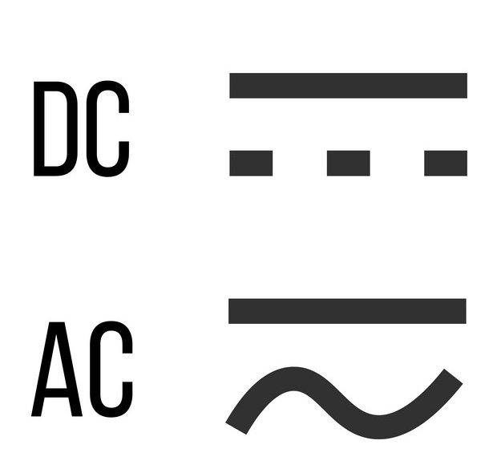
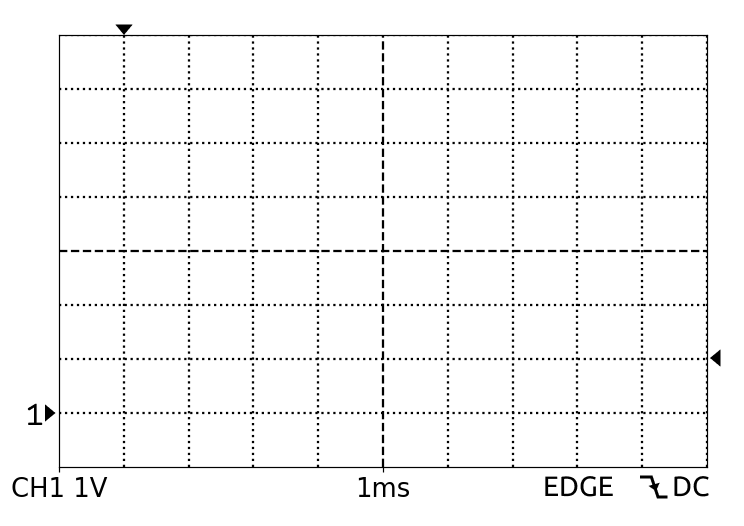
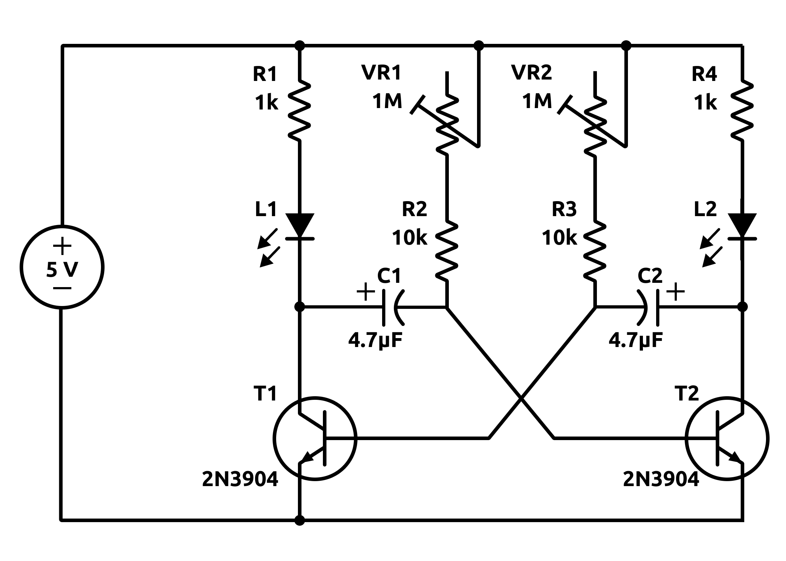
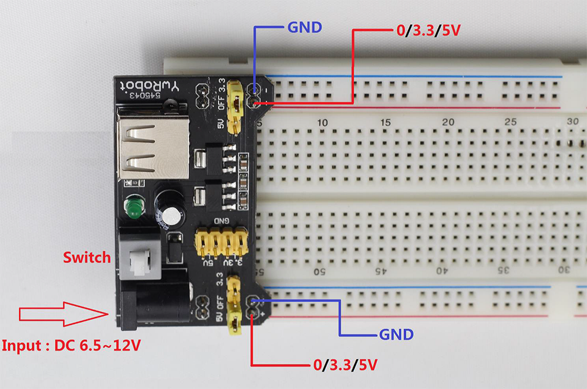
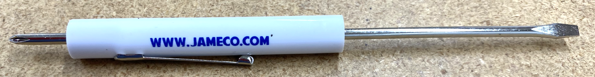
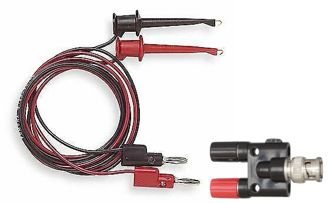

# Oscilloscope Training and Breadboarding Practice

:::Intro (Objective)
The following exercises aim to help you become familiar with an important electronic measurement tool, the oscilloscope. You will use this tool in upcoming 20BL labs, in the upper-division lab courses focused on electronics (127AL and 127BL) and in any research project that involves collecting and/or processing electrical signals.
:::

# Introduction to the Oscilloscope
An oscilloscope takes an electronic signal, specifically a time varying voltage, and graphs it in real time. It does this by sampling the signal, that is, recording the voltage over a specific length of time, and plotting every coordinate pair $(v_i, t_i)$ in that sample on a screen. The user sets a criterion for when the sampling starts, how long it lasts, and how frequently the scope should take a new sample and generate a new plot.

To understand the utility of an oscilloscope, first consider the signal from a battery. Batteries provide a constant voltage across their terminals, which can easily be measured with a voltmeter. When an oscilloscope is used to measure the "signal" from the battery, its screen displays a flat line. 

Headphones, on the other hand, are driven by a time-varying voltage signal. When a voltmeter measures this signal, it can only report the time-averaged voltage, which tells something about the average loudness of the music being played, but not much else. If instead an oscilloscope is used to look at the signal, a lot of information can be had: dominant frequencies, peak voltages, amount of noise in the signal, etc.

## Oscilloscope Controls

At first glance, the controls on an oscilloscope can seem quite complicated. There are many buttons to touch and knobs to turn. The figure below breaks down the controls into chunks that are easier to understand.

:::Figure (oscilloscopeDiagram)

:::

### Screen
First look carefully at the screen. It has a 10x8 grid made of dotted lines. The lines are difficult to see in the image above, but clearly visible in person.  in the  shows what the grid looks like. The grid is permanent: always present and never changing.  One box on the grid is called a division, or div for short, and is used as the basic unit of measurement. 

Information about scale of the grid is displayed at the bottom of the screen. The scale of the vertical axis can be seen in the bottom left corner.  In the photo, CH1 has a vertical scale of $5 \text{ V/div}$ and CH2 has a scale of $2 \text{ V/div}$. Another way to say that is there is a difference of $5 \text{ V/div}\times 8 \text{ div}=40 \text{ V}$ from the top of the grid to the bottom for CH1 and $16 \text{ V}$ for CH2. 

The scale of the horizontal axis is also displayed at the bottom of the screen closer to the center. In this picture it is set to $50 \text{ }\mu\text{s/div}$. In other words, there is a difference of $50 \text{ }\mu\text{s/div}\times 10 \text{ div}= 500\text{ }\mu\text{s}$ from the left edge of the grid to the right edge. 

It is important to note that **CH1 and CH2 can have different vertical scales but always share the same horizontal scaling**. 

Further to the right along the bottom of the screen is an indicator of which channel is being measured or manipulated at the moment, and a few other indicators that will be explained below. Finally, on the right side of the screen are five sections that change depending on context.  In the figure they display a set of measurements, but in other contexts they display labels that indicate what happens when the adjacent button is pressed.

### Soft Buttons 
The buttons immediately to the right of the screen change functionality depending on context, as mentioned abobve. For this reason they are sometimes called "soft buttons".  

### Variable Knob
The variable knob is rotated to set the value of some parameter that, like the soft buttons, changes with context.  Like the soft buttons, when the variable knob is active, the value it changes appears in the rightmost portion of the screen.

### Signal Inputs
This oscilloscope is capable of looking at two signals at the same time. The inputs for these signals are labeled CH1 and CH2. They are designed to connect to a [coaxial cable](https://en.wikipedia.org/wiki/Coaxial_cable) with a [BNC connector](https://en.wikipedia.org/wiki/BNC_connector). When you connect a cable to one of these ports you and turn on that channel, you will see the signal displayed on the screen.

### Vertical Controls
CH1 and CH2 each have their own Vertical Controls. Pressing the Yellow or Blue button in the center of the column above one of the channel inputs will determine whether that channel is displayed on the screen. 

Turning the small knob at the top of the column shifts the $V=0$ position for that channel. In other words, it moves the signal up and down on the screen. This knob is called the **vertical positioning knob**.

Turning the large knob at the bottom of the column changes the vertical scaling for that channel.  Note that the vertical scales of the two channels can be adjusted independently. For instance, if you want to change the vertical scaling of CH1 from $5 \text{ V/div}$ to $2 \text{ V/div}$ you would rotate the large CH1 knob.  

### Time Controls
The knobs in the time control area adjust the horizontal scaling and positioning. 

Turning the small knob at the top of the column shifts the $t=0$ position for both channels. In other words, it moves the signal left and right on the screen. This knob is called the **horizontal positioning knob**.

Turning the large button on the bottom changes the horizontal scaling for both CH1 and CH2. For instance, if you wanted to change the scaling from $50 \text{ }\mu\text{s/div}$ to $100 \text{ }\mu\text{s/div}$, you would rotate this knob.

The middle button activates a menu for the soft buttons that offers features you won't be using for now.  If you're curious, you can read about them on p. 86 of the <a href="https://gauchospace.ucsb.edu/courses/pluginfile.php/3529972/mod_resource/content/1/GDS-1000A-U%2Buser%2Bmanual%2B2012%280504%29.pdf" target="_blank">oscilloscope's User Manual</a>.

### Trigger Controls
The trigger is arguably the most important, and typically the most confusing, feature of an oscilloscope. The trigger sets a voltage level and a scenario that together determine when the oscilloscope will begin drawing the signal on the screen. For instance, if the voltage level of the trigger is set to $1 \text{ V}$ and the scenario selected is "positive slope", the scope will begin drawing a signal whenever the signal goes from less than $1 \text{ V}$ to greater than $1 \text{ V}$. A signal that goes from greater than $1 \text{ V}$ to less than $1 \text{ V}$ would not prompt the scope to start drawing it (because the scenario criterion of a positive slope was not met). 

When the scope begins to draw the signal, we say that the scope was "triggered".

There are three main triggering modes: automatic, normal, and single. 

**Automatic** mode will trigger under two conditions. First, if the triggering condition is met, it will trigger. Second, if the scope hasn't been triggered within a set amount of time, it will automatically draw whatever signal it sees on the inputs. This means that the screen is continuously updating no matter what.

**Normal** mode will only trigger if the trigger condition is met. It will wait indefinitely to trigger. This means if the triggering condition is never met, the screen will never update. Once it has been triggered the screen will only update the next time the trigger condition is met.

**Single** mode behaves the same as normal mode expect that it will update only once and then it will freeze and not draw the signal again until the trigger is manually reset.

Turning the small knob at the top of the trigger column adjusts the voltage threshold of the trigger. the level of the trigger is displayed by a small arrow on the right side of the screen.

Pushing the >menu< button drectly below the small knob one time opens a menu on the right side of the screen that lets the triggering scenario be set via the soft buttons and variable knob. (Pushing it twice opens a different menu for the soft buttons that you can read about on p. 98 of the <a href="https://gauchospace.ucsb.edu/courses/pluginfile.php/3529972/mod_resource/content/1/GDS-1000A-U%2Buser%2Bmanual%2B2012%280504%29.pdf" target="_blank">oscilloscope's User Manual</a>.)  

Pushing the >single< button sets the triggering to single mode.

Pushing the >force< button forces the oscilloscope to trigger. This means that the screen will update to display whatever is on the channel inputs the moment it is pressed.

### Advanced Controls
These buttons bring up different menus on the right side of the screen with settings that can be selected and changed using the soft buttons and the variable knob. The two that are relevant for today are "Cursor" and "Save/Recall".

**Cursor**  Pressing this button will display two lines that run the length of the screen (the cursors) and a menu at the right of the screen.  When the lines are on, the menu shows that the uppermost soft button is for choosing which channel the cursors report on.  The next three soft buttons activate one cursor or the other individually or both together, so that its/their position can be adjusted using the variable knob. The menu next to each of these soft buttons displays the corresponding location and separation of the cursors.  The bottommost button toggles the cursors from horizontal (for measuring vertical (voltage) values) to vertical (for measuring horizontal (time) values).  

**Save/Recall**  Pressing this button will display one of two soft button menus, each with lots of nested functions.  You can read about all of them starting on p. 32 of the <a href="https://gauchospace.ucsb.edu/courses/pluginfile.php/3529972/mod_resource/content/1/GDS-1000A-U%2Buser%2Bmanual%2B2012%280504%29.pdf" target="_blank">oscilloscope's User Manual</a>.  The only one you will use today is the **Save All** function.  See p. 122 of the <a href="https://gauchospace.ucsb.edu/courses/pluginfile.php/3529972/mod_resource/content/1/GDS-1000A-U%2Buser%2Bmanual%2B2012%280504%29.pdf" target="_blank">oscilloscope's User Manual</a> or click [here](https://gauchospace.ucsb.edu/courses/pluginfile.php/3553149/mod_resource/content/2/Saving%20on%20the%20Oscilloscope.pdf) for a step-by-step guide.

# Oscilloscope Fundamentals

## Warm-up Exercise

**Before proceeding** complete all of the exercises inside the following . If you are unsure of any of your answers, ask for help.   

::::::::::::Activity (plotting)

In the first part of this activity you will practice reading an oscilloscope by drawing a signal as it would be displayed on different time per division and volts per division settings. 

**Note:** The time per division is displayed at the center bottom of the screen, the volts per division is displayed at the bottom left of the screen. The triangle at left indicates where $V=0$, the triangle on top indicates where $t=0$ and the triangle at right indicates the trigger level.  The trigger criterion (rising edge) is displayed at the bottom right of the screen.

:::Note
You can left click on any of the images A-F below and right click to save the image.
:::

:::::::::Figure (blankPlots_rising_even)
::::::row
:::col

A
:::
:::col

B
:::
:::col

C
:::
::::::
---
::::::row
:::col

D
:::
:::col

E
:::
:::col

F
:::
::::::
:::::::::

Recall that the basic equation for a sine wave takes the following form:

:::Equation (sineWave)
$$
A\sin(2\pi f t + \phi) + D
$$
:::

Where $A$ is the amplitude, $f$ is the frequency, $\phi$ is the phase shift, and $D$ is the offset.

To remind yourself how each of these parameters affects the sine wave, use .

:::Simulation (sineWave)
<iframe src="https://www.desmos.com/calculator/hewgxa02fd?embed" width="100%" height="800" style="border: 1px solid #ccc" frameborder=0></iframe>
:::

<!-- The wave you will be drawing will have the equation:

:::Equation
$$
3\sin(2\pi\cdot 1000t)
$$
::: -->

<!-- Note that the relationship between frequency and period is given in  below.

:::Equation (period)
$$
T = \frac{1}{f}
$$
::: -->

:::Exercise (changing scales, constant trigger | 18 Points)
Download the blank screens A-F from Figure 2 and **sketch** how a sinusoidal signal with a frequency of $1000 \text{ Hz}$ (or $1 \text{ kHz}$) and an *amplitude* of $3 \text{ V}$,
$$
3\sin(2\pi\cdot 1000t),
$$
would display in each. **Hint:** The period, $T$, is the inverse of the frequency, $f$.
$$ 
T = 1/f
$$
:::

::::::::::::

## Measuring

:::::::::Activity

In this activity you will learn the basics of how to use an oscilloscope and practice characterizing a sinusoidal signal. 

Recall that a sine wave is defined by the four parameters $A$, $f$, $\phi$, and $D$. In order to characterize the sine wave we must specify these four parameters.

1. Start by turning on the function generator, setting it to produce a $\sim 1 \text{ kHz}$ sine wave.
2. Turn on the oscilloscope and connect the function generator output to the CH1 input of the oscilloscope.
3. Calculate the period of a $1 \text{ kHz}$ sine wave and set the horizontal scaling to a value that will display more than one period of the wave.
4. Set the vertical scaling of CH1 to $1 \text{ V/div}$.
5. Center the zero of both the vertical and horizontal positions using the CH1 vertical positioning knob and the horizontal positioning knob.
6. Adjust the trigger level to $0 \text{ V}$.
7. Now, using the amplitude knob on the function generator, adjust the **amplitude** of the signal to $\sim 3 \text{ V}$ as seen on the oscilloscope.

:::Exercise (screenshot | 1 Point)
Take a picture of the waveform on your screen and include it in your notes.
:::

:::Exercise (by eye| 6 Points)
1. Referencing the on-screen grid, determine the period of the signal by eye.  Show your work (*i.e.*, number of divisions multiplied by scaling).
2. Referencing the on-screen grid, determine the peak-to-peak voltage of the signal by eye. Show your work (*i.e.*, number of divisions multiplied by scaling).
3. What is the uncertainty in your measurements? Give your reasoning.
:::

8. Turn on the cursors.

:::Exercise (by cursor| 6 Points)
1. Using the cursors, measure the period of the wave. Describe your process.
2. Using the cursors, measure the peak-to-peak voltage. Describe your process.
3. What is the uncertainty in your measurements? Give your reasoning.
:::
<!-- 
:::Exercise ( | 3 Points)
Which method do you think is better for making a measurement? Why?
::: -->

:::Exercise ( | 6 Points)
1. Determine the peak (maximum) voltage and trough (minimum) voltage of the signal.
2. What is the amplitude of the signal?  (**Hint:** it is half the peak-to-peak voltage.)
3. What is the offset of the signal? (**Hint:** it is the average of the peak and trough voltages.)
:::

:::Note
The phase of a signal can only be measured with respect to something. Since we only have one signal, the phase is arbitrary, and we will take it to be zero ($\phi=0$).
:::

:::Exercise ( | 4 Points)
What is the equation for the input signal?
:::

9. Adjust the vertical scaling and the horizontal scaling by one click each.

:::Exercise ( | 11 Points)
1. What are the new scalings?
2. Measure the period with these settings. Describe your process and include uncertainty.
3. Measure the offset with these settings. Describe your process and include uncertainty.
4. Measure the peak-to-peak voltage. Describe your process and include uncertainty.
5. Did changing the scaling change the signal (*i.e.*,did the parameters change)?
:::

10. Use the CH1 vertical positioning knob to move the signal up two divisions. Adjust the vertical scaling so that the signal is entirely on screen.

:::Exercise ( | 8 Points)
1. What is the new scaling?
2. Measure the period. Include uncertainty.
3. Measure the offset voltage. Include uncertainty.
4. Measure the peak-to-peak voltage. Include uncertainty.
5. Did changing the vertical positioning change the signal (*i.e.*,did the parameters change)?
:::

11. Use the horizontal positioning knob to move the signal by one division. Adjust the horizontal scaling so that the signal is entirely on screen.

:::Exercise ( | 8 Points)
1. What is the new scaling?
2. Measure the period. Include uncertainty.
3. Measure the offset voltage. Include uncertainty.
4. Measure the peak-to-peak voltage. Include uncertainty.
5. Did changing the horizontal positioning change the signal (*i.e.*,did the parameters change)?
:::

12. Move the vertical and horizontal zero positions back to the center of the screen.

:::::::::

<!-- ## Coupling

::::::Activity

:::Figure (acdc|s|R)

:::

1. Press the yellow CH1 knob on the oscilloscope.
2. Use the soft buttons to adjust the coupling to DC. See  for symbology.
3. Rotate the offset knob on the function generator so that it is positioned to point at 12 o'clock.
4. Pull the knob out.
5. Now rotate the knob so that the signal moves by one division.

:::Exercise ( | 4 Points)
2. What is the offset voltage of your signal?
3. Does adjusting the DC offset affect your wave (did the parameters change)?
:::

6. Now switch the coupling to AC.

:::Exercise ( | 4 Points)
1. What happened to your signal?
:::

AC coupling does **not change** the input signal. It only changes how the signal is displayed to you. This next exercise should help you understand why AC coupling is useful.

7. Adjust your coupling back to DC.
8. Adjust your DC offset to the maximum setting (fully clockwise or counter-clockwise).
9. Adjust your vertical scaling knob until you can see your signal.

In this scenario, we want to measure the peak-to-peak voltage of the signal.

:::Exercise ( | 4 Points)
1. What is the peak-to-peak voltage? Include uncertainty.
Now switch to AC coupling and adjust the CH1 vertical scaling so that the signal fills as much of the screen as possible.
2. What is the peak-to-peak voltage? Include uncertainty.
3. Why is it useful to use the AC coupling?
:::

:::Note
You could have achieved the same result by staying on DC coupling, and using the CH1 vertical positioning knob to move the signal back to zero, then adjust the CH1 vertical scaling knob. 

Feel free to try this!

This can be a lot of work instead of using the AC coupling. **However**, there are times where AC coupling will distort our input signal and this is the best method.
:::

:::::: -->

## Triggering

::::::Activity
1. On the function generator, find the DC offset knob, push it in, and turn it fully counter-clockwise to set it to zero.
2. On the oscilloscope, adjust the horizontal and vertical scaling until at least two periods of the signal fully on screen.
3. Press the trigger menu button and enable automatic mode.
4. Raise the trigger level until it is greater than the maximum signal voltage.

:::Exercise ( | 4 Points)
1. What happens to the signal when the trigger level exceeds the input signal?
2. Why does this happen? **Hint:** Read about automatic mode in the Trigger Controls section above, or refer to p. 96 of the <a href="https://gauchospace.ucsb.edu/courses/pluginfile.php/3529972/mod_resource/content/1/GDS-1000A-U%2Buser%2Bmanual%2B2012%280504%29.pdf" target="_blank">oscilloscope's User Manual</a> 
:::

5. Lower the trigger level back to $0 \text{ V}$.
6. Disconnect the function generator from the oscilloscope and connect a microphone instead.
7. Turn the microphone on and continuously speak into it.
8. Adjust the vertical scaling until variations in the microphone signal are visible on the screen. ;;;The signal from the microphone is only a few millivolts.;;;
9. Adjust the horizontal scaling until variations in the microphone signal are spread out on the screen. ;;;Audible frequencies are between 1 kHz and 20 kHz.;;;

10. Now sing or hum a constant note into the microphone and adjust the trigger level to be slightly below the maximum of the input signal.

:::Exercise ( | 2 Points)
What happens when you stop singing or humming?
:::

11. Set the trigger mode to normal.
12. Sing or hum at or above the same volume as before and stop.

:::Exercise ( | 2 Points)
What happens when you stop singing or humming?
:::

:::Exercise ( | 4 Points)
Try singing or humming at different volumes. Try snapping or clapping. 

1. Under what condition does the screen update when in normal trigger mode?
2. What is the difference between normal mode and auto mode?
:::

12. Disconnect the microphone and reconnect the function generator.
13. Set the trigger level to $0 \text{ V}$. 
14. Enable vertical cursors on the screen and place one of them at $t=0$. 

:::Exercise ( | 4 Points)
Slowly move the trigger level up and carefully watch the waveform.

1. What happens when you do this?
2. Why does this happen? ;;;Read the trigger portion of the intro for help.;;;
:::

15. Changing the function generator output to a square wave.

:::Exercise ( | 4 Points)
Slowly move the trigger level up and carefully watch the waveform.

1. What happens when you do this?
2. Why does this behave differently from the sine wave?
:::

::::::
## Wrap-Up Exercise

**Before proceeding** complete all of the exercises inside the following . If you are unsure of any of your answers, ask for help.   

::::::::::::Activity (trigger)

 Practice reading an oscilloscope by drawing a signal as it would be displayed with different offset and trigger settings. 

**Again:** The time per division is displayed at the center bottom of the screen, the volts per division is displayed at the bottom left of the screen. The triangle at left indicates where $V=0$, the triangle on top indicates where $t=0$ and the triangle at right indicates the trigger level.  The trigger criterion (rising edge) is displayed at the bottom right of the screen.

:::Note
You can left click on any of the images G-L below and right click to save the image.
:::

:::::::::Figure (blankPlots_1V1ms)
::::::row
:::col

G
:::
:::col

H
:::
:::col

I
:::
::::::
---
::::::row
:::col

J
:::
:::col

K
:::
:::col

L
:::
::::::
:::::::::

:::Exercise (changing offsets, channging trigger | 18 Points)
Download the blank screens G-L from Figure 3 and **sketch** how a sinusoidal signal with a frequency of $250 \text{ Hz}$ and an *amplitude* of $2 \text{ V}$ would display in each.
$$
2\sin(2\pi\cdot 250t)
$$
:::

::::::::::::

# Unknown Signals

## Generated function

::::::Activity

1. Turn off the oscilloscope.
2. Rotate the function generator until you can't see its controls
3. Have another student or the TA adjust the type of wave, frequency, amplitude, and offset to whatever they like. 
3. Turn on the oscilloscope. 

:::Exercise ( | 8 Points)
1. Characterize the type, frequency, amplitude, and offset of the wave they have set up for you. Include uncertainties.
2. Only after you've done part a, turn the function generator back around, and take a photo of its settings.  Are the settings consistent with your findings?
:::

::::::

## Tuning Forks
::::::Activity

Get a tuning fork from your TA.

<!-- 
:::Note
Use the "Run/Stop" button to freeze the signal so that you can make a measurement.
::: -->

:::Exercise ( | 7 Points)
 
1. Using the microphone, determine frequency of the tuning fork. Describe your approach.
2. What is the identifying number written on the tuning fork?
3. What is its frequency? Include uncertainty.
:::

::::::

## Flashing Lights
::::::Activity

In this activity, you will breadboard a bistable circuit and then characterize its time-dependence using the oscilloscope.

1. Copy the circuit diagram below into your notes and make a list of the circuit elements you will need.

:::Figure (CircuitSchematic)

:::

2. Retrieve exactly and only the elements you need from the bins in the front of the classroom.

:::Note
The bins contain only enough capacitors, transistors and variable resistors for twelve circuits.  You will need to dismantle your circuit and return these elements to the bins at the end of class.  Handle them gently so as not to break their leads.  
:::

3. Identify the breadboard and power supply you will use and make sure they are connected properly, with jumpers positioned to deliver 5V to the rails.  (**DO NOT** plug in the power supply until after you have built your circuit and had it verified by your TA.)

:::Figure (Breadboard+PS)

:::

4. Build the circuit on the breadboard.  Use the figures below to make correspondance between the connections in the circuit diagram and the leads on the circuit elements.

:::Figure (Pinouts)

:::
5. When you have finished building your circuit, have your TA check it.

:::Exercise (breadboard | 1 Point)
Take a picture of your final circuit and include it in your notes.
:::

6. Using the trimpot tool (see figure below), adjust the two variable resistors to midway between their extremes and connect your circuit to power.  You should see the LEDs flash in succession.

:::Figure (Trimpot Tool)

:::

:::Exercise ( | 2 Points)
Observe the rate at which **one** of the LEDs flashes. Estimate its frequency by eye.
:::

7. Connect CH1 of the oscilloscope to the circuit with mini-grabber leads (see figure).  
:::Figure (BNC-testLeads)

:::

8. Attach black to ground and red to one of the leads of one of the LEDs.

:::Exercise ( | 9 Points)
1. Describe where you attached your leads in your notes.
2. Characterize the signal. ;;;Include its shape, period, amplitude, and frequency;;;
:::

:::Exercise ( | 2 Points)
Observe the manner in which the **two** LEDs flash. Sketch your best guess of what the oscilloscope display would look like if connect CH2 were connected to the other LED.
:::

9. Connect CH2 of the oscilloscope to the circuit with another set of mini-grabber leads.  Attach black to ground and red to one of the leads of the other LED.  Adjust the oscilloscope settings so that both signals are clearly visible.

:::Exercise ( | 8 Points)
1. Use the oscilloscope's **Save All** function to get a copy of the display image in bitmap format and paste it into your notes. ;;;See the section on Advanced Controls in the first section;;;
2. Measure the time delays between successive LED flashes.  Include uncertainty.
:::

::::::

# Reflection

:::Exercise ( | 4 Points)
1. Describe one (or more) of the most interesting things you learned today.
2. Describe one (or more) of the questions you are left with.
:::

:::Summary

:::
