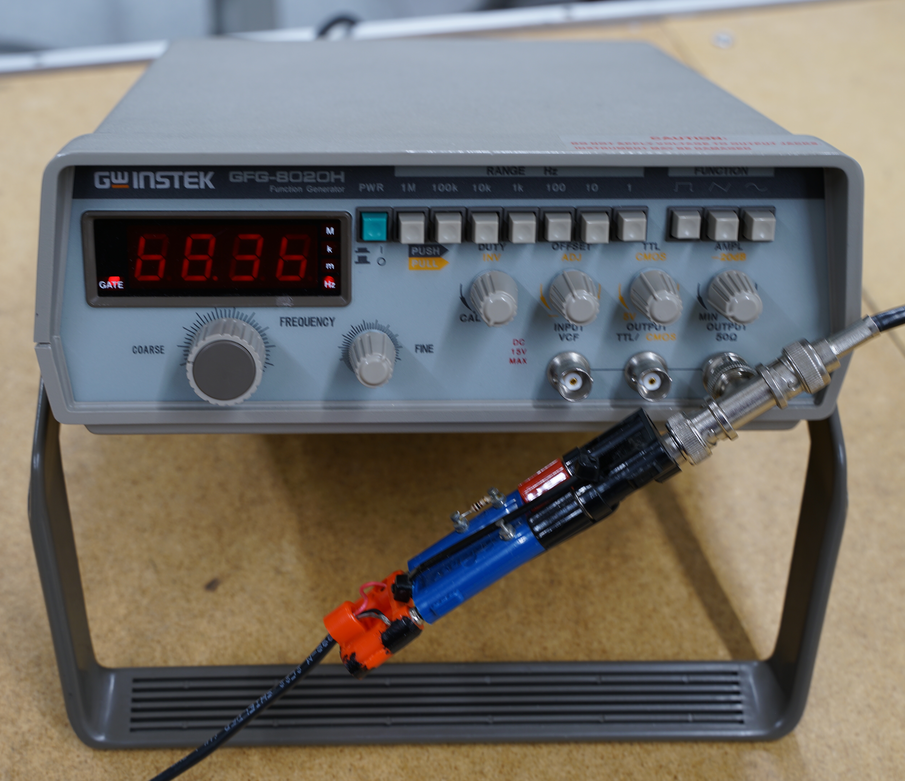
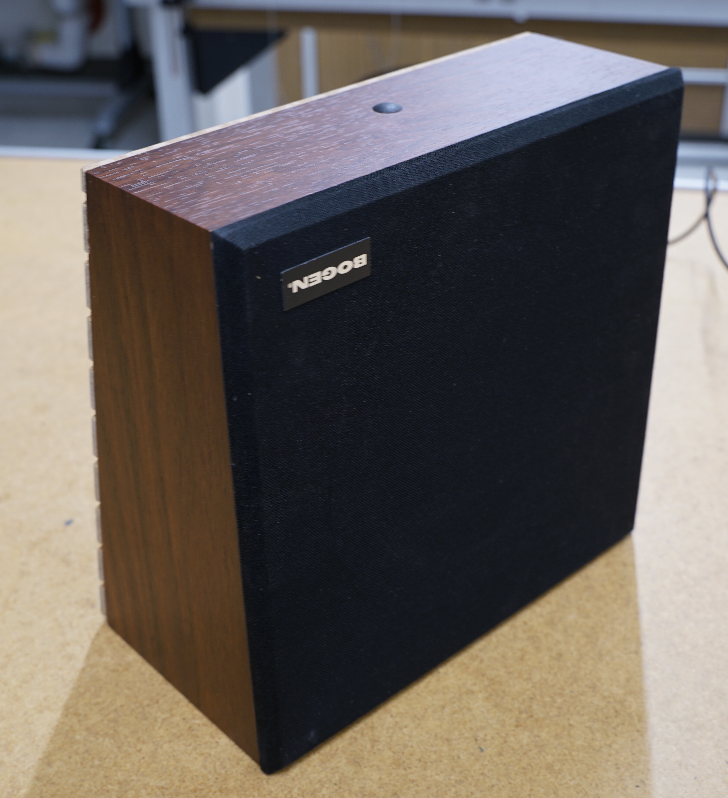
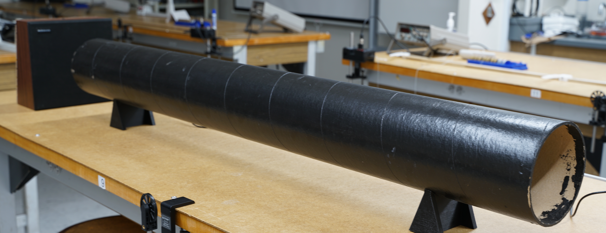
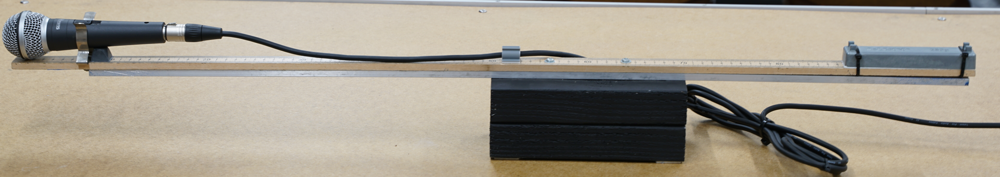
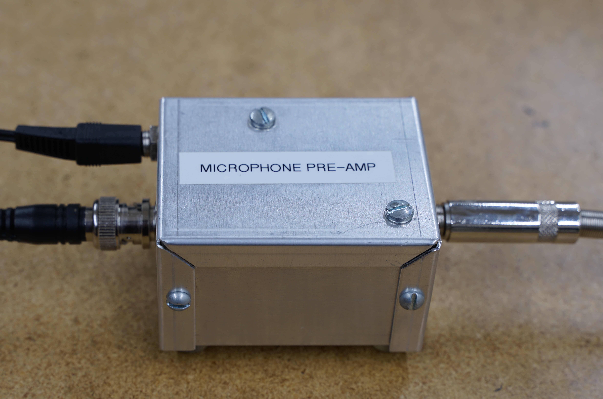
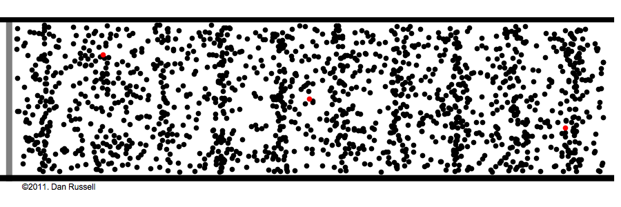
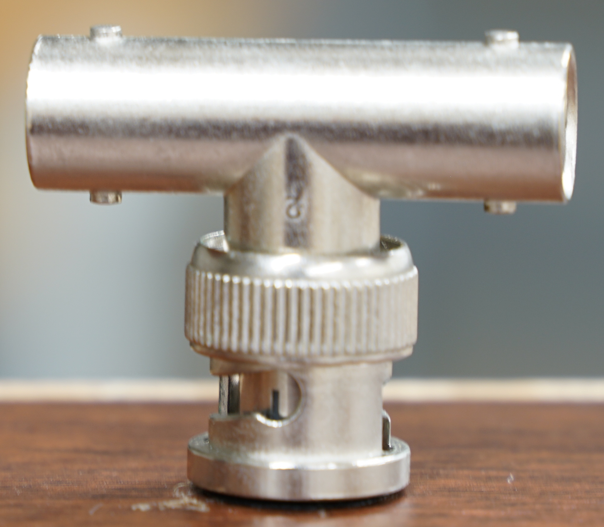
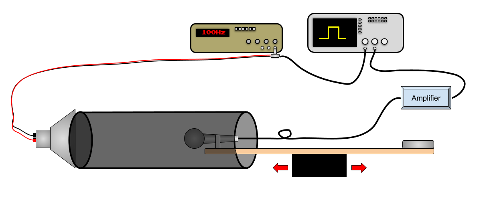
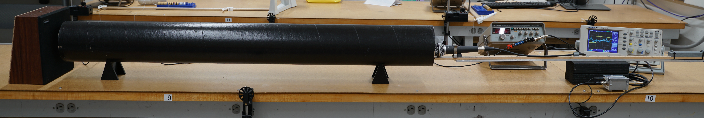

# Speed of Sound

:::Intro (In this lab you will)
- measure the speed of sound in air using a function generator, a speaker, a cardboard tube, a microphone or two, and an oscilloscope
- develop a model for the speed of sound in air 
- test the model against your measurement 
:::

# Approach (Background)

You will determine the speed of sound by measuring the time required for a short burst of sound (like a snap, clap, or pulse) to travel a known distance.  This is called the "time of flight" method.

To make the sound burst, you will connect a function generator (.A) to a speaker (.B).  Setting the function generator to output a square wave will cause the speaker to emit a continuous series of sound pulses.  Placing the speaker at one end of a large tube (.C) will constrain the sound so it does not radiate around the room.  

:::::::::Figure (soundGeneration|L)
::::::row
:::col

:::
:::col
::::::row

::::::
::::::row

::::::
:::::::::

To detect the sound, you will use a microphone. The microphone can be attached to one end of a counter-balanced meter stick so that it can be placed at different distances inside the tube (.A).

By itself, a microphone produces a fairly small electrical signal, detectable only if the sound is fairly loud, that is, when it is placed near a source.  However, with a little electronic amplification, a microphone's signal can be detected even if the sound is faint, so it can be placed far from the source (e.g., at the other end of the tube). You will use a home-built "microphone pre-amp" (.B) to amplify a microphone signal before sending it to the oscilloscope (.C).  

:::::::::Figure (soundDetection|R)
::::::row

::::::
::::::row
:::col

:::

:::col

:::
::::::
:::::::::

<!-- :::::::::Figure (oscope|m|R)
::::::row
:::col

:::
::::::
::::::::: -->

The signal from the function generator can be split using a BNC Tee ().  That way it can be observed on the oscilloscope as well as drive the speaker.   

:::Figure (BNCTee|s)

:::

A is diagram of the connected apparatus and B is a photograph of a typical setup. 

:::::::::Figure (apparatus)
::::::row
:::col

:::
::::::
::::::row
:::col

:::
::::::
:::::::::

<!-- ## Pre-Lab
:::Prelab
**Before coming to lab** you will need to complete , Exercises 1-4 inside of it, , . This will be checked off by your TA when you get to class. 
::: -->

<!-- :::Exercise (procedure | 6 Points)
Write a procedure for performing the experiment you described above. Your procedure should enable you to answer the questions in  and  that follow.
::: -->

# The Experiment (In-Section Notes)

## Frequency

:::Intro (Notetaking Tip)
Before making any measurement, design your experiment. It should involve making at least one plot and performing at least one linear fit.

- Briefly describe the experiment you will perform.
- What will you be plotting?
- What is the meaning of the slope of your fit?
- What is the meaning of the intercept?
:::

Decide what frequency you will set your function generator to. 

:::Note
Try to keep it on the lower of the frequency range so as not to annoy your classmates.
:::

:::Intro (Notetaking Tip)
- What frequency will you use for your experiment?
- Give your reasoning for choosing this frequency.  (Comment on any issues with setting the frequency too high or too low... besides annoying your classmates.)
:::

## Systematic Errors
Consider possible sources of error in your measurement.  

The function generator must send the signal to the speaker and to the oscilloscope down a wire. Then the speaker must react and send a pulse of sound down the tube. Then the microphone must react to the sound reaching it and send that signal to an amplifier. Then the amplifier must process the signal and send it to the oscilloscope.

Additionally, the position where the sound is generated in the speaker and where sound is detected in the microphone are not obvious.  If they are not exactly where you assume they are, then the distance the sound travels might be different than what you measure.

:::Intro (Notetaking Tip)
How will you address these systematics?
:::

## Data Collection

:::Intro (Notetaking Tip)
Write a procedure for performing the experiment you described in the Approach section that accounts for the questions you have just considered.
:::

Take notes as you experiment. 

:::Intro (Notetaking Tip)
- Describe what you actually do if it differs from what you planned.  
- Describe any problems you ran into, what you did about them and why. 
- Describe anything interesting you notice while performing your experiment.
:::

:::Note
There is a $\text{CO}_2$, temperature, and relative humidity sensor in the lab.  Noting this information may be useful for your out-of-lab analyses.
- The uncertainty in the $\text{CO}_2$ meter is $\pm 75 \text{ppm}$ or $\pm 8\\%$, whichever is higher.
- The uncertainty of the temperature sensor is $\pm 1^{\circ} \text{ F}$.
- The uncertainty of the humidity sensor is $\pm 5\\%$ of the reading.
:::

Collect your raw data.

:::Intro (Notetaking Tip)
- Include a picture of your oscilloscope screen when it is displaying the features you are measuring.  (Use the SAVE feature of the oscilloscope instead of your phone camera.)
- Add a caption that describes what is being measured on the screen.
- Make sure your data tables are clearly labeled (with units) and annotated (so it is clear what procedures lead to which data).
:::

# Data Analysis (Out-of-Section Notes)

Document your measurements with well-formatted plots.

:::Intro (Notetaking Tip)
Make sure the slopes and intercepts of any linear fits are clearly noted and include uncertainties with an appropriate number of significant figures.
:::

Report your measurement of the speed of sound in air. Include uncertainty.

# Modeling the Speed of Sound (Out-of-Section Notes)

## Important Relations
The speed of sound through a fluid is determined by the Newton-Laplace equation equation below.

:::Equation (speedOfSound)
$$
v=\sqrt{\frac{B}{\rho}}
$$
:::

where $B$ is the elastic bulk modulus of the fluid and $\rho$ is the density of the gas.

The bulk modulus of an ideal gas is given by the following equation:

:::Equation (bulkModulus)
$$
B = \gamma p
$$
:::

where $\gamma$ is the "adiabatic index" (*a.k.a* the specific heat ratio) of the gas, and $p$ is the pressure.

The pressure of an ideal gas is given by the "ideal gas law":

:::Equation (idealGasLaw)
$$
pV=N k_B T
$$
:::
where $V$ is the volume of the gas, $N$ is the number of gas molecules, $k_B$ is the Boltzmann constant, and $T$ is the temperature in Kelvin.

And density is defined as:

:::Equation (density)
$$
\rho = \frac{Nm}{V}
$$
:::

where $m$ is the mass of a single gas molecule.

## Building the Model

Using the equations above, solve for the speed of sound, $v$, as a function of $\gamma$, $k_B$, $T$, and $m$. Show your work.

:::Note
For a given gas, $\gamma$, and $m$ are constants. $k_B$ is a fundamental constant known as the Boltzmann constant. This means that the speed of sound in a gas is only dependent on the temperature, $T$.
:::

The Boltzmann constant is **exactly** $1.380649 \times 10^{-23} \text{J} \cdot \text{K}^{-1}$. 

:::Note 
In 2019 the definitions of the SI units were redefined [fn] [2019 SI Redefinition](https://en.wikipedia.org/wiki/2019_redefinition_of_the_SI_base_units)[/fn]. As a result, some constants became *exact* with **no uncertainty** in them. The Boltzmann constant was one of them. 
:::

The adiabatic index, $\gamma$, is determined by the structure of the gas molecule. Air is primarily composed of $\text{N}_2$ and $\text{O}_2$.  Since both of these molecules are diatomic, they have the same $\gamma$ value of $1.4$. 

:::Intro (Notetaking Tip)
- Consider what factors might contribute to $\gamma$ not being $1.4$.
- What uncertainty would you attribute to the value of $\gamma$?
:::

Decide what value to use for $m$.  Be sure to specify units.

:::Intro (Notetaking Tip)
- Give your reasoning for using this value of $m$. 
- - Use a combination of words and math. 
- - List any sources you used to guide your choice.
:::

Specify the uncertainty in the value of $m$ you chose.

:::Intro (Notetaking Tip)
- Explain how you determined this uncertainty.
- - Use a combination of words and math. 
- - List any sources you used to guide your choice.

:::

Plug in your values for the three constants and simplify your equation for $v$. ;;;Check your units;;;

Summarize the assumptions your model makes.

# Conclusion (Out-of-Section Notes)

Compare your measurement to the speed of sound predicted by your model. Include uncertainty.

:::Intro (Notetaking tip)
- If your measurement is in agreement with your model, discuss how you might improve the experiment to increase its precision and more strongly test the model. 

- If your measurement does not agree with your model, discuss how you might modify the model to explain the discrepancy. Are there any assumptions that maybe aren't met?  How would relaxing or eliminating them from the model change affect the discrepancy?
:::

