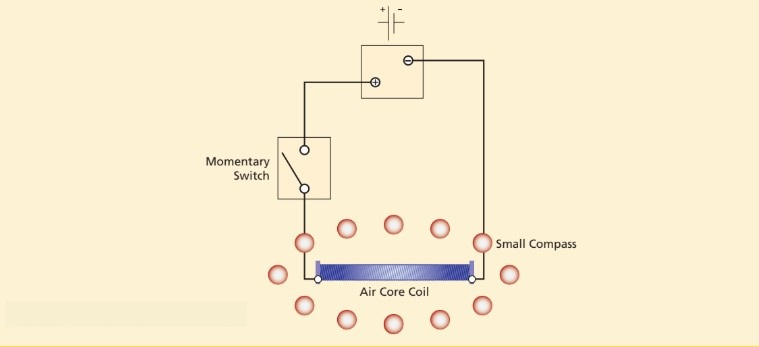
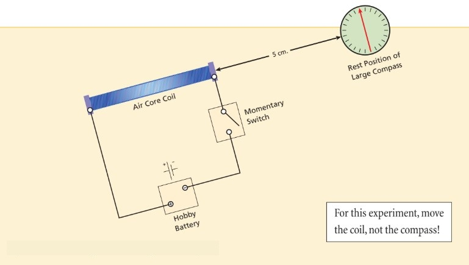
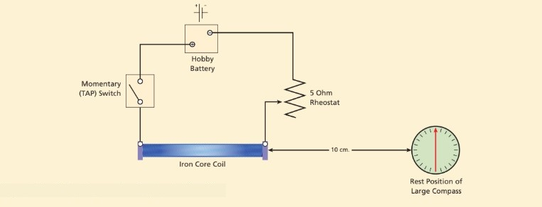
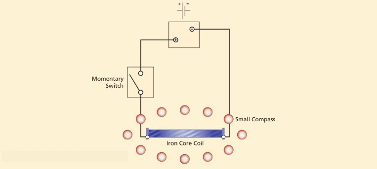
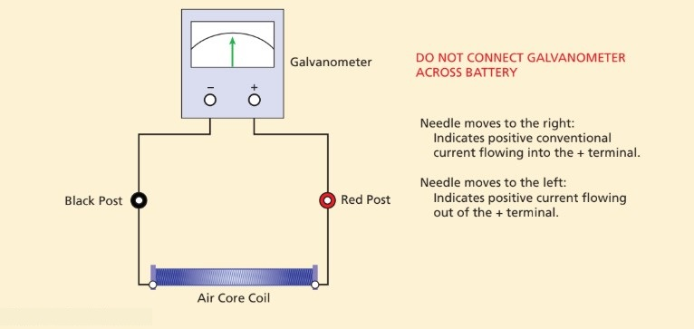
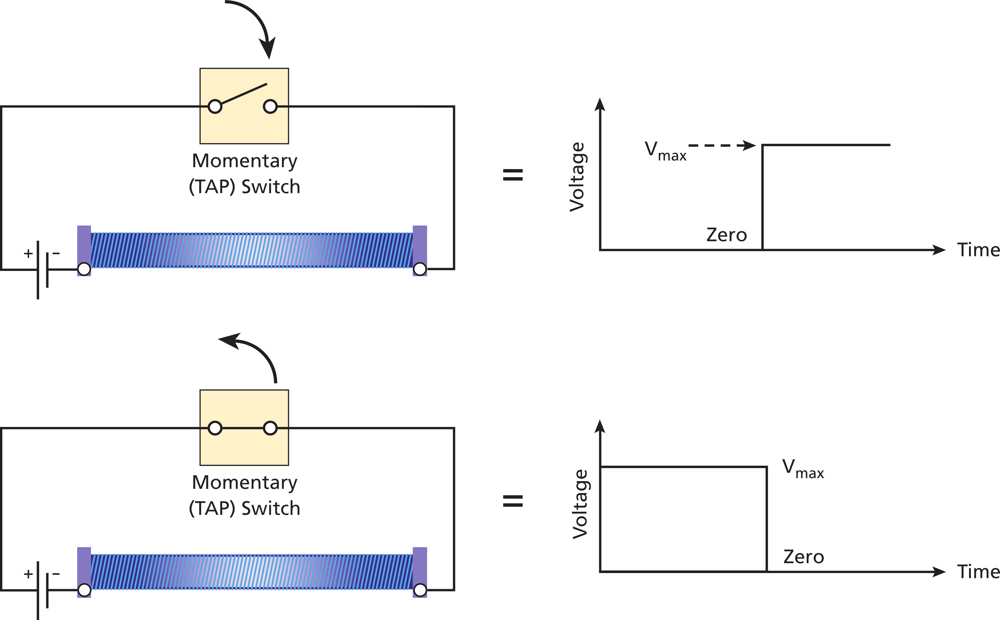
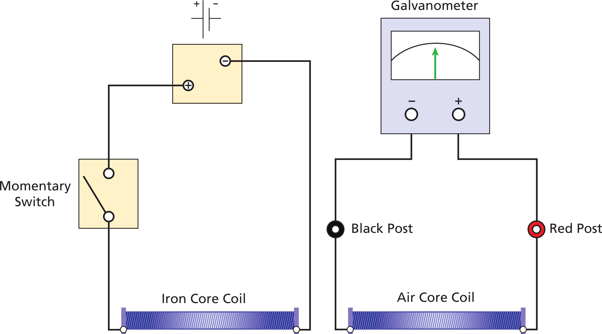

# Magnets and Inductors 

# Introduction

:::Video
<iframe src="https://drive.google.com/file/d/1HCorUFXEPEtfkIyGYHVCCxuUs8mFQ8WW/preview" width="100%" height="100%" allow="autoplay"></iframe>
:::

# Experiments

## Fields of Magnets
In this exercise you will gain intuition on magnetic fields and  magnetic field lines. You will explore how permanent magnets affect the region surrounding them.
### Permanent Magnets and Electro Magnets
:::::::::Activity (permanentMagnet|Permanent Magnets and Electromagnets)

:::Figure (caroundm|xl)

:::

1. Lay a blank sheet of paper on the table.
2. Distribute the small compasses equally around the paper and note the direction each one points. The north pole of
the compass is painted red. Most of them will align themselves with the earth’s magnetic field.

:::Note 
The compasses sometimes “stick” in one orientation because of static friction between the needle and the center pin.
Lightly tapping the face of the compass fixes this. 

Other times, the compasses may orient themselves in a seemingly random fashion, there are metal fixtures below the table which
cause this. Move your paper to a location where you do not observe any strong effects.
:::

3) Place the provided permanent magnet in the middle of the paper. Trace the outline of the magnet. For each compass,
draw a small arrow in the direction of its north pole.
4) To double the number of data points, redistribute the compasses about the paper. They should be equally distributed
and should not be at any of the original locations. Again draw an arrow in the direction of the compass.
:::::::::

:::Exercise (| 1 Point)
Attach a picture of your trace here. You will refer back to it in the next Activity
:::
### Air Core Electromagnet

A coil of wire with current flowing through it generates a magnetic field. We call this an electromagnet. If there is nothing but air inside of the coil, it is an "air core" electromagnet. We can also place other materials such as iron inside of the coil to amplify the magnetic field. We call this an "iron core" electromagnet.

:::::::::Activity (airCoreField| Air Core Electromagnet)
In  you gained intuition about magnetic fields using a permanent bar magnet. In this exercise you will be using an air core electromagnet. The circuit diagram for this experiment is shown in .

:::Figure (airCoreField|xxl)

:::

1. Get a new sheet of paper. Place coil A in the center (trace the outline) and again distribute the compasses about the page. Wire the coil
to the switch and battery as shown in 

::: Note
The electromagnet is the coil, not the battery.
:::
2. Watch the compasses as you depress the switch. The effect is dramatic. The compasses will align themselves with
the new field generated by the coil.
3. With the switch still depressed, draw an arrow for each compass. It is not necessary to move them to different
locations this time.
4. DO NOT change the paper yet.
5. Reverse the leads running to the coil. This will reverse the direction that current flows.
6. Depress the current switch with the compasses in the same position ans observe what happens.
:::Exercise (|1 Point)
What happens when you reverse the current?
:::
7. You can now remove the compasses to reveal the arrow pattern

:::::::::

:::Exercise (reverse|2 Point)
Two magnetic fields are similar if, for all points in one field, a compass placed there points in the same direction as it does at the same point in the other field.
1. Attach an image of your sketch here.
2. Based on your 10 compass locations, is the magnetic field of a bar magnet similar to that of an electromagnet? Why or why not?
:::

## Field Strength
### Compass on the Axis of the Electromagnet

In this Activity we will be exploring the strength of magnetic fields: how they vary in space and how they depend on the geometry of the magnet. 
::::::Activity (airCoreStrength|Strength v.s. Distance in an Air Core Electromagnet)
We will be working with the system described in . This system uses an electromagnet that has an air core, just as in . 

1) Wire the coil as shown in . Use the air core; that is, do not use the iron rod. Put the larger compass on the
axis of the coil, about $5 \text{cm}$ away.

:::Figure (airCoreStrength|xxl)

:::

:::Note
The Earth’s magnetic field will affect the compass needle. Thus we will align the entire apparatus, both the electromagnet and the compass, so that the compass needle is nearly perpendicular to the axis of the coil when the electromagnet is not powered.
:::
2. Press the current switch and record how many degrees the compass needle deflects.
3. Move the coil to a distance of 10 cm and again measure how many degrees the compass needle deflects.
4. Continue to move the coil away from the compass. Stop when the needle barely deflects and record this value.
5. Leave the compass at the same distance. Put the iron core into the space between the windings. Again press the
current switch and observe what happens.
::::::
:::Exercise (|4 Points)
1. How many degrees does the compass needle deflect when the electromagnet is originally powered at 5 cm away?

2. How many degrees does the compass needle deflect when the electromagnet is 10 cm away? Is this smaller or greater than the deflection angle at 5 cm away?  What can you conclude about the magnetic field strength at the two distances?

3. At what distance is the needle's deflection just barely noticeable?

4. How does the needle's deflection change once the iron core is placed into the coil in comparison to when the core was an air core? What can you conclude about the magnetic field strength when we place an iron core into an air core electromagnet?
:::

:::Note
Ferromagnetic materials greatly increase the strength of a magnetic field. This is due to the atomic and molecular structures of the material lining up with the externally applied field.
:::
### Compass on the Axis of a variable current Electromagnet
This Activity continues our investigation of magnetic field strength. Instead of varying the distance between our compass and our electromagnet as we did in , we will vary the current flowing through our electromagnet. We will use a circuit containing a variable resistor  (a rheostat), as shown in  in . We apply a fixed voltage, and vary the resistance of the rheostat; thus we vary the amount of current flowing through the coil (according to Ohm's Law). 

::::::Activity (currentFieldStrength|Strength v.s. Current in an Air Core Electromagnet)

A rheostat is a variable resistance device. By varying the resistance we can vary the amount of current flowing
through the coil. 

1. Rewire the setup to include the rheostat as shown in . Set the compass at a distance of
$10 \text{cm}$. Keep the iron core in the winding.

3. Set the rheostat to zero resistance. The zero position is when no current is required to flow through the resistive
winding (current bypasses the resistor). Increasing the distance which current must travel through this material
increases the overall resistance. 

:::Figure (currentFieldStrength|xl)

:::

3. Press the current switch and record how many degrees the compass needle deflects.
4. Move the rheostat head to the 1/4 position ;;;This increases the resistance.;;;. Press the current switch again and record the degree of deflection.

5. Repeat this measurement for the 1/2, 3/4, and 1 rheostat positions.

::::::
:::Exercise (|2 Point)
1. How many degrees does the compass needle deflect with the rheostat at each position; $0$, $\frac{1}{4}$, $\frac{1}{2}$, $\frac{3}{4}$, and $1$? 

2. The magnetic field strength is proportional to the angle of deflection of the compass needle.  How does the magnetic field strength change as we increase the resistance of the rheostat?
:::

::: Note
Moving charges give rise to magnetic fields. More current means more moving charges. More moving charges means a stronger magnetic field. By decreasing the current in the electromagnet we reduce the magnetic field strength.
:::

## Magnetization

In this Activity we will explore magnetization and how objects can become magnetized. We will start with an iron bar that is not magnetized, and place it in an external magnetic field to magnetize it. 

::::::Activity (magnetization|Exploring Magnetization)

1. Remove the rheostat from the circuit. Leave the iron rod in the coil. Place a few of the smaller compasses around the
coil. Note the orientation of the iron rod within the coil.

:::Figure (magnetization|xl)

:::

:::Exercise (|1 Point)
Does the iron core create its own magnetic field after it is placed in an external field? Justify your answer.
:::

2. Depress the current switch for about 3 seconds, then release it. You will notice that the iron core electromagnet continues
to affect the direction of the compasses even with no current flowing. 
3. Carefully note the rod’s direction within the coil (using the color coded ends of the rod), then remove it. 
4. Move it close to the individual compasses and identify its north pole.
5. Insert the rod back into the coil in the opposite direction. Hit the switch again. Remove the iron rod and observe its effect on the compasses.
:::Exercise (|1 Point)
Did the north pole of the magnetized iron core change? How do you know?
:::
::::::

::: Note
In some materials, the magnetic domains remain aligned after the external magnetic field has been removed. As a result, the material itself becomes a magnet. This phenomenon is called *ferromagnetism*. A material that behaves this way is said to be *ferromagnetic*.
:::

## Magnetic Flux and Faraday's Law

### Flux

In , we discussed magnetic field lines between the N and S poles of the bar magnet.  When these lines cross an area they produce *magnetic flux*. Magnetic flux is associated with a given surface and represents a measure of the number of field lines crossing that surface. 

For a uniform magnetic field perpendicular to a surface, the magnetic flux is defined as the product of the magnetic field strength and the area of the surface.

For a given area, a greater magnetic field strength yields a greater flux. A smaller field strength yields a smaller magnetic flux.

For a given magnetic field strength, a greater area yields a greater flux. A smaller area yields a smaller flux.

### Faraday’s Law

Consider an area bounded by a loop of wire. If the amount of flux through the area is changing, then a voltage is
induced in the loop. This, in turn, gives rise to a current, which we will refer to as the induced current. 

### Lenz’s Law

Lenz’s Law states that a magnetic field produced by an induced current always opposes the change in magnetic flux that produced the current. If the magnetic flux is increasing, current flows in the direction that causes its magnetic field to point in the opposite direction to the increasing flux; it tries to cancel the change in flux. You can determine the direction of the induced current by means of the right-hand rule. If you point the thumb of your right hand in the direction of the magnetic field from the induced current (opposite to the direction of the change in flux that is causing it), your fingers will curl in the direction of the induced current. (See Figure 6c below. The thumb points north.)

:::Note
The right hand rule holds that when your right thumb is aligned with the direction of current flow, your fingers will wrap in the direction of the magnetic flux. (They will point north. See the b below.)
:::

:::::::::Figure (Astrength|l|Row)
::::::row
:::col (4)
 F = q v x B. Your index finger goes in the direction of v, middle finger in the direction of B. Your thumb is the direction of F.") 
:::
:::col (4)
 For a wire, when your thumb points in the direction of positive current flow, your fingers wrap in the direction of the magnetic field.")
:::
:::col (4)
 For a coil, when your fingers wrap in the direction of positive current flow (look at the windings to determine this), your thumb points in the direction of the magnetic field.")
:::
::::::
:::::::::

In this Activity we will explore laws critical to the study of electromagnetism. We will be using the air core coil to explore how a moving magnet produces current in a nearby coil of wire. 

::::::Activity (lenzLaw| Exploring Lenz' Law)

:::Figure (lenzLaw|xl)

:::

1. Wire the circuit shown in 

2. Bring the north pole of the permanent magnet close to the end of the coil and note the motion of the galvanometer needle. Experiment with different approach and recession speeds, note the relationship between the speed and the needle’s deflection.

:::Exercise (|2 Point)
1. Which way does the needle deflect when you move the magnet towards the coil? Which way does it deflect when you pull the magnet away from the coil?

2. What is the relationship between the magnet’s approach speed and the degree to which the needle is deflected?
:::

:::Exercise (|2 Point)
1. Magnetic field strength decreases as you get farther from the poles of the magnet. Does the flux through the face of the coil change as you move the magnet? Explain your answer.

2. Why does the meter needle deflect? Is the deflection in accordance with Lenz’s Law? Justify your answer in terms of Lenz’s law and your above answers. 
:::

3. Reverse the leads hooked to the coil and repeat the above experiment. Again use the north pole of the magnet.

:::Exercise (|1 Point)
Describe what you’ve observed. Comment on the direction in which the meter needle deflects and the relative degree to which it does so.
:::

4. Return the leads to their original position. Repeat step 2 using the south pole of the magnet.

:::Exercise (|1 Point)
1. What is different when you use the south pole instead of the north pole?

2. How does Lenz’s law explain this phenomenon?
:::
::::::

## Inductive Coupling

:::::::::Activity (inductive_coupling|Circuit for Inductive Coupling)

:::Figure (inductive1)

:::

1. Wire the circuit shown in . Note that the two coils are not touching. Coil 1 is hooked to the battery, coil 2 is hooked the the galvanometer. Position the compass to one side of coil 2. This will serve as a magnetic field indicator for cases where the galvanometer is not sensitive enough.

:::Figure (inductive2)

:::

2. The switch provides a step function of voltage (and thus current) to the first coil. This sets up a magnetic field in the first coil. Depress the switch and note the movement of the galvanometer's needle. Release the switch, again noting the needle's movement.

::: Note (galvometer|10)
Depending on the battery's condition it may be hard to observe this first case. This is okay. Watch the compass as you flip the switch. If it moved, then you've successfully set up a magnetic field. The galvanometer just wasn't sensitive enough to make a reading.
:::

3. Insert the iron rod into the first coil. Again depress the switch, note the deflection. Release the switch and note the deflection.

:::Exercise (galvometer_deflection|2 Points)
1. What causes the deflection of the galvanometer meter in the second coil? Specifically, how can current in the first coil cause current in the second coil when the two circuits are *not connected*? ;;;Hint: Think about the patterns you saw in the first section and what you've read about Faraday's Law.;;;

2. Explain why this case experienced more deflection than the last.

3. Explain the results that you observe when you release the switch. When the current is turned on, the second coil is reacting to a new magnetic field. What is happening when the current is cut off? Again, think about this in terms of Faraday's Law.
:::

4. Insert an additional iron rod into the second coil. The rods should *not* be touching. Space them approximately 1$\text{cm}$ apart. Again depress the switch, note the deflection. Release the switch and note the deflection.

:::Exercise (more_deflect|1 Point)
Explain why this case experienced more deflection than the last.
:::

5. Now slide the two rods together such that there is a common iron core between the two coils. Again depress the switch, note the deflection. Release the switch and note the deflection.

:::Exercise (more_deflect2|1 Point)
Explain why this case experienced more deflection than the last.
:::

6. Positive current flows from the positive (red) battery terminal. Tracing this with your right hand you should be able to figure out the direction of magnetic flux in the first coil.

:::Exercise (coupled_current|2 Points)
1. What direction will current flow in the second coil when the first coil generates an increasing flux? Assume the magnetic field points into the second coil.
2. What direction will current flow when this flux is decreasing?
3. Assuming that the galvanometer expects current to flow in through the positive terminal, were your experimental results consistent with the last two questions? Draw pictures to illustrate your thinking. Make sure to include your pictures with your written explanation in the report.
:::

:::::::::

# Conclusion
:::Exercise (summary|1 Point)
Write a brief conclusion summarizing the important points of this lab.
:::

:::Summary
:::
