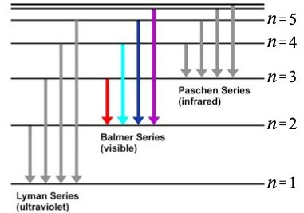
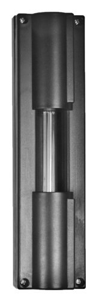
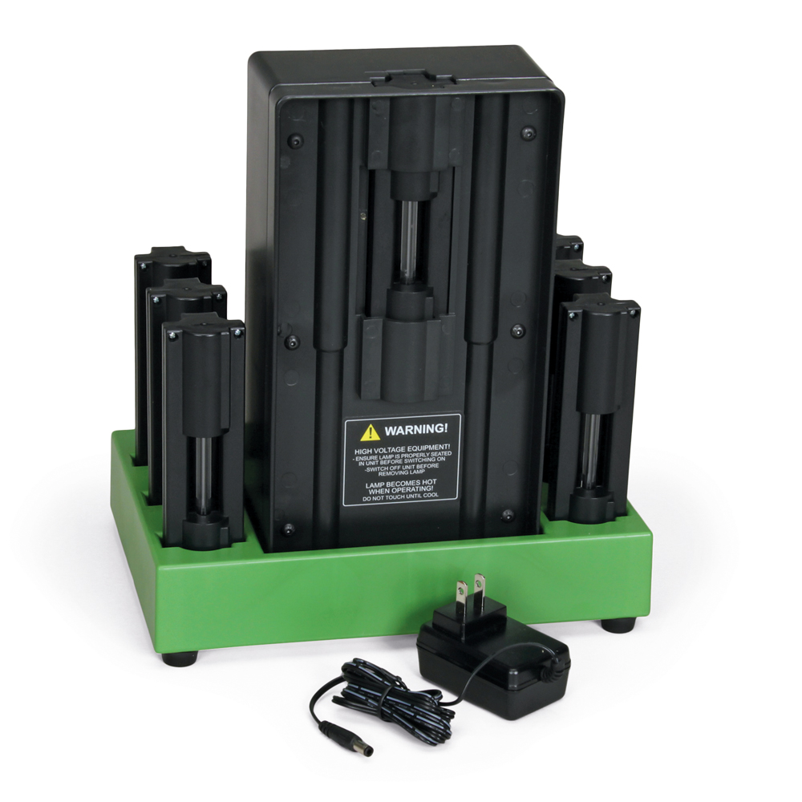
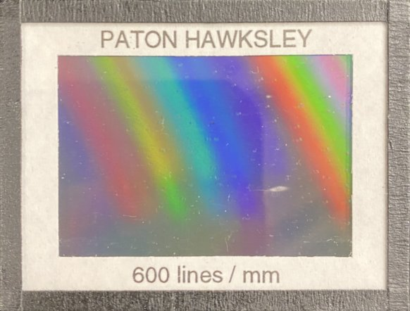
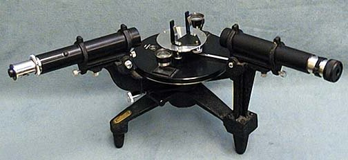
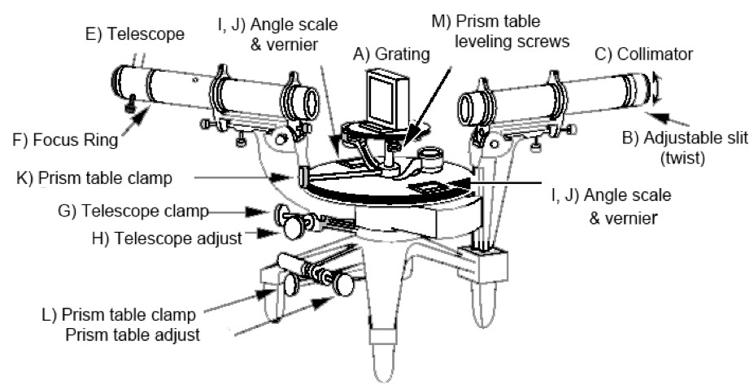
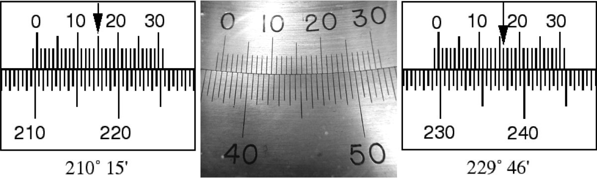
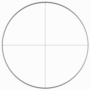

 </img>

# Atomic Spectra

# Introduction

Spectral analysis is a powerful technique for identifying elements because, when bombarded with charged particles, every element emits a unique set of discrete wavelengths. The pattern of wavelengths in the emission spectrum of hydrogen provided key evidence for the heretical assertion of the Bohr model that the energy levels of electrons within an atom are quantized. 

In this lab you will measure the wavelengths of visible light emitted by Hydrogen and observe the pattern in their values. You will then conduct a simple spectral analysis of two unknown sources to determine their atomic content.

# Background
The quantum explanation for atomic structure was developed in the early 1900’s based largely on measurements of the wavelengths of light emitted by atoms in [gas-discharge lamps](https://en.wikipedia.org/wiki/Gas-discharge_lamp).  These measurements, first made in the late 1800’s, provided evidence that the energy levels of atoms are quantized (*i.e.* have a discrete set of possible values).
In particular, in 1885, Johann Balmer measured the visible spectrum of Hydrogen and found the wavelengths of light that were present were related according to
$$
\frac{1}{\lambda} = R\left(\frac{1}{2^2}-\frac{1}{n^2}\right);&nbsp;&nbsp;\mathrm{for}&nbsp;n>2.
$$

The ultraviolet and infrared portions of the Hydrogen spectrum were later measured (by Lyman, Paschen, Brackett and Pfund) and found to fit similar formulas but with integers other than 2 in the first term (and in the inequality). They all measured the same coefficient, $R$, called the Rydberg constant. 

The origin of this formula was eventually understood within the Bohr model of the atom, which posited that the light from Hydrogen consists of photons of energy $E = h\nu = hc/\lambda$ that are emitted by atoms transitioning between electronic states that have discrete energies of $E_n = -hcR/n^2$, where $c$ is the speed of light, $h$ is Planck's constant, $R$ is the Rydberg constant and $n$ is a positive integer (). Transitions from excited states to the $n = 2$ state produce visible light (red to violet, left to right for the four lines shown) that you will observe in this lab. Transitions to the $n = 1$ state produce ultraviolet light, and those to the $n = 3$ state produce infrared light, neither of which can be seen by eye.
:::Figure (levels)
 
Diagram of the energy levels for a Hydrogen atom.
:::

This understanding allowed the Rydberg constant to be formulated in terms of purely fundamental constants like the charge of the electron, $e$, and the permittivity of free space, $\epsilon_0$:
 $$
 R = me^4/8\epsilon_0h^3c,
 $$
whereas previously it had been only an empirically determined value.[fn]Interestingly, the measured value of R did not match the prediction of the simplest Bohr model which uses $m = m_e$ because the electron and proton together lead to an effective “reduced mass”, $m_\mathrm{eff}$, that is very slightly below the electron mass. Furthermore, the spectrum of hydrogen was found to contain a set of wavelengths with a slightly different R value. These come from deuterium, which is hydrogen with a neutron in the nucleus, the mass of which further alters $m_\mathrm{eff}$). Both effects are smaller than 0.1% and only revealed by exquisitely precise measurements.[/fn] Note that the Rydberg constant applies only to Hydrogen. Other atoms have a similar $1/n^2$ structure to the equation that describes their spectra, but with a different coefficient. Each element’s spectrum is uniquely characteristic, so spectra are often used to identify the elemental composition of a sample (or a star![fn]It is amusing to note how often dialogue in Star Trek episodes involves the captain asking for a “multi-spectral analysis” of some anomaly. Analyzing the spectrum of astrophysical objects is common, in fact so common that it would be done automatically, without the captain’s specific request! But it does provide tech-y sounding, and in this case not incorrect, dialogue.[/fn]).

For a fun, yet scholarly, presentation of the historical context surrounding the Bohr model, watch this 

:::Video (Kathy_on_Bohr|)
<iframe  height="100%" width="100%" src="https://www.youtube.com/embed/8IIg4Qt_qv4" frameborder="0" allow="accelerometer; autoplay; clipboard-write; encrypted-media; gyroscope; picture-in-picture" allowfullscreen></iframe>
:::
 
In this lab, you will observe the visible spectrum of Hydrogen and use it to measure the Rydberg constant.
Then, you will also observe the visible spectra of two unknown samples and use them to determine the samples' atomic content by comparison to known spectra.

# Instruments

## Light source
A **spectrum tube** () provides the light emitted by a gas in a shape that optimally illuminates a narrow slit

:::Figure (lamp)

Photograph of the type of spectrum tube used in this lab.
:::

There are several tubes provided: one containing Hydrogen and two others whose contents you will determine.  The spectrum tubes sit in, or next to, a **housing** () that safely provides the high power needed to make it glow.

::: Figure (housing)

Photograph of the housing that positions and powers the spectrum tube.
:::

## Diffraction Grating

A **diffraction grating** is an optical element that uses the phenomenon of interference to send light of different wavelengths in different directions ().

:::Figure (grating)

Photograph of the diffraction grating used in this lab.
:::

In lecture, you have learned about interference in the context of collimated light passing through a double slit.  In another 5L lab, you will experiment with passing light through an array of three, four or five slits.  When collimated light passes through multiple, equally spaced slits, the result is an intensity pattern with maxima and minima at the same positions as in the pattern created by two slits with the same spacing, but with maxima that are much more narrowly peaked, (*i.e.*, the contrast is much improved). 

The diffraction grating you will use in this lab was made by etching thin parallel lines on a piece of glass. Etched regions scatter light instead of transmitting it, so the non-etched regions between the etched lines act as slits. The etching process allows hundreds or thousands of lines per mm, so this type of diffraction grating has slits that are not only plentiful, but closely spaced as well. 

Because of its very large number of slits, the diffraction grating creates very sharp maxima.  Because of their close spacing, the slits impose a large "lever arm" on the pattern (*i.e.* a greater angular separation between maxima) making it possible to distinguish maxima of subtly different wavelengths.  This can be seen from the equation for constructive interference.  Light passing through slits separated by a distance $d$ will have intensity maxima at angles $\theta_m$ for which 
$$
d \sin \theta_m = m\lambda,
$$
where $m$ is any positive integer. The smaller $d$ is, the larger $\theta_m$ will be for the same $\lambda$.

The $m = 0$ case is the central maximum. By measuring $\theta_m$ for $m = +1$ maxima for each of the different wavelengths, you can precisely determine those wavelengths.[fn]To validate your results, it is good practice to measure $\theta_m$ values for other values of $m$, but be aware that the grating is optimized for $m=+1$, so the other maxima can be hard to see.[/fn]  

Note that this equation applies only if the collimated light is "normally incident" on the grating. You may have to adjust the grating to make this be the case. [fn]If the collimated light hits the diffraction grating at some other angle $\theta_i \neq 0$, the equation becomes $d (\sin \theta_i \mp \sin \theta_{\pm m}) = \pm m\lambda$, where the angles are measured from the grating's normal.  If $\theta_i \gg 0^\circ$ and you neglect the $\theta_i$-term, you will have a systematic error in your wavelength measurements.  Fortunately, it is easy to cancel out the effect of $\theta_i$ by measuring $\theta$ for two different values of $m \neq 0$ (*e.g.*, for $m = +1$ and $m = -1$) for the same wavelength and substracting the corresponding equations.[/fn] 

:::Exercise (spacing|2 points)
What is the spacing $d$ for the diffraction grating?  (Hint: See .)
:::

## Spectroscope
:::Figure (scope)

Photograph of the spectroscope used in this lab.  [Click here to read its manual](docs/scopeManual.pdf). 
:::

A **spectroscope** is a device that allows you to determine which wavelengths of light are present in the spectrum of a light source by eye. The spectroscope used in this lab () holds a grating (see ) in a clip at its center and has two optical tubes aimed at the grating.  

The parts of the spectroscope are labeled in the diagram below ().  The two optical tubes are the **collimator** (C) and the **telescope** (E). They define the light path through the spectroscope. The collimator has an opening at its far end that only admits light through a vertical slit (B). This shapes the light beam into a line oriented in the same direction as the slits of the grating.  

:::Figure (scopeDiagram)

Diagram of the spectroscope used in this lab.  Note that this diagram's vantage point is rotated slightly (~45° CCW) from that in the photo: the arms that are angled toward the viewer in the photo are angled away from the viewer in the diagram.
:::

Letting the light spread vertically doesn’t degrade the resolution in $\theta$ because $\theta$ is an angle in the horizontal plane. Because a line allows more light to hit the detector, it is much easier to determine the location of a line than a point. The use of vertical slits in spectral measurements is so common that the observed maxima are called *spectral lines*.

The width of the vertical slit is narrow but adjustable. Opening the slit lets more light through, enabling you to see fainter wavelengths, but it also widens the diffracted image of the slit, lowering the precision with which you can measure the diffraction angle and potentially causing neighboring wavelengths to overlap and become indistinguishable.  It is best to adjust the slit while looking at the central maximum and gently rotating the knurled ring at the end of the collimator. 

You can see the central maximum by looking through the eyepiece when the telescope is parallel to the collimator. The telescope swings to different angles around the grating (A) and images the light that comes through the grating onto a "detector", typically your eye, which is why the lens at the far end of the telescope is called the **eyepiece**.  

The angular position of the telescope is read off of scales (I,J) situated on either side of the spectrometer. The scales measure degrees down to one arc minute with Vernier markings. 

### Vernier scales 
Using a Vernier scale takes a bit of explanation and some practice. There are some good extended descriptions online (*e.g.* [in Wikipedia](https://en.wikipedia.org/wiki/Vernier_scale)), so here we’ll introduce it with a few examples specific to the scales you will be using. The scales on the spectroscope consist of two sets of uniformly spaced lines that are arranged so that they slide past each other. The lower set's lines mark each half degree, while the upper one's (which are very slightly more closely spaced) have markings corresponding to 0-30 arc minutes. The two scales are used together. 

:::Figure (verniers)

:::
Cartoons of two different measurements are shown in  to illustrate the procedure. **First you look where the zero mark on the inner scale is located.** In the left hand cartoon that is to the right of $210^\circ$; in the right hand cartoon it is to the right of $229.5^\circ$. **Then you look where the lines on the inner and outer scales align most closely.** In the left hand cartoon that happens for the $15^\prime$ mark; on the right side it happens at the $16^\prime$ mark. These measure the number of arc minutes to add to the values obtained from the first step. So, the measurement on the left side is $210^\circ + 15^\prime = 210^\circ + (15/60)^\circ = 210.250^\circ$, and the measurement on the right is $229.5^\circ + 16^\prime = 229.5^\circ + (16/60)^\circ = 229.767^\circ$. 

:::Exercise (verniers| 2 points)
What is the angular position indicated by the vernier scales in the photo in the middle of ? 
:::

The precision of these $\theta$ readings is limited by the one arc minute granularity of the Vernier scale, but it is possible to make mistakes in reading or calculating the values. **Here are a few things you can do to reduce the chance of such mistakes and their impact:**
1. Have someone else (*e.g.* your lab partner) make the same reading (without telling them what you got) and compare.  
 
2. Recall that the position of the telescope can be read off of scales situated on either side of the spectrometer. The angles recorded by the two scales should differ by exactly $180^\circ$. Read and record both. If, after correcting for the $180^\circ$ difference, you find that their values differ by more than the $0.005^\circ$ precision of the scales, something is wrong - if not with your readings, then with the spectrometer itself (*e.g.*, warping of the scales). This approach of making multiple, independent measurements of the same quantity is always a good idea and helps validate your results. 
 
3. Record your raw readings in degrees and arc minutes, and then calculate the corresponding decimal degree values. This will help you disentangle any calculation errors that may occur. While the calculations in this case are not complicated, and the consequences of a mistake are small, this sort of fastidious data recording is a good habit to develop for professional laboratory work, when both the chances and consequences of mistakes increase.

Be aware that the Verniers read angular position but the location of $0^\circ$ is arbitrary. 

In order to determine the wavelength using $d\sin\theta = \lambda$, where $\theta$ is the angle between maxima, you need to measure two angles and subtract, just like measuring a length requires two position measurements. You could do this by measuring the angular position of the central maximum, which we can call $\theta_0$ , and the angular position of the $m = +1$ maximum, which we can call $\theta_{+1}$. Then $\lambda = d\sin(\theta_{+1}-\theta_0)$. Similarly, you could measure the angular position of the $m = +2$ maximum and use $2\lambda = d \sin (\theta_{+2}-\theta_0)$ or $\lambda = d \sin (\theta_{+2}-\theta_{+1})$. **Finally, note that the direction in which the angles increase or decrease on the scale is arbitrary, so you should use the absolute value of the differences.**

# Procedure
:::Note
- Take notes as you work through the activities and exercises that follow.  
 

- It is unlikely that you will have time to complete  and  during the lab period.  
 

- Turn in your notes at the end of your lab period.  Then continue to take notes as you work outside of lab, *e.g.*, analyzing your data.
 
 
- Once you have finished answering all the exercises, and before your next lab period, turn in your final notes.  These should include answers to all the questions as well as any tables, plots, drawings, screenshots, etc. that you produced.
 
 
- Remember to specify all quantities with (i) appropriate units, if any, and (ii) the correct number of significant figures.
:::

## Prepare the Instruments

::::::Activity (warmup|Set Up, Power On)

1. The first thing you should do is **familiarize yourself** with the clamping and fine-adjustment controls for the grating table and the telescope.

    The spectroscope has clamps, labeled **K**, **G** and **L** in , that hold the grating table and telescope in place when tightened, and let them rotate freely when loose.  Care should be taken not to clamp any of the parts any more tightly than necessary. Overly tight clamping can introduce strain or slight bending of the instrument parts which would compromise the delicate adjustments.
    
    The spectroscope also has fine-adjust knobs located next to, and oriented perpendicular to, the clamping knobs, labeled **H** and **L** in .  These let you move the telescope and grating table, respectively, by very small amounts.   They ONLY work when the clamps are tightened.  
    
    If you want to rotate the telescope or grating table by a large amount, you must loosen the clamps.  If you forget to release the clamps before trying to make a large adjustment, you can damage the spectroscope.  Bottom line: **do not force any motion that doesn’t feel smooth!**
    
    Loosen the grating table clamp (L), rotate the grating table (A) until it is perpendicular to the collimator (C), and gently re-tighten the clamp.
    Then loosen the telescope clamp (G), rotate the telescope (E) until it is aligned with the collimator, and gently re-tighten the clamp.

2. Next, **turn on** the lamp.

    You are provided with three spectrum tubes labeled "Hydrogen", "Sample_A" and "Sample_B".  To remove a tube from the housing, push up on the plastic that sticks out above the glass portion of the lamp.[fn] The housing has a built-in saftey feature that allows you to safely remove the spectrum tube (and replace it with another) without turning off the power to the unit.[/fn]

    **Take care not to touch the glass tube itself!** Oils from your hand will absorb light, heat up and damage the lamp. 
    [fn] If you accidentally touch the glass tube, let your instructor know. They will have materials for cleaning it.[/fn] 

    Put the Hydrogen tube in the housing, plug the power cord into the jack on the back of the housing and into an AC socket.  Flip the switch on the back to power up the lamp.  The gas in the tube should glow.  

3. Now, **align** the lamp and the spectroscope.  (*You may need to repeat this step from time to time, especially if you accidentally bump one of them.*)

    Look at the collimator slit from the side and top.  Check that the housing puts the middle of the tube directly behind, and at the height of, the slit. Loosen the telescope clamp. Then line the telescope up with the collimator and look through the eyepiece. 

    :::Figure (CrossHairs)(|l|R)
    
    Sketch of the crosshairs that should be visible when looking through the eyepiece of the telescope.
    :::
    
    You should see "crosshairs": a pair of very thin dark lines that intersect at right angles in the center of the field of view (see ).  You can rotate the crossharis by turning the eyepiece relative to the silver tube that holds it.  No matter what direction the crosshairs are in, the slit should be a bright vertical line.
    
    Adjust the position of the telescope so that the slit passes through the center of the field of view (where the crosshairs intersect). You may want to tighten the telescope clamp and use the fine adjust.
     
    Move the wooden box underneath the spectroscope or the green base that holds the lamp housing to make the slit as bright as possible.  It may help to widen the slit, which can be done by turning the knurled ring at end of the collimator.  If you do widen it, you will probably want to reduce its width when you're done so that you can more precisely determine the angular position of the diffracted image of the slit and resolve any closely spaced wavelengths.  

4. Finally, cover the lamp and spectroscope to prevent stray light from entering the optical path.

    This will make it easier to see dim lines.  They will also be easier to see if you allow your eyes to become dark-adapted.  You can ask that the room lights be turned off and close your eyes for a while before looking into the eyepiece.

    There is also an adapter for securing a smartphone camera to the eyepiece in place of your eye.  Ask your instructor if you would like to try using it.
::::::

## Observe the Spectra

::::::Activity (Balmer|Hydrogen)
Now that you have familiarized yourself with the spectroscope and have it aligned on the central maximum, you are ready to measure the visible lines of the Hydrogen spectrum.

:::Exercise (firstLines|2 points per question)
* Look for the four emission lines by moving the telescope in one direction. 
* In which direction did you move the telescope?
* Which color line appears closest, and which appears furthest, from the central maximum?  
:::

Note that the violet line is the dimmest of the four and can be difficult to see. You can increase the slit width to make the lines easier to see, but you will want to balance the need for visibility with the desire for narrow lines that can be measured more precisely. 

:::Exercise (secondLines|2 points)
* Move the telescope back until the central maximum is in view.
* Look for the four emission lines by moving the telescope in the other direction. 
* How do the intensities of the lines in this direction compare with the ones you saw in the other direction?
:::

Diffraction gratings are often designed to concentrate most of the diffracted energy in a particular maximum for a given wavelength. This is done by shaping, or "blazing" the grooves to have a triangular profile.  The grating in this apparatus is blazed for an $m=+1$ maximum of a visible wavelength, which is why the lines are much brighter on one side of the central maximum compared to the other.

:::Exercise (measurements|2 points per pair of vernier readings)
* Move the telescope back until the central maximum is centered on the crosshairs.
* What is the angular position of the telescope?  Read both verniers.
* Move the telescope in the direction of the brighter ($m=+1$) lines. 
* What are the colors and angular positions of each of the lines? Read both verniers.
:::

$\Rightarrow$ **Make sure your data appears in a <a href="https://gauchospace.ucsb.edu/courses/course/view.php?id=20895&section=7" target="_blank" rel="noopener noreferrer">well-formatted table</a> in your notes.** $\Leftarrow$

:::Exercise (2nd order lines|2 points per pair of vernier readings)
* Look for the $m=+2$ lines.  
* Note the angular positions and colors of any you can see. Read both verniers.
:::

:::Exercise (-1st order lines|2 points per pair of vernier readings)
* Move the telescope back in the other direction and look for the $m=-1$ lines.  
* Note the angular positions and colors of any you can see. Read both verniers.
:::

You may see a background of colors in addition to the main bright lines. This background is typically due to the ultraviolet light emitted by the hydrogen lamp exciting other atoms to emit.[fn] That is how fluorescent lights work: Ultraviolet emission produced by running a current through the gas in a long tube excites atoms in the white fluorescent material that coats the inside of the tube. That material then emits a large number of different wavelengths that we perceive as white light.[/fn] 
::::::

::::::Activity (mystery|Unknown Gases)
Now you will practice the art of identifying unknowns by comparing their spectra to known spectra.  This is an art because unknowns are rarely pure samples.  Spectroscopists must guess and check for patterns in the relative intensities from a subset of "lines" (*i.e.*, wavelengths), while bearing in mind that some spectral lines may overlap, and so have intensity from more than one species, in proportion to the relative amounts of the different species in the sample.

There are two unknowns for you to practice with, labeled "Sample A" and "Sample B".  To keep things simple, these unknowns are pure samples (*i.e.*, they contain only one species).  They are each one of the Noble gases.

:::Exercise (sampleA|14 points)
* What are the **angular positions** and **relative intensities** of the four brightest lines from Sample A?
* Are there any other distinguishing features of this spectrum?
:::

$\Rightarrow$ **Make sure your data appears in a <a href="https://gauchospace.ucsb.edu/courses/course/view.php?id=20895&section=7" target="_blank" rel="noopener noreferrer">well-formatted table</a> in your notes.** $\Leftarrow$

:::Exercise (sampleB|14 points)
* What are the **angular positions** and **relative intensities** of the four brightest lines from Sample B?
* Are there any other distinguishing features of this spectrum?
:::
::::::

##  Make the Measurements
::::::Activity (analysis|Analyze Data)

:::Exercise (analyzeHydrogen|3 points per measurement)
Refer to your observations of the **Hydrogen spectrum**.

- Calculate the $\theta_m$ values of the various lines from the angular positions you measured. Recall that $\theta_m$  = $|\theta_\mathrm{central\, maximum} - \theta_\mathrm{line}|$ 

- Record your results in a <a href="https://gauchospace.ucsb.edu/courses/course/view.php?id=20895&section=7" target="_blank" rel="noopener noreferrer">well-formatted table</a>.

- In another column of the same table, use the condition for constructive interference 
$$
d \sin \theta_m = m\lambda
$$
to calculate a wavelength from each of the $\theta_m$ you measured.

- In a final column of the table, assign each wavelength to one of the Balmer lines $(n={3,4,5,6})$. 
:::

:::Exercise (RydbergPlot|8 points per bullet)
- Plot $1/\lambda$ vs $1/n^2$ and fit the data to the line
$$
\frac{1}{\lambda} = R\left(\frac{1}{2^2}-\frac{1}{n^2}\right)
$$
If you have more than one value of $\lambda$ for a given $n$, plot them all. 
<!-- you can either plot them all or plot their average value with an error bar the size of their root-mean-squared-deviation $(\mathrm{RMSD} \equiv \sqrt{\sum(x_i-\bar{x})^2)/N})$. -->

- Make this a [well-formatted plot](https://docs.google.com/document/d/1INv7wnZjxOmVdgL0-5uzQY8peINrlz3CZy4GqJDJVmE/edit) 

- What are the values of the fit parameters and their uncertainties?
:::

:::Exercise (compareSpectraA|3 points per measurement)
Refer to your observations of the spectrum from **Sample A**.
- Calculate the $\theta_m$ values of the various lines from the angular positions you measured. Recall that $\theta_m$  = $|\theta_\mathrm{central\, maximum} - \theta_\mathrm{line}|$ 

- Record your results in a <a href="https://gauchospace.ucsb.edu/courses/course/view.php?id=20895&section=7" target="_blank" rel="noopener noreferrer">well-formatted table</a>, listing the $\theta_m$ values of the various lines in order of decreasing intensity (*i.e.*, brightest line first).

- In another column of the same table, use the condition for constructive interference 
$$
d \sin \theta_m = m\lambda
$$
to calculate a wavelength from each of the $\theta_m$ you measured.
:::

:::Exercise (compareSpectraB|3 points per measurement)
Repeat the steps in  for your observations of the spectrum from **Sample B**.
:::
::::::

::::::Activity (conclude|Draw Conclusions)

Refer to the fit parameters you obtained in  of  

:::Exercise (values|4 points)
- What is the value of the Rydberg constant indicated by your data? 
:::

The currently accepted value of the Rydberg constant is $R=0.010973731568160\pm0.000000000000021)~\mathrm{nm}^{-1}$.[fn]This value takes into account the effective reduced mass of the electron in the Hydrogen atom. [See Wikipedia for elaboration](https://en.wikipedia.org/wiki/Rydberg_constant).[/fn]

:::Exercise (discrepancy| 4 points)
- How large a fraction of the accepted value is the discrepancy between your measurement and the accepted value?

- Calculate this proportionate discrepancy by taking the difference and dividing it by the accepted value:
$$
\frac{|R_\mathrm{measured}-R_\mathrm{accepted}|}{R_\mathrm{accepted}}.
$$ 

- Give your answer as a percentage.
:::

Click on these links to see the full (visible) spectra of the noble gases: 
<a href="docs/He_Spectrum.jpg" target="_blank" rel="noopener noreferrer">He</a>, 
<a href="docs/Ne_Spectrum.jpg" target="_blank" rel="noopener noreferrer">Ne</a>, 
<a href="docs/Ar_Spectrum.jpg" target="_blank" rel="noopener noreferrer">Ar</a>, 
<a href="docs/Kr_Spectrum.jpg" target="_blank" rel="noopener noreferrer">K</a>, 
<a href="docs/Xe_Spectrum.jpg" target="_blank" rel="noopener noreferrer">Xe</a>

CLick on these links to see the relative intensities of their major peaks:
<a href="docs/He_majorPeaks.png" target="_blank" rel="noopener noreferrer">He</a>,
<a href="docs/Ne_majorPeaks.jpg" target="_blank" rel="noopener noreferrer">Ne</a>, 
<a href="docs/Ar_majorPeaks.jpg" target="_blank" rel="noopener noreferrer">Ar</a>, 
<a href="docs/Kr_majorPeaks.jpg" target="_blank" rel="noopener noreferrer">K</a>, 
<a href="docs/Xe_majorPeaks.jpg" target="_blank" rel="noopener noreferrer">Xe</a>

:::Exercise (guessA|8 points)
Refer to the intensity-ordered wavelengths you obtained in  of  and any other distinguishing features you observed in  of .

- Which element is in this lamp? Explain your reasoning.
:::

:::Exercise (guessB|8 points)
Refer to the intensity-ordered wavelengths you obtained in  of  and any other distinguishing features you observed in  of .

- Which element is in this lamp? Explain your reasoning.
:::
::::::

# Conclusion

:::Exercise (summarize|10 Points)
Write a brief conclusion summarizing the important points of this lab.
:::

:::Summary

You are expected to turn in all plots and tables you are asked to make in the exercises, as well as all answers to questions

:::
