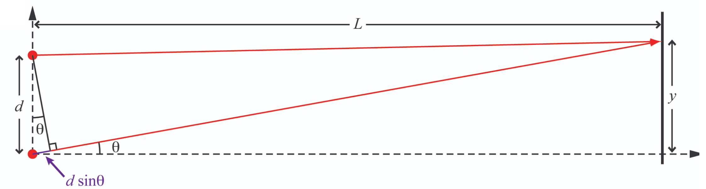
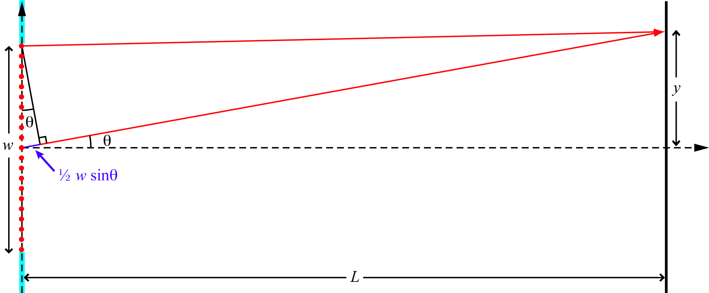
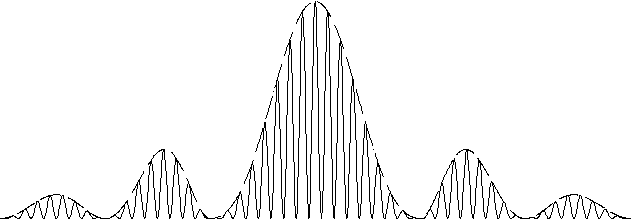
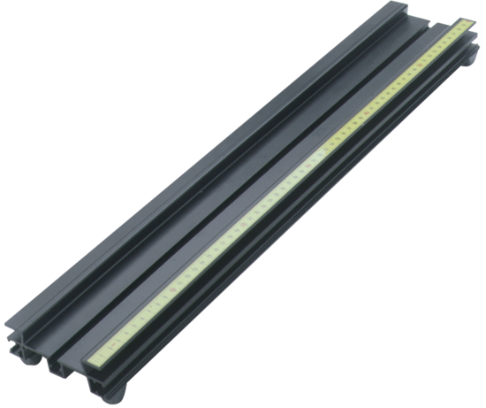
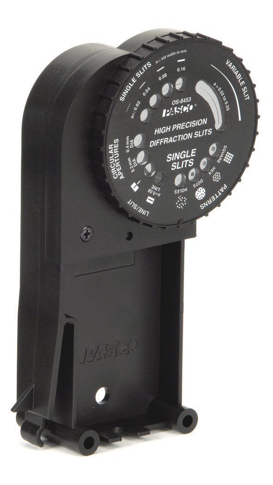
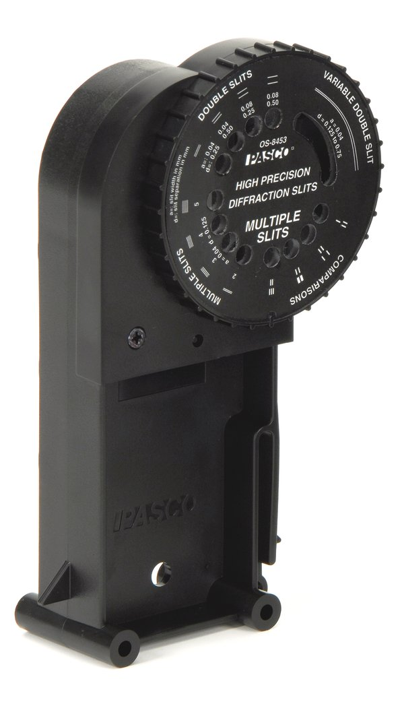

 </img>

# Diffraction & Interference

# Introduction

The notion that light cannot be fully described as either a particle or a wave alone is one of the most counter-intuitive, and fundamental, principles of Quantum Mechanics.
This *wave–particle duality* applies to all fundamental "particles":  In order to fully describe their behavior, both of these seemingly mutually exclusive paradigms must be used.

In this lab you will observe the wave behavior of light and use your observations to measure its wavelength.

# Background

Interference is a property of waves. 
Put simply, waves superimpose - meaning that, when more than one wave is present,  the amplitude at any position and time is the sum of all waves at that position at that time. 
If the superimposing waves are **periodic** and **coherent**, they combine in ways that lead to striking phenomena, which you've learned about in lecture courses: standing waves on a string, diffraction of water waves around a corner, and interference of sound from separated but otherwise identical sources. 
In this lab, you will examine the diffraction and interference of light waves, and then use these phenomena to determine the wavelength of the light from a laser. 
But first, you may find the following re-cap of the underlying physics useful.

Consider two point sources of light that are completely **coherent** (*i.e.*, they emit light of the same wavelength, and do so in phase with each other). 
The light from each point source propagates in all directions, but for simplicity we will consider only a single plane. 
Suppose the point sources are separated by a distance $d$.
We'll use the $(x,y)$ plane and place the light sources at points $(0,0)$ and $(0,d)$.
We can then determine the intensity of the light at different points along a screen, placed a distance $L$ away on the $x$-axis, by considering the superposition of the two light waves at an arbitrary point, $(L,y)$, on the screen.

::: Figure (interference)

Light rays reach a point on the screen where their pathlengths differ by an amount $d\sin\theta$, with consequences discussed in the text.
:::

At the point $(L,d/2)$, the path length for each of the two light waves is equal. 
That means the two waves arrive at the screen in phase with each other, so they add (*i.e.*, interfere) constructively, and make a bright spot at that point.
At any other point on the screen, the path lengths of the two light waves differ, as shown in , 
where the light that comes from the lower point travels an additional length $d \sin\theta$. 
This light arrives at the screen with a phase that is shifted by $\Delta\phi = 2\pi d\sin\theta/\lambda$ with respect to the light from the upper point. 
If the additional path length $d$ is such that $d \sin\theta = \lambda/2$ then the phase shift is $\Delta\phi = \pi$. 
That makes the wave from the lower point exactly the negative of the wave from the upper point, so they interfere destructively and that point on the screen is dark. 

:::Exercise (derivation1stMimimum|4 points)
- Calculate the $y$-coordinate of the point on the screen where this **de**structive interference occurs. 

- Repeat the calcuation assuming that $\theta$ is small (*i.e.*, $L \gg d$), then so that $\tan\theta \approx \sin\theta$
:::

Another special point on the screen, $(L,y_{constr})$, is where the path lengths of the two light waves differ by exactly one wavelength, *i.e.*, $d \sin\theta = \lambda$. 
At this point, the phase of the light that travels the longer path is shifted with respect to that of the light that travels the shorter path by $\Delta\phi = 2\pi d\sin\theta/\lambda = 2\pi$, which has the same effect as no phase shift at all, so the two waves interfere constructively.  
 
:::Exercise (derivation1stMaximum|4 points)
- Calculate the $y$-coordinate of the point on the screen where this **con**structive interference occurs. 

- Repeat the calcuation assuming that $\theta$ is small (*i.e.*, $L \gg d$), then so that $\tan\theta \approx \sin\theta$
:::

The pattern repeats for larger values of $y$: destructive interference occurs at any point for which $\Delta\phi$ is an odd multiple of $\pi$ and constructive interference occurs at any point where the phase difference is an even multiple of $\pi$.

An experimentally direct way to create two coherent light sources is to shine a single laser on something opaque that has two very small holes poked in it. 
If the holes are small enough, they will each behave as a point source from which spherical light waves emanate. 
Because the incident laser light is coherent, the holes will be coherent light sources.  

This is basically the approach that you'll use in this lab, but you'll use *slits* rather than holes. 
If the slit extends in the $z$-direction, a slit is the same as a hole as far as calcuations in the $(x,y)$ plane are concerned,
with the added benefit that a slit can be illuminated without having to aim the laser as carefully!

A possible problem with slits arises if the slits are not narrow enough to be truly ``point'' sources in the $(x,y)$ plane. 

To understand the consequences of passing light through a finite slit width, consider a single slit of width $w$.

::: Figure (diffraction)

Following Huygen's principle, a slit of width $w$ in a light-blocking material (blue) can be thought of as an array of coherent point sources (red dots) situated symmetrically across the $y$-axis, with consequences discussed in the text.
:::

Again considering only the $xy$-plane, it is easy to see that there is constructive interference at the point $(L,0)$ because, for every point source in the slit at a position of say $(0,y_1)$, there is another point source at $(0,-y_1)$, symmetrically across the $y$-axis, which therefore has the same pathlength to the point $(L,0)$. 
The result is constructive interference (*i.e.*, a bright spot) at $(L,0)$.  

Using a similar symmetry argument, it can be shown that destructive interference will also occur at some points $(L,\,y\neq 0)$.  Consider that light from the point at $(0,w/2)$ and light from the point at $(0,0)$ will arrive a point $(L,\,y\neq 0)$ on the screen after travelling different distances.  Their pathlength difference to the point $(L, L\tan\theta)$ will be $(w/2)\sin\theta$, as illustrated in . When the value of $\theta$ is such that $(w/2)\sin\theta = n\lambda/2$, where $n$ is an integer, the light from those two points will arrive out of phase and destructively interfere.
Similarly, light from the point $(0,w/2-\Delta)$ will destructively interfere with light from $(0,-\Delta)$. 
In fact, as long as $L$ is so large compared to $w$ that $\sin\theta \approx \tan\theta$, the light from any point in the upper half of the slit will interfere desctructively with light from a point that lies a distance $w/2$ below it in the lower half of the slit, and the point $(L,y_{\rm destr})$ on the screen will be dark, where
$$
y_{\rm destr} = n \lambda L/ w, ~~{\rm where}~n=\pm 1, \pm 2, \pm 3, \ldots
$$

The resulting pattern of light on the screen is called a **diffraction pattern**; it is a special type of interference pattern that results from light passing through different parts of a finite width slit. 
We say the light "diffracts" through the slit. 

:::Exercise (narrowing|2 points)
- What happens to the position of the first ($n=1$) point of destructive interference (the one closest to the $y$-axis) when the slit gets narrower (*i.e.*, when $w \rightarrow 0$)?
:::

In this lab, you will look at both the diffraction pattern from a single slit and the interference pattern from two slits. 
The pattern from two slits will be a *convolution* of the interference pattern from the two slits and the diffraction from each slit. 

:::Figure (convolution)

A typical pattern created by coherent light passing through two closely spaced, narrow slits.  Note that this pattern was created by a pair of slits whose spacing, $d$, is much larger than their width, $w$.
:::

:::Exercise (convolution|4 points)
Consider the axes in .
- What does the vertical axis represent?  
- What does the horizontal direction represent? 

Now, consider the solid and dashed lines plotted in .
- Which can be attributed to diffraction?  
- Which can be attributed to interference?  
- How can you tell? 
:::

# Instruments

## Optical Bench

A **metal rail** provides a robust way to set and adjust the positions of mounts for optical elements so that they maintain a fixed orientation along a straight line.  A ruler along the side of the rail makes it easy to measure the relative spacing of the elements along that line.
:::Figure (rail)

Photograph of the optics track used in this lab.
:::

## Light Source
A mounted **diode laser** provides collimated, coherent light of a single wavelength.  On the back of the laser are a power socket, an on-off switch, and two thumb screws for fine-tuning the direction of the beam.

::: Figure (laser)

Back, side and front views of the diode laser used in this lab.
:::

## Apertures
Two mounted **rotatable wheels** center your choice of aperture(s) along the optical axis defined by the laser.  

:::::::::Figure (apertures|m|Row)
::::::row
:::col
 
:::
:::col

:::
::::::
Photographs of the aperture wheels.   
:::::::::

One wheel holds single slits of four different widths, a single slit of continuously varying width, and a variety of patterns, including the inverse of a slit (a dark line on a clear background).  The other wheel holds arrays of two, three, four and five slits, all with the same separation between slits, double slits of four different separations, a double slit of continuously varying separation, and a variety of multi-slit arrangements. The relevant dimensions for each aperture or array of apertures are printed on the wheel.  More detailed specifications can be found in the manufacturer's [user's manual](docs/Precision-Diffraction-Slits-Manual-OS-8453.pdf).

## Screen
To see and record the intensity pattern of the light, you have two options: (i) an opaque (metal) screen, or (ii) a translucent (plastic) screen.  The opaque screen allows you to mount a white index card facing the laser, on which you can mark the positions of intensity maxima and minima with a pen or pencil.  The translucent screen allows you photograph the intenisty pattern from behind, so you can later extract the positions of intensity maxima and minima by image analysis.

# Procedure
:::Note
- Take notes as you work through the activities and exercises that follow.  

- It is unlikely that you will have time to complete  and  during the lab period.  
 

- Turn in your notes at the end of your lab period.  Then continue to take notes as you work outside of lab, *e.g.*, analyzing your data.
 

- Once you have finished answering all the exercises, and before your next lab period, turn in your final notes.  These should include answers to all the questions as well as any tables, plots, drawings, screenshots, etc. that you produced.
 
 
- Remember to specify all quantities with (i) appropriate units, if any, and (ii) the correct number of significant figures.
:::

## Think about Safety
The laser you will use in this lab is not high power (<1 mW), but it can still impair or destroy your vision if the beam strikes your eye directly.
:::Card (safety|Do not look directly into the laser beam|Avoid directing or reflecting the beam toward your, or anyone else’s, eyes|bg-UCSB-coral text-white)
Especially when adjusting the optics...
:::

## Align the optical elements

:::Activity (mount|Set Up)
1. Place the laser at one end of the rail.
2. Place one of the slit wheels (you choose) on the rail with its front facing the laser.
3. Plug the laser in and turn it on,
4. Adjust the position of the laser beam from left-to-right and up-and-down until it is centered on the slit.

    Once the beam's position is set, it is not necessary to adjust it further.  Rotating the wheel to a new aperture will not alter the alignment. The slits click into place so you can easily change from one to another, even in the dark. 

5. Place the screen on the rail behind the slit wheel.  
:::

::::::Activity (getFamiliar|Get Familiar)
Play around with the optics bench to understand how it works: slide the elements around, practice measuring the distances between elements.

:::Exercise (schemaitc|4 points)
* Draw a schematic of your setup. 

    The drawing should not be elaborate.  It should be a simple representation of only the essential elements.
    
    Make sure to label the distance between the laser and the slit wheel and the distance between the slit wheel and the screen with different letters, so you can more easily refer to them elsewhere in your notes. 
:::

:::Exercise (wheelPlacement|4 points)
Decide where you will place the slit wheel.  

* What is the distance between the slit wheel and the laser?  
* Why did you choose that distance? 
:::

::::::

## Observe the Intensity Patterns

::::::Activity (diffraction|Diffraction)
Use the Single Slit wheel to view the diffraction patterns created by the four different **single slit widths**. 

:::Exercise (diffractionMetaData|3 points per pattern)
* Record the patterns in your notes.[fn]You are welcome to record the patterns either by marking the locations of the maxima and minima on a paper card clipped to the metal screen, or by taking a photograph of pattern on the translucent screen.  If you choose to take a photograph, be sure to include something of known size (e.g., part of a ruler) in the image for reference. [/fn]

* Somewhere on, near or clearly associated with your record of each pattern, indicate the conditions that went into to creating it (*e.g.*, slit **width**, slit position, screen position)
:::

:::Exercise (diffractionWidth|2 points)
* Qualitatively, how does the separation between maxima and minima change as the slit width changes?
:::

Repeat  for one of the slits and four different slit-to-screen distances.

:::Exercise (diffractionDistance|2 points)
* Qualitatively, how does the separation between maxima and minima change as the slit-to-screen distance changes?
:::
::::::

::::::Activity (interference|Interference)
Use the Multi Slit wheel to view the interference patterns created by the four different **double slit** separations. 

:::Exercise (2slitMetaData|3 points per pattern)
* Record the patterns in your notes.[fn]]You are welcome to record the patterns either by marking the locations of the maxima and minima on a paper card clipped to the metal screen, or by taking a photograph of pattern on the translucent screen.  If you choose to take a photograph, be sure to include something of known size (e.g., part of a ruler) in the image for reference. [/fn]
* Somewhere on, near or clearly associated with your record of each pattern, indicate the conditions that went into to creating it ( *e.g.*, slit **separation**, slit position, screen position)
:::

:::Exercise (interferenceSeparation|2 points)
* Qualitatively, how does the separation between maxima and minima change as the slit separation changes?
:::

Repeat  for one of the slit separations and four different slit-to-screen distances.

:::Exercise (interferenceDistance|2 points)
* Qualitatively, how does the separation between maxima and minima change as the slit-to-screen distance changes?
:::

Use the Multi Slit wheel to view the interference pattern created by the **5-slit aperture** at five different slit-to-screen distances.

:::Exercise (5slitMetaData|3 points per pattern)
* Record the patterns in your notes.
* Somewhere on, near or clearly associated with your record of each pattern, indicate the conditions that went into to creating it.
:::
::::::

## Make the Measurements
:::::::::Activity (analysis|Analyze Data)

You are free to choose whatever method you prefer to measure the distances between features (*e.g.*, minima and maxima) in the intensity pattern.  

* If you recorded them by marking a piece of paper, you may simply use a ruler.  
    
* If you recorded them as photographs (or if you photograph the pieces of paper you marked on) and were careful to include an object of known size in the image, you may use image analysis software.   In this case, I recommend trying the NIH ImageJ-based package called [Fiji](https://imagej.net/software/fiji/) because it is platform independent, has an intuitive user interface, a complete suite of tools, and [good documentation](https://imagej.net/learn/). 

:::Drop (fiji|FIJI tips||bg-UCSB-navy text-white)
Within Fiji you can draw a line anywhere on your image, in any direction, and of any thickness (double-click on the line-selection tool in the toolbar to set the thickness, *a.k.a.* line width). 

Once you’ve drawn a line, you can use the **Plot Profile** command in the **Analyze** menu to create a plot of intensity values (averaged across the width of the line) versus position along the length of the line. 

Pushing the LIST button gives a list of the intensity values used to create the plot. These values can be copied and pasted into your favorite graphing program for further plotting and fitting, if you wish. 

Or you can use the cursor to identify features in the intensity ($y$-axis) and read their position along the line ($x$-axis).  

Read more about this and other commands available in the **Analyze** menu in the  [on-line documentation](https://imagej.nih.gov/ij/docs/menus/analyze.html).
:::

:::Exercise (extractData|1 point per distance, 4 points per question)
* Determine the distances (in mm) from the central maximum to the various intensity minima and maxima in patterns you recorded in  for which you varied $L$
* How did you calibrate the pixel size (*i.e.*, determine the conversion factor between pixels and mm)?
* What conversion factor did you use for each photo?
:::

$\Rightarrow$ **Make sure your data appears in a <a href="https://gauchospace.ucsb.edu/courses/course/view.php?id=20895&section=7" target="_blank" rel="noopener noreferrer">well-formatted table</a> in your notes.** $\Leftarrow$

:::Exercise (plotFit|8 points per plot & fit)
* Plot each set of distances vs $L$.
* Fit each data set to a line and extract the fit parameters. 
:::

$\Rightarrow$ **Record the fit parameters in a <a href="https://gauchospace.ucsb.edu/courses/course/view.php?id=20895&section=7" target="_blank" rel="noopener noreferrer">well-formatted table</a> in your notes.** $\Leftarrow$   $\Rightarrow$ **Make sure it is clear which fit parameters correspond to which condition** $\Leftarrow$

:::Exercise (parameters|2 points per bullet)
For each linear fit from  you should have two parameters: a slope and an intercept. Refer to the equations you found in  and .  
* What information does the slope provide?
* What information does the intercept provide? 
:::

:::::::::

::::::Activity (conclude|Draw Conclusions)

:::Exercise (values|4 points)
Refer to the fit parameters you found and interpreted in  and  of .
* According to your measurements, what is the wavelength of the laser, $\lambda_\mathrm{measured}$? Show your work.
* Which data contributed to this value? 
:::

The manufacturer claims the wavelength of the laser is 650 nm.

:::Exercise (discrepancy|4 points)
- How large a fraction of the manufacturer's value is the discrepancy between your measurement and that value?

- Calculate this proportionate discrepancy by taking the difference and dividing it by the accepted value:
$$
\frac{|\lambda_\mathrm{measured}-\lambda_\mathrm{claimed}|}{\lambda_\mathrm{claimed}}.
$$

- Give your answer as a percentage.
:::

::::::
# Conclusion

:::Exercise (summarize|10 Points)
Write a brief conclusion summarizing the important points of this lab.
:::

:::Summary

You are expected to turn in all plots and tables you are asked to make in the exercises, as well as all answers to questions

:::

<!-- 

Approach
---------------------
Using the instruments above,** you will study the light patterns created by a variety of single and multiple slit apertures, measuring their features and noticing how those measurements depend on the width of the aperture(s) and their separation from each other and from the screen.  Finally, using equations given in the Background section, you will determine the wavelength of the laser.  **

The web-portal for this experiment enables you to manipulate everything as you would in person, and observe the effects of your actions through a live video feed. Through it, you can turn the ambient light and the laser on and off, put any of over a dozen different single and double slits in the path of the laser beam, change the distance between the slits and the screen, and toggle the opacity of the screen. The video feed is displayed at the center of the portal and controls for slit wheel, screen and translation stage are distributed around it, along with links to helpful information.

When the ambient light is on, you should be able to see when the slit wheels are turning as well as when the unobstructed laser light is falling on the screen at the far end.

The POSITION camera is rigidly affixed to the cart that carries screen and looks at a metric tape measure that is mounted along the rail, allowing you to measure the change in position when you move the screen.  Controls for moving the screen are positioned above the live feed.  There is a slider, which allows for large movements, and a pair of green arrows, which move the screen in small ($\sim 1$ cm) increments.

:::Figure:Figure

:::

The SCREEN camera looks down the optical axis from behind the screen.  
It is aimed directly at the laser and slit wheels, as can be seen by clicking the closed eye symbol in the lower left of the webpage, making the screen itself transparent. 

:::Figure:Figure

:::

:::Exercise:
### Determine the number of pixels per centimeter 
*  Using the crosshairs, determine the coordinates of two positions that are separated by $1$ cm.
:::Question
What number of pixels per cm do you find?  Show your work.
:::
* Using the crosshairs, determine the coordinates of two positions that are separated by $10$ cm.
:::Question
What number of pixels per cm do you find now?  Show your work.
:::
:::Question
Which method is more precise?  Explain your reasoning.
:::
:::

Note that the red dot in the lower right of the screen is not yet functional.  If you want to capture an image of a light pattern for analysis in image processing software (*e.g.*, [Fiji](https://imagej.net/Fiji/Downloads)), use your operating system's screenshot function ("cmd-shift-5" on MacOS, "ctrl-shift-S" on Windows)

Measurement
---------------------
:::Exercise
### Gain familiarlity
The first thing you should do is play around with the remote setup to understand how it works. 
Rotate the slit wheels, move the screen and look at the different camera views. 
* Turn on the ambient light and switch to the OVERVIEW camera.
* Click on one of the single-slit apertures (in the left-hand column of the webpage). 
* Watch the slit wheel move.
* Click on one of the multi-slit apertures  (in the right-hand column of the webpage). 
:::Question
How do the slit wheels move in response to this second click?
:::
:::

:::Exercise
### Make qualitative observations
* Use the Single Slit wheel to view the diffraction patterns of *at least* three different slit widths. 
* Take screenshots of the patterns for your notes. 
* Somewhere on, near or clearly related to each screenshot, indicate the conditions that went into to creating it ( * e.g.*, slit width, exposure time, screen position) 

:::Question
How does the separation between maxima and minima change as the slit width changes?
:::
* Go to the smallest of the slit widths you used above. 
* Move the screen to the position furthest from the slits.
* Take a screenshot of the pattern for your notes. 
* Move the screen to the position closest to the slits.
* Take a screenshot of the pattern for your notes. 
* Somewhere on, near or clearly related to each screenshot, indicate the conditions that went into to creating it.
:::Question
How does the separation between maxima and minima change as the distance from the screen to the slit changes?
:::
* Use the Multiple Slit wheel to view the interference patterns of *at least* three different slit separations. 
* Take screenshots of the patterns for your notes. 
* Somewhere on, near or clearly related to each screenshot, indicate the conditions that went into to creating it ( * e.g.* , slit width, slit separation, exposure time, screen position) 
:::Question
How does the separation between maxima and minima change as the slit separation changes?
:::
:::

Now that you have some qualitative familiarity with the phenomena of diffraction and interference, 
it's time to measure the laser's wavelength. 
You will do this using the the Multiple Slit Accessory, with its given values of $d$,  measuring $L$ and $y$, and extracting $\lambda$ from the relations you derived in response to Question $1$ and Question $2$ above. 

:::Exercise
### Measuring the wavelength of the laser

* Move the screen to a position about half-way between its closest and farthest positions.
* Rotate the Multiple Slit wheel to place the 5-slit aperture in the path of the laser beam.
* Take a screenshot of the patterns for your notes. 
* Somewhere on, near or clearly related to the screenshot, indicate the conditions under which it was created.
* Note the position of the screen.
* Use the camera controls and the crosshairs to determine the positions of the intensity maxima.
:::Question
What was your procedure for determining the positions of the instensity maxima?
:::
* Move the screen closer to the slits and repeat.
* Move the screen farther from the slits and repeat.
* Move the screen as close to the slits as possible and repeat.
* Move the screen as far from the slits as possible and repeat.

$\Rightarrow$**Make sure your data  is clearly tabulated.**$\Leftarrow$
:::Question
How can you use this data to determine the wavelength of the laser?  (Hint:  See Questions $1$ and $2$.)
:::
* Plot the average distance between intensity maxima as a function of screen position.
* Perform a least-squared error linear regression (*i.e.*, fit a line to your data).

 $\Rightarrow$ **Make this a well-formatted plot!** $\Leftarrow$
 
:::Question
 Your fit should have two parameters: a slope and an intercept.  
 What are their values?  What do they each provide a measurement of?
:::
* Use the appropriate fit parameter to calculate the wavelength of the laser light.
* The manufacturer claims the wavelength is 650 nm.
:::Question
How large is the discrepancy between your measurement and the claimed value?

Calculate this *proportionate discrepancy* by taking the difference and dividing it by the claimed value:
$$
\frac{|\lambda_\mathrm{measured}-\lambda_\mathrm{claimed}|}{\lambda_\mathrm{claimed}}\,.
$$
Give your answer as a percentage.
:::

:::
-->