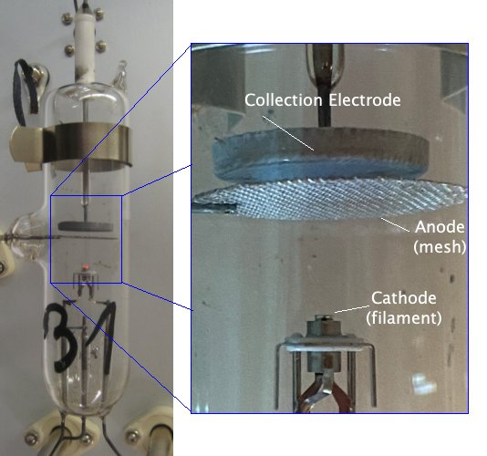
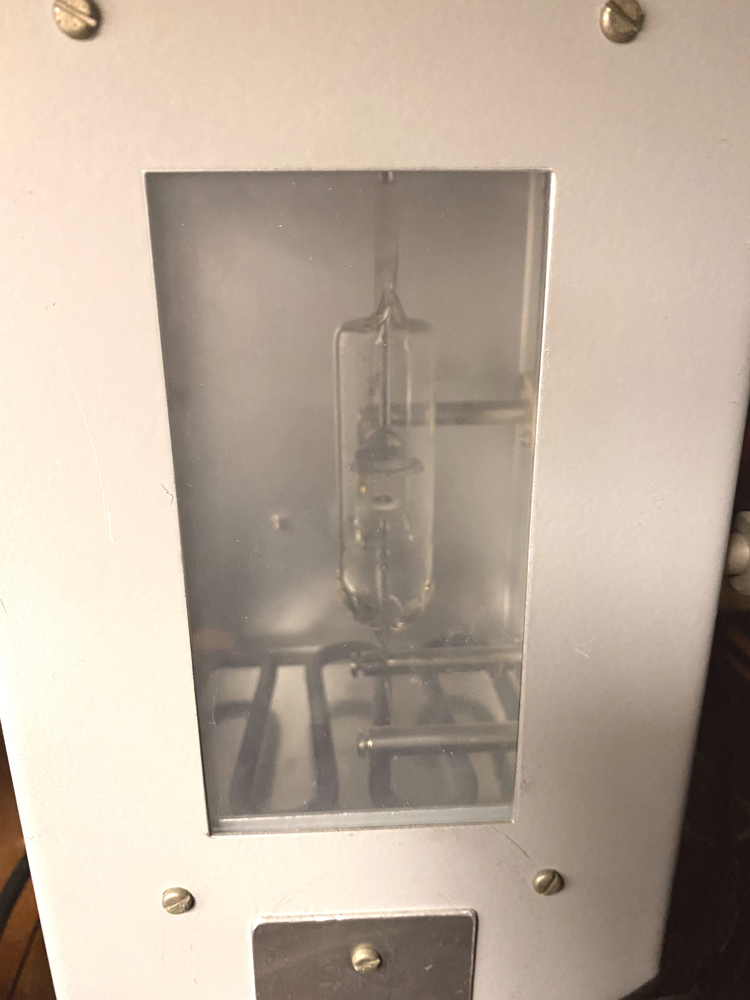
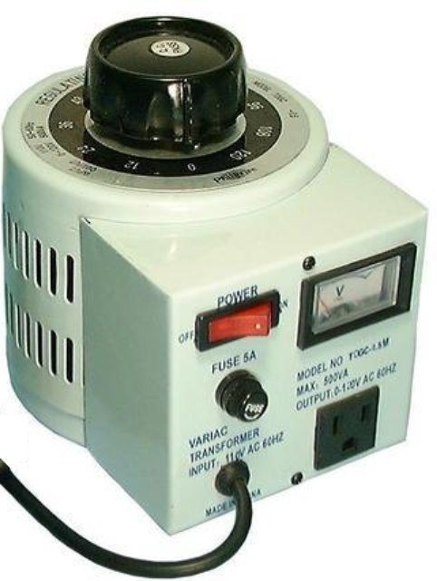
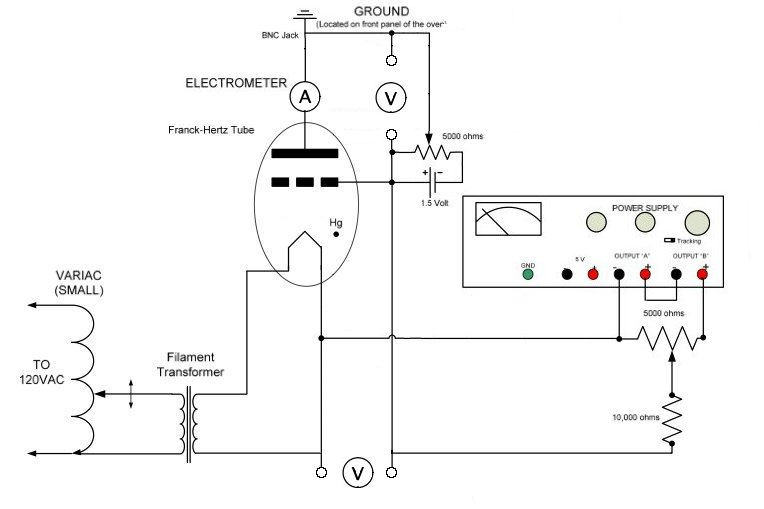
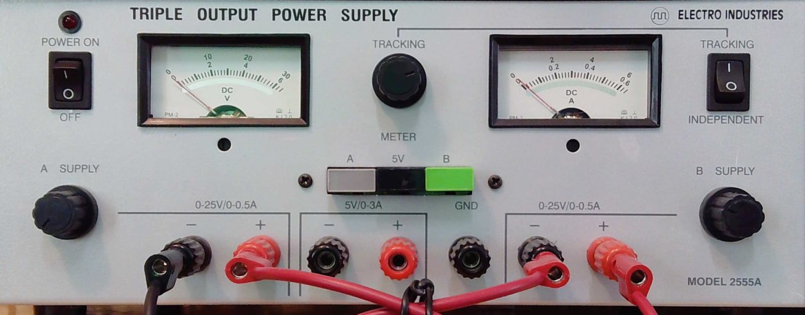
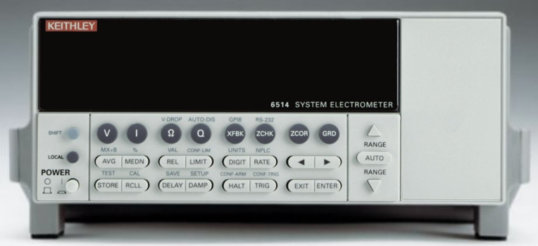
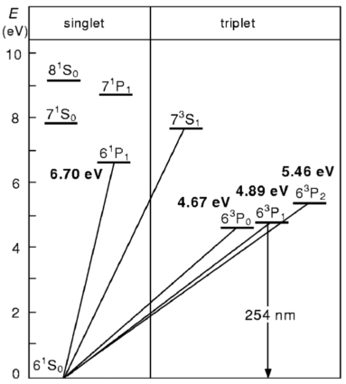

 </img>

# The Franck-Hertz Experiment

# Introduction
When quantum mechanics was first proposed, some physicists wondered if it wasn't just a "trick of the light" because all the phenomena that motivated it (*i.e.*, atomic spectra and the photoelectric effect) involved light. That changed when James Franck and Gustav Hertz provided evidence for quantum mechanics that did not involve light. In this lab you will carry out a modern version of the Nobel-prize winning Franck-Hertz experiment.

# History
In 1911, James Franck was a 29-year old professor of Physics.  Gustav Hertz was a 24-year old gradaute student. Franck and Hertz didn't set out to validate quantum theory.
They conceived their experiment well before Niels Bohr proposed his model of the atom, with the goal of better understanding electron conductivity through gases. But by the time they built their experiment, collected their data and reported their results, it was 1914. The Bohr model of the atom was about one year old.

The Franck-Hertz data offered unequivocal evidence that an atom can accept energy only in discrete (*i.e.*, quantized) amounts. It was crucial to the acceptance of quantum theory because, at that time, photons were still somewhat mysterious but electrons were unquestionably real particles whose kinetic energy could be readily determined.

To hear a first-hand account of the historical context surrounding the Franck-Hertz experiment from Hertz himself (in German, with subtitles), listen to this 

:::Video (Hertz|)
<iframe  height="100%" width="100%" src="https://www.mediatheque.lindau-nobel.org/embed/31437" frameborder="0" allow="accelerometer; autoplay; clipboard-write; encrypted-media; gyroscope; picture-in-picture" allowfullscreen></iframe>
:::

# Background
The Franck-Hertz experiment generates free electrons by heating a cathode inside an evacuated tube (*i.e.*, a vacuum tube). The newly freed electrons accelerate towards an anode because a voltage difference, $V_a$, is imposed between the anode and the cathode. As they move from cathode to anode, the electrons gain kinetic energy $eV_a$, unless they run into something along the way and undergo an inelastic collision.

"*But what could the electrons run into?*" you ask, "*Didn't you just say they are in an evacuated tube?*"

Yes, the tube is evacuated, but it is not empty.
There is a a small amount of mercury in the tube.  Mercury is a liquid at room temperature and pressure.  Under vacuum and with a little heat, it becomes a gas.
When the tube is heated (in an oven), a low pressure gas of mercury atoms occupies the region between the cathode and anode. So the moving electrons can collide with, and scatter off of, the mercury atoms.

Because the mass of a mercury atom ($3\times10^{-22}$g) is a few hundred thousand times greater than the mass of an electron ($9\times10^{-28}$g), and because the kinetic energy of a mercury atom, even in an oven at 200$^\circ$C, is $\ll 0.1$ eV, which is much less than that of an electron that has traveled only a fraction of the distance to the anode, if the two undergo an *elastic* collision the electron's kinetic energy will barely change. 

If they undergo an *inelastic* collision, however, the electron could come away with much less kinetic energy. 

If Hg atoms could absorb an arbitrary amount of energy, electrons that collide with them would lose energy no matter what the value of $V_a$. 
But, if Hg atoms can only absorb discrete energies from the electrons, 
the electrons that collide with them will only lose energy if they have kinetic energy greater than or equal to the lowest (or first) excitation energy of the mercury atoms. 

The Franck-Hertz experiment involves changing $V_a$ and measuring the kinetic energy of the electrons that reach the anode.

In theory, a sudden drop should occur when $eV_a$ reaches the first excitation energy $eV_1$. 
If the voltage is increased above $V_1$, 
an electron that excites a mercury atom in one collision can regain energy after the collision. 
When $eV_a$ reaches $2eV_1$, it becomes possible for an electron to undergo two interactions, 
and again be left with little energy when it reaches the anode. 
This continues as the voltage is increased further; 
we should see drops in the electrons' final kinetic energy 
each time $V_a$ crosses an integer multiple of mercury's first excitation energy.[fn] *But*, you ask,*what if $V_1 < V_2 < 2V_1$? Couldn't electrons lose $eV_2$ instead of $eV_1$?* Yes, in principle.  But the electrons are colliding with mercury atoms very frequently. Unless $V_2 \approx V_1$, it is very unlikely that they will manage to reach an energy of $eV_2$ before undergoing an inelastic collision and losing $eV_1$.[/fn]

There are two complications in the actual experiment. 
First, it is not easy, or necessary, to directly measure the final kinetic energy of the electrons. 
It is simpler, and sufficient, to measure how many electrons are above some kinetic energy threshold. 
This can be done by using a wire mesh for the anode, so the electrons can pass through it, 
and then placing a third electrode beyond it. 
If the voltage difference between the anode and the third electrode is negative, the electrons will slow down as they approach it (they will be attracted back toward the anode).  We call this voltage difference a retarding voltage, $V_r$.   Only electrons with kinetic energy greater than $e(V_a - V_r)$ will reach the third electrode. 

:::Exercise (tooSlow|2 points)
Where do the other electrons go?
:::

Measuring the current collected by the third electrode tells us how many electrons have sufficient kinetic energy to reach it. 
If any electrons lose kinetic energy as they travel from the cathode to the anode, there will be a drop in the current through the "collection electrode".

The second complication is that the electrons don't have exactly zero kinetic energy or even zero potential energy when they leave the cathode.
There are small offsets due to the contact potential of the electrodes (the thermionic emission of electrons from the cathode requires a small amount of energy, 
similar to the work function of the metal that you encountered in measurements of the photoelectric effect.) 
As a result, the value of $V_a$ when the first current drop occurs is not a good measure of $V_1$. 
However, measuring the *difference in voltage between subsequent current drops* removes the bias and can be used to determine $V_1$.

# Instruments

## Vacuum Tube

The apparatus used in this lab consists of a vacuum tube containing (see )
* a **filament cathode** that ejects electrons upon heating, 
* a **wire mesh anode** that allows electrons to pass through it, 
* a **collection electrode** that receives only the most energetic electrons, and 
* a small amount of **mercury (Hg)** that transforms from liquid to vapor upon heating.  

::: Figure (vacuumTube)

At left is a snapshot of the entire vacuum tube, as attached to the interior of the oven.  Note the droplet of liquid Mercury that has condensed on the glass in the lower half of the tube, just right of center, near the written numeral '1'. At right is an annotated close-up of the key electrical elements.
:::

## Oven

:::Figure (oven|m|L)

The vacuum tube is mounted directly above the heating coils inside the oven
:::

:::Figure (largeVariac|m|R)

 A **VARI**able **AC** source is just a large transformer with a variable number of windings. 
:::

The vacuum tube is housed inside an **oven** () that is connected to a **large variac** ().  The oven consists of a metal casing with windows on two sides and feed-throughs for electrical connections on a third side.  A thermometer (not shown) enters the oven from above.

A large variac connects a resistive heating element in the bottom of the oven to the 120V AC wall power.  The peak-to-peak AC voltage across the heating element is controlled by rotating the large, black knob, on top of the variac and can be read off the needle gauge on the front of the variac.  

<!-- ## Mercury

Mercury vapor provides a dilute monoatomic gas for the free electrons to interact with.   -->

## Electronics

A schematic of the tube and its direct electrical connections is shown in 
:::Figure (wiring)

The central oval represents the vacuum tube.  The filament cathode is drawn as a pointed line at the bottom of the tube.  The grid anode is represented as a thick, broken line in the upper half of the tube.  The collection electrode is a thick, solid line slightly above the grid anode.
:::

A **small variac** provides power to heat the filament.  Like the large variac, the small variac draws a variable amount of 120V AC wall power. However, instead of feeding current directly to the filament, the small variac's electrical connection goes through a second transformer.  This way, the electrical potential of the filament can be determined by a different circuit. 

A pair of variable resistors – also known as a **potentiometers** or "pots" – provide adjustable voltages: one between the anode and the cathode to accelerate the electrons ($V_a$). The other between the anode and the collection electrode to hold the collection electrode at a potential slightly below that of the anode ($V_r$). The latter retards electrons that pass through the anode, so that only the most energetic electrons are detected.    

:::Exercise (FH_circuit|7 points)
Put a copy of the electrical schematic in your notes.  Identify and label: 
* the filament
* the anode
* the cathode
* the potentiometer that adjusts $V_a$
* the voltmeter that measures $V_a$
* the potentiometer that adjusts $V_r$
* the voltmeter that measures $V_r$
:::

The retarding voltage is provided by a 1.5V D-cell battery (not visible).  The accelerating voltage is provided by a **DC power supply** ().

:::Figure (40Vsupply)

This DC power supply has two channels, each capable of delivering 20 V.  The channels can be operated independently or in "Tracking" mode, using the switch in the upper right corner.  When in "Tracking" mode, a single knob, centered between the needle gauges that display the voltage (left) and current (right) being delivered, sets the output of both channels to the same value.  By wiring the channel outputs in series (as shown in the photo) a maximum of 40 V can be supplied.
:::

Finally, the electrons that make it to the collection electrode are detected by a sensitive **electrometer**. This instrument can reliably detect mere fractions of a picoampere (1 pA = $10^{-12}$A).

:::Figure (electrometer)

Click here to access the [electrometer user's manual](docs/Keithley6514manual.pdf) in PDF format. 
:::

:::Exercise (electrometer| 2 points per bullet)
The electrometer has ten ranges for current measurement, with the full scale
values ranging from 20 pA to 20 mA. 

* When the range is set to 20 pA full-scale, how many digits after the decimal point are displayed? 

* How many electrons per second does a single unit in that smallest decimal place represent?  (Recall that 1 Ampere = 1 Coulomb per second and 1 Coulomb $= 6.2\times10^{18}$ elementary charges)
:::

# Procedure
:::Note
- Take notes as you work through the activities and exercises that follow.  

- It is unlikely that you will have time to complete  and  during the lab period.  
 

- Turn in your notes at the end of your lab period.  Then continue to take notes as you work outside of lab, *e.g.*, analyzing your data.
 

- Once you have finished answering all the exercises, and before your next lab period, turn in your final notes.  These should include answers to all the questions as well as any tables, plots, drawings, screenshots, etc. that you produced.
 
 
- Remember to specify all quantities with (i) appropriate units, if any, and (ii) the correct number of significant figures.
:::

You will measure the potential difference between successive minima in the current that arrives at the collection eletrode as you vary the accerating voltage imposed between the anode and the cathode.

## Prepare the Instruments
::::::Activity (warmup|Power On, Warm Up, Zero Out)

1. The first thing you should do when you start to work is warm up the oven to establish a stable vapor pressure of Hg in the tube.

    Insert the thermometer into the oven so that its bulb is even with the mid section of the tube. Then turn the large variac on and slowly adjust its knob to about "78". Be aware that the thermal response time is large. It may take 10 - 15 minutes for the oven to stabilize in temperature, and if it doesn't stabilize to the right temperature, adjusting the variac knob will not cause an immediate change. It is best to make small changes and patiently monitor the thermometer.

    The target temperature is in the 170$^\circ$C − 190$^\circ$C range, which corresponds to a [vapor pressure of Hg](www.govinfo.gov/content/pkg/GOVPUB-C13-66a1ade54071892930184393b1802e69/pdf/GOVPUB-C13-66a1ade54071892930184393b1802e69.pdf) of ~1 kPa. As you work through the lab, monitor the oven temperature regularly and adjust accordingly.
    
2. Next, turn on the Keithley 6514 electrometer, switch to current mode, and give it time to warm up.
    
    Since the Keithley 6514 electrometer is central to your measurement, you may be curious to understand its operation.  You can refer to its [user's manual](docs/Keithley6514manual.pdf). You will notice that it can be used to measure voltage, current, resistance or charge.  When powered on, it defaults to voltage measurement mode. For this lab, current measurement is the only relevant capability.  
    
    Most equipment has a "warm up" period. This is simply the time it takes for all the heat production and dissipation mechanisms to come to equilibrium so that the device's components remain at a constant temperature. Variations in temperature can alter operational details of electronics, such as amplifier gains and leakage currents. The electrometer in particular has calibration circuitry that measures and corrects for most temperature dependent effects, but operating at a stable temperature still improves its precision.

3. Set the electrometer to read 2 nA full-scale.

    You should see a non-zero, fluctuating value on the display with no letters "Z" or "C" after the nA units.  The "Z" and "C" letters are explained in the next step, but at this stage, they should not be present.  If they are, press the ZCOR button until they go away.  If ZCOR alone doesn't turn them  off, press the ZCHK button once and try again.

4. Set the readout rate to SLOW.

    Press the RATE button and notice the change in the display.  

5. Zero any offset currents
    
    The Keithley 6514 electrometer is capable of measuring very small currents with great precision, but that precision requires some careful procedures. In particular, it is helpful to  correct for any offset currents. This can be done with the Zero Check and Zero Correct functions. 

    When Zero Check is enabled, the input signal is shorted so that the input amplifier sees only offset currents and voltages that are not part of the input signal and thus should be subtracted. That subtraction can, and should, be done internally using the Zero Correct function, following the procedure below. 

:::Card
### Zero Correction procedure to remove offsets

1.  If you haven't already, select the current measuring mode by pressing I. 

2.  Select an appropriate measurement range.

3.  Press ZCHK to enable Zero Check mode. You should see a "ZC" message
    appear to the right of the units on the display.

4.  Press ZCOR to subtract the reading in Zero Check mode from future readings. You should see a "ZZ" message appear in the display.

5.  Finally, press ZCHK a second time to disable the Zero Check mode.
    You should see a "CZ" message appear in the display to indicate that the  readings are being corrected for any zero point offsets.

6.  If you ever want to abandon the Zero Correct mode, for example, if you want to check whether it is dramatically affecting your measurement, just press ZCOR a second time.
:::

 :::Card (currentWarning|ALWAYS repeat the zero correction procedure before making a measurement on a more sensitive scale than the last||bg-UCSB-coral text-white)
  The offset currents in the machine depend on the measurement scale.  If you correct the offsets at a less sensitive scale and then move to a more sensitive scale without repeating the zero correction procedure, the readings on the more sensitive scale will likley be incorrect because too large of an offest is being subtracted.
  :::
::::::

::::::Activity (pots|Establish Potentials)
1. Set the retarding potential to 1.3 V.

2. Set the accelerating potential to 40 V. 

3. Heat the filament.

    Make sure the knob on the filament variac is set to zero (fully counter-clockwise). Then heat the filament **slowly**. Turn the filament variac knob $\sim 90^\circ$ and wait for the current detected by the electrometer to stabilize.  Then turn it another $\sim 90^\circ$ and, again, wait for the current to stabilize.  

    If the current exceeds $1$ nA before the filament variac knob has been turned more than about halfway, shut the filament off immediately and notify the instructor.  This could indicate that the filament is overheating.
    
    Otherwise, continue increasing the power to the filament (turning the variac knob in small increments and waiting for the current to stabilize between turns) until the current reading on the electrometer is between $0.75$ and $1.0$ nA.  Try not to go much beyond $1.0$ nA but if you do, just gradually reduce the filament power to lower the current to just below $1.0$ nA.

    :::Card (currentWarning|Be Prepared – As you reduce $V_a$, the current may go up.||bg-UCSB-coral text-white)
    This is ok, but a current $\sim 2.0$ nA can permanently damage the filament. This is why it is important that the current you measure when $V_a = 40$ V should not exceed 1 nA.
    :::

::::::

## Observe the Current
::::::Activity (coarse|Coarse Voltage Sweep)

Now that the temperature of the oven and the current from the filament have stabilized, and the accelerating voltage is at its maximum value ($40$ V), you are ready to start collecting data.  First,  take a "coarse" measurement to get a general sense for how the current changes as a function of the accelerating voltage.  Don't bother waiting very long for the current to settle to a stable value at each voltage setting.  Give it a few seconds and just jot its value down.

:::Exercise (sweepDown| 12 points) 
* Set $V_a$ to the highest value and note the electrometer current, $I$. 
* Reduce $V_a$ by ~1 V. Note the value of $V_a$ and the value of $I$.
* Repeat a few dozen times, until you reach $V_a = 0$ V.
:::

$\Rightarrow$ **Make sure your data appears in a <a href="https://gauchospace.ucsb.edu/courses/course/view.php?id=20895&section=7" target="_blank" rel="noopener noreferrer">well-formatted table</a> in your notes.** $\Leftarrow$

:::Exercise (roughPlot| 6 points)
* Plot $I$ vs $V_a$.

$\Rightarrow$**It is NOT necessary to make a well-formatted plot at this stage.   A "quick and dirty" plot is all that's is needed.**
$\Leftarrow$

* What are the most interesting/important features of the data in your plot?
:::
::::::

::::::Activity (fine|Fine Voltage Sweep)
Now that you know roughly what the data will look like, take a "fine" measurement, gathering high resolution data $(V_a, I)$ in the most interesting regions as you increase $V_a$ back to $40$ V.

:::Exercise (sweepUp| 3 points per feature) 
* Set $V_a$ to a value just below the first interesting feature and note the electrometer current, $I$. 
* Increase $V_a$ gradually, let the current stabilize, and note the value of $I$.
* If you find you step past the feature of interest, it is ok to go back and collect more points.
* Move to a $V_a$ vlue just below the next interesting feature and repeat.
:::

$\Rightarrow$ **Make sure your data appears in a <a href="https://gauchospace.ucsb.edu/courses/course/view.php?id=20895&section=7" target="_blank" rel="noopener noreferrer">well-formatted table</a> in your notes.** $\Leftarrow$

<!-- :::Activity (shut down| Shut down)
1. Return $V_a$ to zero.
2. Return $V_r$ to zero.
3. Turn the filament Variac knob to zero, then turn the filament Variac off.  
4. Turn the oven Variac knob to zero, then turn the oven Variac off.
5. Turn off the electrometer.  
::: -->

:::Exercise (logic| 4 points)
* What features did you focus on and why?
:::
::::::
## Make the Measurements
::::::Activity (analysis|Analyze Data)

:::Exercise (plot I(V_a)| 12 points)
* Plot $I$ vs $V_a$.

$\Rightarrow$**Make this a well-formatted plot.**$\Leftarrow$
:::

:::Exercise (assess| 2 points)
* How many cycles of current peaks and minima did you see?
:::

:::Exercise (planMeasuring| 4 points)
Let $V^\mathrm{max}_n$ be the $n^\mathrm{th}$ value of $V_a$ at which $I$ goes through a maximum.  
Let $V^\mathrm{min}_n$ be the $n^\mathrm{th}$ value of $V_a$ at which $I$ goes through a minimum. 

* How will you extract values for the $V^\mathrm{max}_n$ and the $V^\mathrm{min}_n$ from your data?
* What values did you get? 

$\Rightarrow$ **Give your answer in a <a href="https://gauchospace.ucsb.edu/courses/course/view.php?id=20895&section=7" target="_blank" rel="noopener noreferrer">well-formatted table</a> in your notes.** $\Leftarrow$
:::

::::::

::::::Activity (conclude|Draw Conclusions)
Refer to the fit $V_n$ you obtained in  .
To calculate the first excitation energy of Mercury, $E^\mathrm{Hg}_\mathrm{1}$, you could:
* fit a line to each series of $V_n$ and report the average of their slopes,  or
* calculate the differences $\Delta = (V_i - V_j)/(i-j)$  for all $i,j\leq n$ and $i\neq j$ and report the average difference, or
* come up with, and justify, another way.  

Keep in mind that the absolute voltage is biased by potential offsets so, instead of using the voltage values directly, you should use the differences between consecutive peaks or consecutive minima for your measurement.

:::Exercise (planCalculating| 4 points)
* What approach will you use to  calculate $E^\mathrm{Hg}_\mathrm{1}$?
:::

Whatever your approach, you will end up with a measurement in Volts, which you will have to multiply by the elemental charge, $e$, to get an energy (in eV).

:::Exercise (calculateFromData| 6 points)

* Calculate $E^\mathrm{Hg}_\mathrm{1}$ based on your data. (Show your work.)

* What value did you use for $e$?
:::

The quantum structure and energy levels of Mercury's lowest lying excited states are given in the following figure.

::: Figure (HgLevels)

The lowest energy levels of the Mercury atom, labeled in [term symbol notation](https://en.wikipedia.org/wiki/Term_symbol). The four lowest transitions energies are written in bold near their corresponding diagonal lines. The vertical down arrow indicates a radiative transition back to the ground state and is labeled with the  wavelength of the corresponding photon.[fn] [Rapior, Sengstock and Baev, American Journal of Physics 74, 423 (2006).](https://doi.org/10.1119/1.2174033))[/fn]
:::

:::Exercise (calculateFromLambda| 4 points)
* Predict $E^\mathrm{Hg}_\mathrm{1, predicted}$ based on the information given in .  
* Explain your reasoning.
:::

:::Exercise (discrepancy| 4 points)
* How large a fraction of the predicted value is the discrepancy between your measurement and the predicted value?

* Calculate this proportionate discrepancy by taking the difference and dividing it by the accepted value:
$$
\frac{|E_\mathrm{1\,measured}-E_\mathrm{1\,accepted}|}{E_\mathrm{1\,accepted}}
$$
* Give your answer as a percentage.
:::

::::::
# Conclusion

:::Exercise (summarize|10 Points)
Write a brief conclusion summarizing the important points of this lab.
:::

:::Summary

You are expected to turn in all plots and tables you are asked to make in the exercises, as well as all answers to questions

:::
