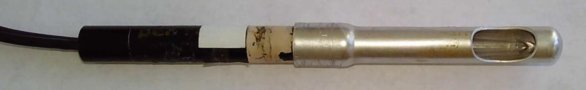
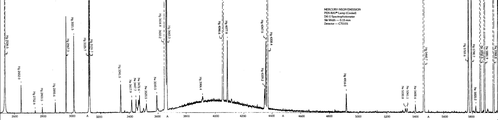
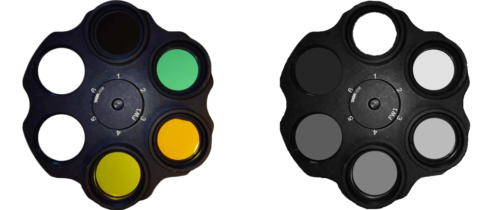
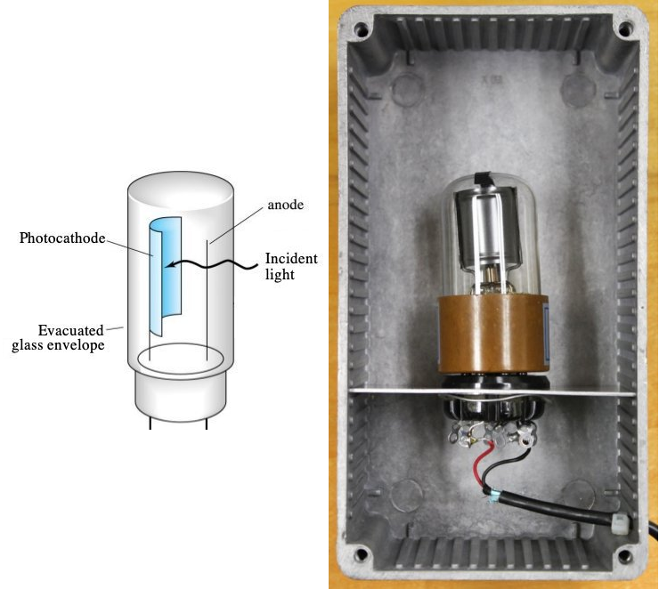
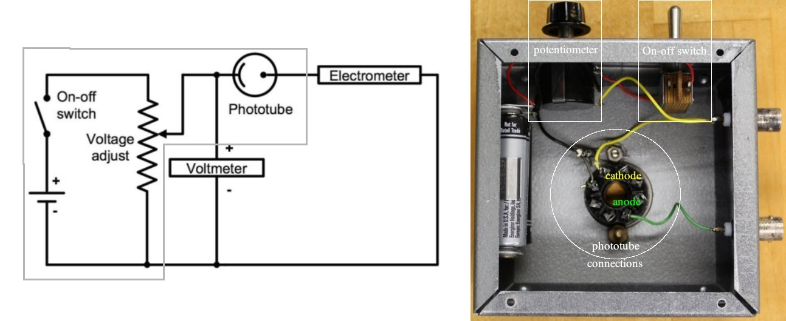
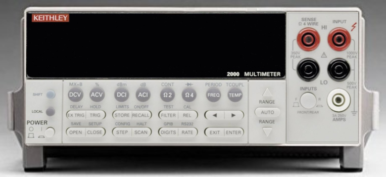

 </img>

# The Photoelectric Effect

# Introduction

Two critical experimental observations provided irrefutable evidence that light was not merely wavelike, but also had particle-like aspects: the blackbody spectrum and the photoelectric effect. 
In this lab you will explore the photoelectric effect and use it to measure Planck's constant.

# History

Quantum Mechanics was developed in the early 1900's, but the evidence for it began to appear even in the late 1800's. 
For example, in 1887 Heinrich Hertz noticed that sparks started more rapidly when electrodes were illuminated with ultraviolet (UV) light. 
Other investigators later determined that free charges (*i.e.*, electrons) were emitted from metal electrodes illuminated by UV light. 
These were called **photoelectrons**. 
Some metals, mostly the alkali metals in the first column of the periodic table, produced a steady supply of photoelectrons (called a **photocurrent**) when illuminated by either UV light or visible light, but other metals only did so for UV light. 
Detailed measurements of this **photoelectric effect** established the following characteristics:

1.  For a given metal, there exists a definite cut-off frequency, $\nu_0$. 
    Incident light with frequency below $\nu_0$ produces no photocurrent regardless of its intensity.

2.  For light with frequency $\nu>\nu_0$, the magnitude of the photocurrent produced is 
    directly proportional to the intensity of the incident light.

3.  The maximum kinetic energy of the photoelectrons does not depend on the intensity of the light, 
    but it is proportional to the frequency of the incident light.

These characteristics could not be explained by the classical description of light as a wave that continuously transmits energy in proportion to the intensity of the light. 
No, these observations require a completely different description for light

In a paper published in 1901, Planck proposed to describe light as consisting of discrete bundles of energy, rather than as a continuous stream of energy. 
Today we call the bundles, or "quanta, of energy **photons**. 
Each photon carries an energy of $E=h\nu$, where $h$ is Planck's constant with units of energy times time. 
The name of this constant honors Planck because he was the first to use the idea of quanta (to explain the blackbody radiation spectrum). 
Then, in 1905, Einstein used it to explain the photoelectric effect.  <!-- [^1] ([^1]:)  -->
(Einstein's quantum explanation for the photoelectric effect is described concisely in a three page section of [his paper, Ann. Physik 17, 132 (1905)](https://aapt.scitation.org/doi/abs/10.1119/1.1971542?journalCode=ajp), and was the reason for his subsequently being awarded the Nobel Prize.)

For a fun, yet scholarly, presentation of the historical context surrounding the photoelectric effect, watch this 

:::Video (Kathy_on_Einstein|)
<iframe  height="100%" width="100%" src="https://www.youtube.com/embed/BiPEY99w8Lo" frameborder="0" allow="accelerometer; autoplay; clipboard-write; encrypted-media; gyroscope; picture-in-picture" allowfullscreen></iframe>
:::

# Background
Einstein explained the photoelectric effect as follows:
$$
\.
$$
- A photon of incident light transfers *all of its energy* to an electron in the metal. 
- If that energy is sufficient, it can dislodge the electron from the metal  
&nbsp;&nbsp;&nbsp;&nbsp;(*i.e.*, it does some amount of work, $W$, to overcome the potential energy binding the electron in the metal). 
- Any excess energy goes into the kinetic energy of the ejected electron,
$$
E= W +\frac{1}{2} m_e v^2 
$$

Experimentally, it is important to realize that not every electron in the material experiences the same potential. 
This means that the work required to eject the electrons varies and so, even if all the photons have the same energy, the kinetic energy of the photoelectrons will vary. 
However, the work required to eject electrons is never zero.
There is a minimum amount of work, $W_\mathrm{min}$, required to eject the most loosely bound electrons, which will then leave the material with a maximum amount of kinetic energy. 
$$
E = W_\mathrm{min} +\frac{1}{2} m_e v_\mathrm{max}^2 
$$
This is key because, while it is difficult to measure the photoelectrons' individual kinetic energies, 
it is straightforward to measure their *maximum* kinetic energy. 
This is done by applying a **stopping voltage** that any photoelectron must overcome in order to be detected.
A measurement of the smallest stopping voltage that suffices to make the photocurrent go to zero is therefore the voltage, $V_s$, that is able to stop the most energetic photoelectrons, $eV_s = \frac{1}{2}m_ev_{\rm max}^2$. Thus, for an experiment in which all the photons have the same energy, $E=h\nu$, Einstein's equation becomes
$$
h\nu = W_\mathrm{min} + eV_s
$$

In this lab, you will control $\nu$ and measure $V_s$, so it makes sense to rearrange this equation to get $V_s(\nu)$
$$
V_s = \frac{h}{e}\nu - \phi
$$
where the greek letter $\phi$ ("phi"), also known as the **work function** of the metal, is used in place of $W_\mathrm{min}/e$. 
This equation represents a straight line on a graph of $V_s$ vs. $\nu$, with a slope of $h/e$ and a $y$-intercept of $\phi$. 
Thus, by measuring $V_s$ for different frequencies of light and fitting such a line you will determine both Planck's constant and the metal's work function.

# Instruments

## Light source
A **mercury (Hg) discharge lamp** () provides the light that will eject electrons from the metal.  Mercury is an ideal light source for this purpose because it emits a lot of light, but only in a small number of wavelengths.  

::: Figure (lamp)

Photo of a Pen-Ray&copy; lamp made by UVP. <!--(Insert model number here!)-->
Product details and technical data are available [on the UVP website](https://www.uvp.com/en/products/ultraviolet-products/uvp-pen-ray-light-sources/mercury-lamps/)
:::

This is evident from a plot of Mercury's emitted light intensity as a function of wavelength ().  This kind of plot is called an *emission spectrum*.

::: Figure (HgEmission)

Hg emission spectrum. The horizontal axis is wavelength in Ångströms ( $1$Å $=10^{-10}$m), the vertical dashed lines are the edges of peaks whose intensities are too large to plot on the vertical scale used, and the numbers labelling each peak indicate that peak's central wavelength, again in Ångströms.  To zoom in, right-click on the image and open in a new window.
:::

## Light filters
An **interference filter** transmits light only in a narrow range of wavelengths, $\lambda \pm \Delta\lambda$, and blocks light of all other wavelengths.  Placing different interference filters in front of the Hg-discharge lamp allows photons from only one (or occasionally two) of the peaks in the Hg emission spectrum to fall on the photocathode.

A **neutral density (ND) filter** attenuates light uniformly across a wide range of wavelengths.  Placing different ND filters in front of the Hg-discharge lamp changes the intensity of the light (i.e., the number of photons per unit area) that falls on the photocathode.  **Note**: ND filters are specified by -log$_10$ of their attenuation factor.  A filter that reduces the light intensity by 1/10 has an **optical density** of 1 (also referred to as OD 1).  A filter that reduces the light intensity by 1/100 has an optical density of 2 (or OD 2). 

The filters for this lab are mounted on rotating wheels () so that you can select which one(s) to place in front of the light source.

:::Figure (filterWheels)

**Left:** Wheel of interference filters. Click on the link corresponding to a filter's position in the wheel to view its transmission spectrum:  [1](docs/curv_f365.pdf), [2](docs/curv_f436.pdf), [3](docs/curv_f546.pdf), [4](docs/curv_f577.pdf). 
**Right:** Wheel of neutral density filters. Position 1 is open.  Positions 2, 3, 4, 5, and 6 have [OD_0.1](docs/curv_OD_01%2605.gif), [OD_0.5](docs/curv_OD_01%2605.gif), [OD_1](docs/curv_OD_1%262.gif), [OD_2](docs/curv_OD_1%262.gif), [OD_3](docs/curv_OD_3%264.gif), and [OD_4](docs/curv_OD_3%264.gif), respectively. Click on the links to view their transmission spectra.
:::

## Electronics

A **phototube** is a clear glass container that holds two metal electrodes under vacuum.  One of the electrodes is a large, curved rectangle.  The other is a thin cylinder. (See .) 

The curved rectangle is called the **photocathode** — *cathode* because it attracts cations (or positive charges) and repels (or, in this case, ejects) anions (in this case, electrons) –– and *photo* because it will only do so so when light hits it. The thin cylinder is called the *anode* because it attracts anions (*i.e.*, electrons).

The photocathode's inner surface is coated with a special alloy of Cesium (Cs) and Antimony (Sb) in which electrons are not very tightly bound, and so can be ejected by relatively low-energy (*i.e.*, visible) photons.

Removing gas particles from the space between the electrodes greatly reduces the chances that ejected electrons will collide with anything as they travel from the cathode to the anode. The vacuum isn’t perfect, of course, but it is good enough that some of the ejected electrons reach the anode without losing any energy... which is crucial for measuring the maximum kinetic energy of the ejected electrons. 

:::Figure (photoTube)

Schematic (left) and photograph (right) of the phototube used in this experiment.  You can't see the phototube because it is mounted inside a metal box that has only one small hole to let in the light from the Hg lamp and is otherwise light-tight.
:::

A **variable voltage circuit** () puts an adjustable voltage across the phototube (*i.e.*, between the anode and the cathode). The voltage source is a pair of AA batteries, connected in series. The voltage is adjusted by turning the knob of a variable resistor (also known as a *potentiometer*). The circuit is connected so that the anode can have a more negative potential than the photocathode.  This negative potential is the *stopping voltage* discussed in <ins>Part III: Background</ins>.

:::Figure (circuit)

Schematic (left) and photograph (right) of the electric circuit that places an adjustable stopping voltage between the photocathode and the anode.  The gray box on the schematic encloses the elements contained in the metal box in the photograph.
:::

A **digital multimeter (DMM)** measures the potential difference between the photocathode and the anode and a **system electrometer** measures the photocurrent. The electrometer is an especially sophisticated instrument that can reliably detect fractions of a picoamp (1 pA = $10^{-12}$A)

:::Figure (meters)

  

Front views of the [digital multimeter](docs/Keithley2000manual.pdf) and [electrometer](docs/Keithley6514manual.pdf).  Click on the links to access their User Manuals.
:::

# Procedure
:::Note
- Take notes as you work through the activities and exercises that follow.  

- It is unlikely that you will have time to complete  and  during the lab period.  
 

- Turn in your notes at the end of your lab period.  Then continue to take notes as you work outside of lab, *e.g.*, analyzing your data.
 

- Once you have finished answering all the exercises, and before your next lab period, turn in your final notes.  These should include answers to all the questions as well as any tables, plots, drawings, screenshots, etc. that you produced.
 
 
- Remember to specify all quantities with (i) appropriate units, if any, and (ii) the correct number of significant figures.
:::

## Prepare the Instruments

::::::Activity (warmup|Power On, Set Up)

1. The first thing you should do when you start to work is turn on the Hg lamp and the two meters so that they have time to warm up.

    Most equipment has a "warm up" period, which is simply the time it takes for all the heat production and dissipation mechanisms to come to equilibrium so that the device's components remain at a constant temperature. Variations in temperature can alter operational details of electronics, such as amplifier gains and leakage currents. The electrometer in particular has calibration circuitry that measures and corrects for most of these temperature dependent effects, but operating at a stable temperature still improves its precision.

2. Set the meters to the appropriate measurement mode using the front panel buttons.

    The meters are central to your measurement, so you may be curious to understand their operation. Skim the table of contents of the [DMM User's Manual](docs/Keithley2000manual.pdf) and the [electrometer User's Manual](docs/Keithley6514manual.pdf). Notice that they can both be used to measure voltage, current, or resistance.  (The DMM can also measure frequency and temperature.  The electrometer can also measure charge.)  When powered on, they both default to voltage measurement mode. For this lab, you will use the DMM to measure the stopping voltage betwen the photocathode and the anode and the electrometer to measure the photocurrent.

3. Set the appropriate measurement ranges using the up and down arrow (triangle) keys.

    The appropriate range is the one that offers the greatest precision without saturating. 

:::Exercise (Vs | 2 points per question)
- How many full rotations are required to sweep through the entire range of the potentiometer? 

- What is the highest stopping voltage you can apply?

- What range did you set the DMM to?
:::
  

:::Exercise (electrometer|2 points per question)
The electrometer has ten ranges for current measurement, with the full scale values ranging from 20 pA to 20 mA. 

- When the range is set to 20 pA full-scale, how many digits after the decimal point are displayed?

- How many electrons per second does a single unit in that smallest decimal place represent?
    (Recall that 1 Ampere = 1 Coulomb per second and 1 Coulomb $= 6.2\times10^{18}$ elementary charges)

- What range did you set the electrometer to?
:::
    
4. Set the RATE setting to SLOW.

5. Set the DIGIT setting to display 2 or 3 digits after the decimal point.

    Displaying more digits provides greater precision, but temporal variations typically limit the usable level of precision. 
::::::

::::::Activity (zero|Zero Correct)
The Keithley 6514 electrometer is capable of measuring very small currents with great precision, but that precision requires some careful procedures. In particular, it is helpful to calibrate and correct for any offset currents. This is done with the Zero Check and Zero Correct functions.

When Zero Check is enabled, the input signal is shorted so that the input amplifier sees only offset currents and voltages that are not part of the input signal and thus should be subtracted. That subtraction can, and should, be done internally using the Zero Correct function, using the following procedure:

**Zero Correction procedure to remove offsets**

1. Press ZCHK to enable Zero Check mode. 
    - You should see a "ZC" message appear to the right of the units on the display.
  
2. Press ZCOR to subtract the reading in Zero Check mode from future readings. 
    - You should see a "ZZ" message appear in the display.
  
3. Finally, press ZCHK a second time to disable the Zero Check mode. 
    - You should see a "CZ" message appear in the display to indicate that the readings are being corrected for any zero point offsets.

- If you ever want to abandon the Zero Correct mode, for example, if you want to check with it is dramatically affecting your measurement, just press ZCOR a second time.
  
- It is reasonable to perform the zero correction procedure between each set of measurements ( e.g., for each new filter) to compensate for any drifts that may occur over time.
  
- It is essential to repeat the zero correction procedure before making a measurement on a more sensitive scale than the last. 
    - The offset currents in the machine depend on the measurement scale. If you correct the offsets at a less sensitive scale and then move to a more sensitive scale without repeating the zero correction procedure, the readings on the more sensitive scale will likley be incorrect because too large of an offest is being subtracted.
::::::

## Observe the Photocurrent

Placing different interference filters between the Hg lamp and the phototube changes which color of light hits the photocathode.  

Placing different ND filters between the Hg lamp and the phototube changes the intensity of the light that hits the photocathode. 

::::::Activity (data| Collect Data)
Rotate the ND filter wheel until the open position is between the lamp and phototbe.

Rotate the interference filter wheel to place a filter of your choice between the lamp and the phototube.

:::Exercise (filter| 1 point)
- Which interference filter did you choose?
:::

Rotate the potentiometer knob all the way to the left (counter-clockwise).

:::Exercise (pot prep| 2 points per question)
- What is the potential difference between the anode and the cathode?

- What is the magnitude and sign of the photocurrent?
:::

Get a rough sense for how the potential difference bewteen the photocathode and the anode affects the photocurrent. 

:::Exercise (IVcurve|4 points per major bullet point)
Rotate the potentiometer knob to the right (clockwise) and observe the change in photocurrent, $I$, as a function of the stopping voltage, $V$. 

- Record your observations in a <a href="https://gauchospace.ucsb.edu/courses/course/view.php?id=20895&section=7" target="_blank" rel="noopener noreferrer">well-formatted table</a>. Make sure it is clear what is being recorded and for which conditions.

- Make a quick plot of your data (*e.g.*, using [Desmos](https://www.desmos.com/calculator)). Make sure to label your axes, and include units.

- What is the overall shape of $I(V)$?
    - Answer in words only. Use adjectives like {positive, negative, increasing, decreasing, linear, non-linear}, verbs like {approaches, crosses, saturates} and adverbs like {near, far, above, below, at}.
:::

Do a fine scan to determine the voltage, $V_s$, at which $I = 0$. 

:::Exercise (measureV_s|4 points per bullet point) 
- Describe your approach: What range of voltages will you focus on?  How many points will you take?

- Record your observations in another  <a href="https://gauchospace.ucsb.edu/courses/course/view.php?id=20895&section=7" target="_blank" rel="noopener noreferrer">well-formatted table</a>.

- Make another plot.
:::

Repeat  and  for each of the interference filters.

Choose one of the interference filters and repeat  and  for each of the ND filters.

Continue collecting data in this manner for as many of the interference filters as possible, until the end of the lab period.
:::::::::

## Make the Measurements
:::::::::Activity (analysis|Analyze Data)

::::::Exercise (analyze V_s|2 points per method described, 2 points per $V_s$ determined, 4 points for a well-formatted table)
- Describe at least two methods for determining $V_s$ from your data.

- Choose one of the methods and use it to determine $V_s$ for every filter combination you used.

- Record your results in a  <a href="https://gauchospace.ucsb.edu/courses/course/view.php?id=20895&section=7" target="_blank" rel="noopener noreferrer">well-formatted table</a>.

<!-- :::Table (droptable | $V_s$ (Volts))

| Interference Filter |(open) 0| 0.1||0.5|O.D. 1|2||3||4|
|----|--|--|-|--|--|--|-|--|-|--|
| 1  |  |  | |  |  |  | |  | |  |         
| 2  |  |  | |  |  |  | |  | |  |       
| 3  |  |  | |  |  |  | |  | |  |       
| 4  |  |  | |  |  |  | |  | |  |                   
::: -->
::::::

::::::Exercise (filters| 3 points per filter, Extra credit: 6 points per bullet)
- Refer to the emission spectrum of the lamp () and the transmission spectra of the interference filters (). Determine the wavelength, $\lambda$, and frequency, $\nu =c/\lambda$,  of the photons that will hit the photocathode when each filter is in place.  

Give your answers in table format.

:::Table (droptable | Example table format)

| Interference Filter | $\lambda$ ($\text{nm}$) | $\nu$ ($\text{s}^{-1}$)|
|----|--|--|
| 1  |  |  |           
| 2  |  |  |      
| 3  |  |  |      
| 4  |  |  |                  

:::

**Extra credit** (do outside of lab): 
- Estimate the uncertainty in these values.  
- Explain your logic and your procedure.

::::::

:::Exercise (linefitVSfreq|8 points per bullet)
- Plot $V_s(\nu)$ for O.D. = 0 and fit the data to the line
$$ 
V_s = \frac{h}{e}\nu -\phi
$$​

- Make this a [well-formatted plot](https://docs.google.com/document/d/1INv7wnZjxOmVdgL0-5uzQY8peINrlz3CZy4GqJDJVmE/edit)

- What are the values of the fit parameters and their uncertainties?
:::

Repeat  for a different O.D.

:::Exercise (linefitVSod|10 points)
- Plot $V_s(O.D.)$ for one of the interference filters and fit the data to a line.

- What are the fit parameters and their uncertainties?
:::

:::::::::

::::::Activity (conclude|Draw Conclusions)
Refer to the fit parameters you obtained in  
:::Exercise (values|2 points per bullet)
- What is the value of Planck's constant, $h$, indicated by your data?

- What is work function of the CsSb alloy, $\phi$?

- Which data contributed to these values?

- What value did you use for $e$?
:::

The currently accepted value of Planck's constant is $h=(6.62606957 \pm 0.00000029)\times 10^{-34}~\mathrm{J s}$.

:::Exercise (discrepancy| 4 points)
- How large a fraction of the accepted value is the discrepancy between your measurement of Planck's constant and the accepted value?

- Calculate this proportionate discrepancy by taking the difference and dividing it by the accepted value:
$$
\frac{|h_\mathrm{measured}-h_\mathrm{accepted}|}{h_\mathrm{accepted}}.
$$

- Give your answer as a percentage.
:::

::::::
# Conclusion

:::Exercise (summarize|10 Points)
Write a brief conclusion summarizing the important points of this lab.
:::

:::Summary

You are expected to turn in all plots and tables you are asked to make in the exercises, as well as all answers to questions

:::
