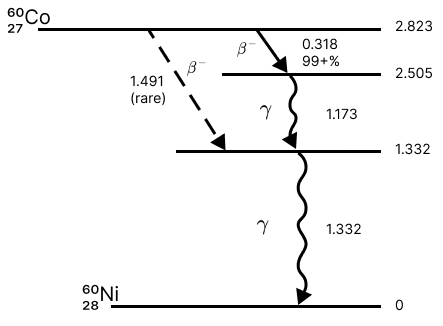
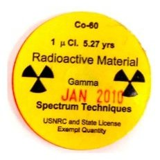
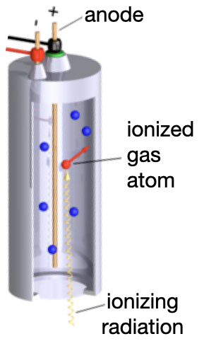
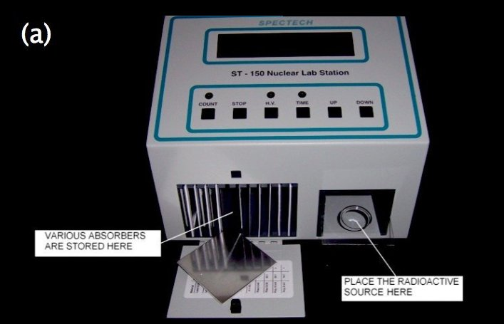
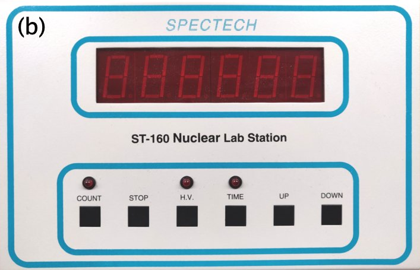
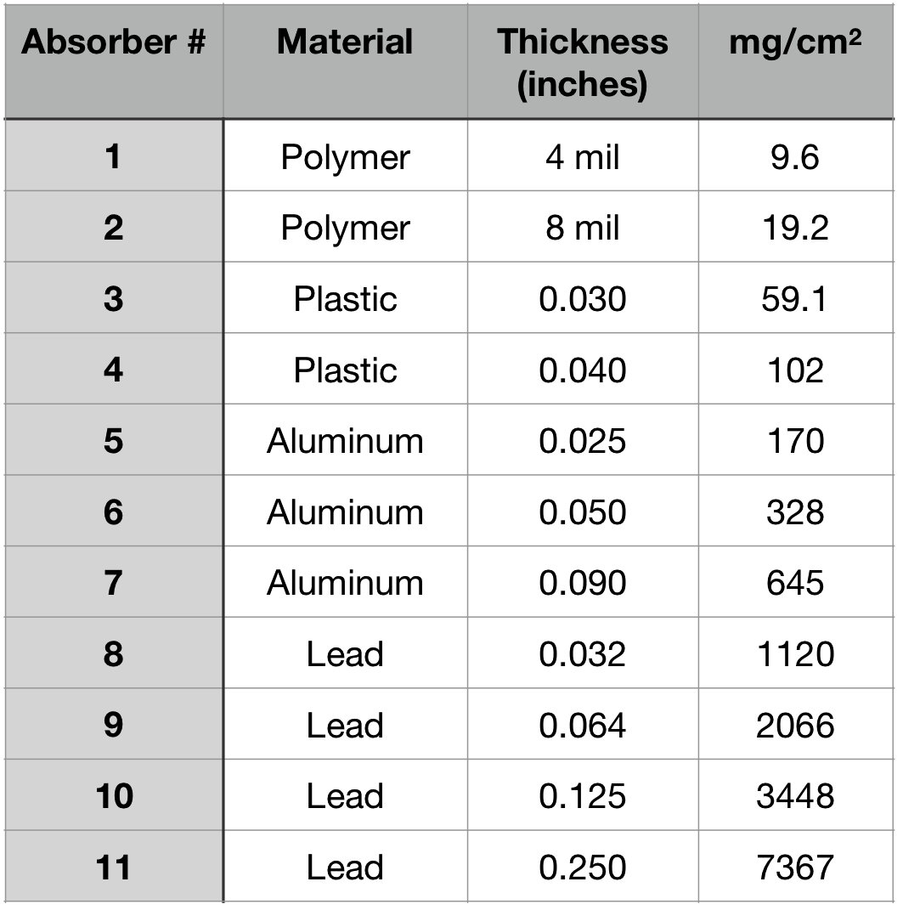

 </img>

# Gamma Radiation Absorption

# Introduction
Gamma rays are a penetrating form of electromagnetic radiation (light) that is created by the radioactive decay of atomic nuclei. They have the greatest energies (highest frequencies, shortest wavelengths) of all electromagnetic waves. In this lab, you will measure the absorption of gamma rays in matter.

# History 

For a fun, yet scholarly, presentation of historical context relevant to this lab, watch this 

:::Video (Kathy_on_Geiger|)
<iframe  height="100%" width="100%" src="https://www.youtube.com/embed/eoorE5nEQQg" frameborder="0" allow="accelerometer; autoplay; clipboard-write; encrypted-media; gyroscope; picture-in-picture" allowfullscreen></iframe>
:::

# Background

Just as the electrons in an atom can transition between energy levels by emitting photons of specific energies, the nucleus of an atom can also transition between energy levels. However, the energy levels in the nucleus typically differ by MeV rather than eV, so the radiation absorbed or emitted is highly energetic. Such highly energetic photons are called gamma rays, or just $\gamma$'s for short. 

Nuclear transitions result in/from gamma rays with specific energies and, consequently, the spectrum of gamma ray energies absorbed or emitted by a sample can be used to identify its composition. 
Characterizing the energies of gamma rays emitted by a source is called gamma ray spectroscopy in analogy to atomic spectroscopy but, because gamma rays are thousands to millions of times more energetic that visible light, it requires very different equipment. Gamma rays are detected by observing the effects they have on matter.  In this lab you will study how gamma radiation interacts with matter. 

## Radioactivity
A *radioactive* element is simply an element with a nucleus that is in an excited state. 
Decays of this unstable state emit radiation and leave the nucleus in a lower energy state. 
There are three kinds of nuclear radiation: $\alpha$, $\beta$ and $\gamma$. 
Their names are a legacy from when they were first identified in the 1890's. 
When a nucleus decays by emitting $\gamma$ radiation, we say it underwent $\gamma$ decay.
While $\gamma$ decay involves emission of a high energy photon, 
$\beta$ decay involves emission of an electron (or anti-electron) from the nucleus. 
These electrons are produced when a neutron changes into a proton
($n\rightarrow p + e^- + \bar\nu$) 
or *vice versa* ($p \rightarrow n + e^+ + \nu$). [fn]The latter is not possible for an isolated proton because $m_n > m_p$, but it can occur within a nucleus if the accompanying change in the binding energy of the nucleus makes it energetically allowed.[/fn]
Finally, $\alpha$ decay involves ejecting part of the nucleus, consisting of
two protons and two neutrons (which is essentially the nucleus of a Helium atom).

The particles emitted during $\alpha$ and $\beta$ decay are often called $\alpha$ and $\beta$ particles. 
Sometimes they are called $\alpha$ and $\beta$ "rays" because that was the original terminology, used before their nature was fully understood. 
The "ray" terminology is still in use because it carries additional information about the origin of the particle. 
For example, although they are all electrons, the names cathode ray, $\beta$ ray, $\delta$ ray, and photoelectron each tell you something about how the electron was produced. [fn]Never heard of $\delta$ rays?  I encourage you to [look up the details](https://en.wikipedia.org/wiki/Delta_ray) if you are curious.[/fn]

## Cobalt-60
The gamma ray source you will use in this lab is Cobalt-60. The complete symbol for this isotope is $^{60} _{27}$Co, where the lower number (27) is the atomic number, Z, (*i.e.*, the number of protons) and the upper number (60) is the number of nucleons (*i.e.*, the number of protons plus neutrons).
The atomic number is redundant with the Co symbol, so it is often just called Co-60. 
However, explicitly listing the atomic number sometimes helps when looking at decays to remind you of how many protons there are. 

::: Figure (cobaltdecays_diag)

Decay diagram for Co-60. The diagram is structured like an energy level diagram, with the *relative* energy of the states (in MeV) indicated by the numbers along the right side. 
The Co-60 nucleus has 2.823 MeV higher energy than the lowest energy Ni-60 state (at the bottom), which is the zero point for the energy scale. 
There are two intermediate states at energy levels of 2.505 and 1.332 MeV. 
The arrows (solid, dashed and wavy) between the states represent decay paths, with the corresponding energy change listed next to the arrow along with the type of decay ($\beta$ or $\gamma$). 
The dashed arrow is a rare process that we will neglect here.
:::

Cobalt-60 decays to Nickel-60 through the processes illustrated in (). 
Neglecting the rare process represented by the long, dashed arrow, the decay proceeds as follows:
  

- The Co-60 nucleus $\beta$ decays to a Ni-60 nucleus. A neutron is converted to a proton so the number of nucleons stays constant at 60, but the number of protons increases by one so it is now a Nickel nucleus. That nucleus is in an excited state, 2.505 MeV above its ground state. 

- The excited nucleus decays to a lower energy, but not yet ground state by emitting a 1.173 MeV $\gamma$.

- A second decay brings the nucleus down to its ground state by emitting a 1.332 MeV $\gamma$. 

The timescale for the $\beta$ decay, which starts the cascade, is quite long: the half-life of Co-60 is 5.27 years. 
The **half-life** is the time required for half of the nuclei to decay. 
The two $\gamma$ decays happen very quickly afterward, so although they are in fact decays of a Nickel nucleus, we still call this a Co-60 source.  [fn] If the decays were to happen slowly, we could isolate the material part way through the decay to obtain a different source. That is, in fact, how many radioactive sources are produced; they are metastable products of the decays of other radioactive elements, typically from the Uranium and Thorium decay chains. The Co-60 source that we will use, however, is produced synthetically by bombarding Co-59 with neutrons. It is commonly produced for a variety of applications, including radiation therapy for cancer treatment.[/fn]

## How radiation interacts with matter
All three types of nuclear radiation, $\alpha$, $\beta$, and $\gamma$, transfer energy to matter  electromagnetically, interacting primarily with the electrons in the material, but they do so with qualitatively different features. 

Because $\beta$ particles are high energy electrons, they scatter off the electrons in a material's atoms, ionizing the atoms and losing energy in the process. 
$\alpha$ particles also lose energy by ionization, but they don't penetrate as far into a material as $\beta$'s because the $\alpha$'s are more charged  ($+2e$) and (much!) more massive. 
For a given material (*i.e.*, a given density of electrons), the rate of energy loss by ionization is proportional to the square of a particle's charge and inversely proportional to the square of its velocity. 
As a result, $\alpha$ particles lose all their energy in a layer of material that is usually less than a millimeter thick, while $\beta$'s typically traverse a few millimeters before stopping. [fn]The rate of energy loss is described by [the Bethe-Bloch formula](https://en.wikipedia.org/wiki/Bethe_formula), the details of which are beyond the scope of this lab.[/fn]

Gamma rays, by contrast, have no charge and no mass.  Their electromagnetic interactions with a material through several processes: 
- ionization of the atoms via an "atomic photo-electric effect"; 
- Compton scattering off of atomic electrons, which also ionizes the atom but gives the ejected electron high enough energy to cause further ionization of its own; and,
- "pair production", which involves creation of an electron and anti-electron (positron) that have sufficient energy to further ionize. 

Each of these processes depends differently on energy.
The first two  dominate for the $\sim 1$ MeV gamma rays from Co-60 that you will use; pair production becomes important only at higher energies.

Gamma rays do not interact as strongly with matter as alphas or betas.  Consequently, gammas can penetrate several cm of material before interacting. 
When they do interact, they typically deposit all their energy in a small volume at the interaction point.
Because of this feature, we can describe their interaction with a given material in terms of an **absorption length**, $\mu$, which is defined such that the number of gamma rays remaining after traversing a material of thickness $x$ is 
$$
N = N_0 e^{-x/\mu}.
$$ 

The principal characteristic that determines a material's absorption length is the density of atoms along the gamma's path, which is related to the mass density of the material. 
We can account for that, and obtain a definition of absorption length that is very nearly material independent, by defining a **mass absorption length**, $\lambda = \rho\mu$, which has units of ${\rm g/cm}^2$. 
(Don't confuse this with wavelength! While it may be the same symbol, we're using it for a different purpose.) 

We can also define a **density thickness**, $z$, measured in ${\rm g/cm}^2$ rather than $\rm{cm}$.
If you have a chunk of material, such as aluminum, whose thickness $x$ you have measured, then you can get the **density thickness** from $z = \rho x$ using the known density, $\rho$, of aluminum.
So the number of gammas remaining after passing through a piece of material with density $\rho$ and thickness $x$ is

:::Equation (exponential)
$$
N = N_0 e^{-x/\mu} = N_0 e^{-(x*\rho)/(\rho*\mu)} = N_0 e^{-z/\lambda}
$$
:::

In this lab, you'll measure the mass absorption length, $\lambda$, for the $\gamma$'s from Co-60. Specifically, you will vary the density thickness, $z$, of absorber between the source and the detector, measure the count rate $N(z)$ and use the equation above to determine $\lambda$.

## Uncertainty

You will be counting the number of radiation-induced ionization events detected over some period
of time.  So, what is the uncertainty in the number that you measure? This idea of counting unrelated,
randomly occuring events is common to many experiments and there is a standard method for determining the uncertainty in a count based on *counting statistics*. To a good approximation, if we call the number of events that occur in a given interval of time $N$, the uncertainty in that number, $\delta N$, is its square-root: $\delta N = \sqrt{N}$.  [fn] This statement is valid as long as $N>5$, which should be the case for all the measurements you will make here.  When $N$ is smaller, the more complicated *Poisson statistics* approach is required. [/fn]

This works for counting any sort of random variable, be it radioactive decay events or the number of birds that fly overhead per hour. You might protest that there is no uncertainty in the number that you count. If you saw 15 birds, then there were 15 birds. That is correct, but if the reason you are counting these things is to determine the underlying event rate, then what the uncertainty represents is not how certain you are about the number of events that actually did happen, but how much that number (of events that happen during the counting time) can fluctuate. If you were to repeat the measurement, counting over many different time periods of the same duration, you wouldn’t always get the same number. You would see the number of events fluctuate even though the different time periods were all of the same duration. So, $N \pm \delta N$ represents the range that will contain 68% of those measurements. It accounts for the fact that the time interval between these random events is, well, random.

# Instruments

## Source
The activity of a radioactive source is measured in Curie, where $1&nbsp;{\rm Ci}$ corresponds to $3.7\times 10^{10}$ decays per second. 
The Co-60 source you will use had an activity of $1&nbsp;\mu {\rm Ci}$ when it was originally manufactured (), but it has since been decaying.
You can figure out the current activity of a source by multiplying its original activity by one-half raised to the power of the number of half-lives that have elapsed since its manufacture. 
::: Figure (source)

Photograph of a typical Co-60 source used in this lab. The yellow label gives information about the source. The radioactive material is encapsulated at the center of the plastic disk.
:::
:::Exercise (activity|4 points)
* If you were to use the source pictured in , how many decays per second would you expect it to undergo during your experiment?  Explain your reasoning.
:::

:::Card (safety|The radioactive source you will use in this lab has low activity......You should nevertheless handle it with care:||bg-UCSB-seagreen text-white)

- **Do not damage the source**. 

   - The radioactive material is encapsulated in the plastic disks. Releasing the material, e.g., by physically breaking the plastic, could cause contamination that is difficult to contain  
  

- **Do not lose the source**. 

    - The sources are kept in a locked box at the front of the room. You can check one in and out by contacting the instructor.
  
:::

## Detector
::: Figure (geigerMueller|s|R)

Schematic of a Geiger-Mueller tube.
:::
A **Geiger counter** is a generic radiation detector.  It detects any form of ionizing radiation.
The sensor inside a Geiger counter is called a **Geiger-Mueller tube** (). It consists of a metal cylinder of gas with a thin wire running down its central axis.
A high voltage applied between the cylinder (cathode) and the wire (anode) produces a large electric field inside the tube. 
When the gas is ionized by incident radiation, the electrons and ionized atoms that result are accelerated by the electric field toward the anode and cathode, respectively. 
Because the anode wire is very thin, the electric field near it is very large, and the electrons accelerated by it obtain enough energy to ionize additional gas atoms. 
This leads to an avalanche of ionization, resulting in a large and detectable current pulse.
The number of such pulses over a period of time is a measure of the rate of incident radiation.

The Geiger counter that you will use is shown in . On the left is an area where the absorber sheets are stored. On the right is an open area with six slots separated by 1 cm each.  Each slot can hold either an absorber sheet or a plastic tray with the source.  A Geiger-Mueller tube is situated above the open area, so absorber sheets placed above the source will affect the amount of radiation detected. 

::::::::: Figure (geigerCounter||)
:::::: row
:::col 5

:::
:::col 2
:::
:::col 5

:::
::::::
(a) Photo of the Geiger counter apparatus.  (b) Close-up of the control buttons.
The manual for this instrument is available [here](docs/ST160_Manual.pdf).
:::::::::

Geiger counter operation is controlled with the START and STOP buttons. To count for a preset time, press the TIME button and enter the required counting time in seconds using the UP/DOWN buttons. Once set, the preset time will remain unchanged unless the UP/DOWN buttons are pressed again. 

Start the count with the COUNT button. If the red LED above the TIME button is lit, the display will show the number of seconds elapsed.  Pressing TIME will toggle the display to read the number of counts detected instead.  The count may be stopped before the preset time is reached by pressing the STOP button. Once the preset time is reached the counter will stop accumulating data. At this point it is only necessary to press COUNT to restart the next cycle: the preset will automatically be restored and the count register will automatically be reset to zero. 

:::Card (safety|To ensure the proper functioning of the detector:||bg-UCSB-seagreen text-white)

- **Do not touch the Geiger-Mueller tube**. 

    - There is a thin window up in the top of the open shelf area through which radiation enters the Geiger-Mueller tube. Thin windows are notoriously easy to damage and difficult to clean. To avoid damaging the window, do not poke *anything* (*e.g.*, fingers, pens, etc.) up into the region above the shelf area.
  

- **Don’t set the voltage too high**. 

    - The operating voltage for the Geiger counter should be limited to avoid sparking within the tube because sparks cause damage. The Geiger counter you will use operates best at 500 V; set the HV to that value, but no higher.
  
:::

## Absorbers
::: Figure (absorberList|s|L)

Absorber characteristics by number.  (Click to enlarge.)
:::
In the storage area on the left of the Geiger counter housing is a set of materials of different thicknesses that are sized or mounted to fit easily into slots between the source and the detector in the open area on the right of the housing.  Each absorber is numbered and the characteristics of the material it contains are listed both (i) on the inside cover of their storage area in the housing and (ii) in .  Multiples of any one of the absorbers are available upon request.

# Procedure
:::Note
- Take notes as you work through the activities and exercises that follow.  
 

- It is unlikely that you will have time to complete  and  during the lab period.  
 

- Turn in your notes at the end of your lab period.  Then continue to take notes as you work outside of lab, *e.g.*, analyzing your data.
  

- Once you have finished answering all the exercises, and before your next lab period, turn in your final notes.  These should include answers to all the questions as well as any tables, plots, drawings, screenshots, etc. that you produced.
 
 
- Remember to specify all quantities with (i) appropriate units, if any, and (ii) the correct number of significant figures.
:::

## Plan your experiment 

::::::Activity (getAsense|Determine Settings)
Before beginning to collect data for your measurement of $\lambda$, you should do some simple measurements to get a feel for how to operate the equipment and a sense for how best to design your experiment.

1. Set the high voltage across the Geiger Mueller tube to 500 V.
    
    Press the H.V. button.  The red LED above the button should light up and the display will show the voltage setting (in Volts). Press the UP/DOWN buttons to adjust the voltage setting. Then press H.V. again to return to the count display mode.

2. Set the count time to 20 seconds.

    Press the TIME button.  The red LED above the button should light up and the display will show the time setting (in seconds). Press the UP/DOWN buttons to adjust the time setting. Then press TIME again to return to the count display mode.

::: Exercise (fluctuations | 12 points)
To get a sense for how much the measurement fluctuates: 

- Observe the number of counts detected with the source placed in the top slot (*i.e.*, as close to the Geiger counter as possible).

- Repeat nine times.  Record your observations in a <a href="https://gauchospace.ucsb.edu/courses/course/view.php?id=20895&section=7" target="_blank" rel="noopener noreferrer">well-formatted table</a>.

- What was the average number of counts $\langle N\rangle$ you observed in the 20 second interval?

- Do all your observations fall within the range $\langle N\rangle \pm \sqrt{\langle N\rangle}$ of the other measurements? [fn]We only expect this to be the case 68%, or roughly 2/3, of the time! [/fn]

    This range, when multiplied by 3, is a measurement, complete with uncertainty, of the **count rate** (*i.e.*, counts per minute).

- Why is it necessary to multiply by 3?
:::

::: Exercise (distance | 12 points )
 - Observe the number of counts detected with the source placed in the bottom slot (*i.e.*, as far from the Geiger counter as possible).

 - Describe your method (*i.e.*, over what time interval did you observe? how many observations did you make?) and state your measurement, complete with uncertainty.

 - Did the count rate increase or decrease?  Give a plausible explanation.
:::

:::Exercise (background | 4 points)
- Now remove the source. Place it at least 50 cm away from the Geiger counter, and measure the count rate. This will give you a measure of the **background** (*i.e.*, the rate of counts that come from sources other than your Co-60 source).

 - Describe your method and state your measurement, complete with uncertainty.
:::

You want your runs to be long enough that the uncertainty in your measurement of the count rate is less than < 10\%.

::: Exercise (countRate| 4 points)
- How many counts must you collect to have an uncertainty $<10$% in your count rate?

- If the uncertainty in your background count rate was not $<10$%, redo  to make it so.
:::

For subsequent measurements, you'll want to place the source in a slot low enough to allow you to stack multiple absorbers above it and high enough to allow you to collect data quickly.

::: Exercise (choose | 12 points )
 - Choose a slot and measure the count rate.

 - Describe your method (*i.e.*, which slot did you choose? etc.) and state your measurement, complete with uncertainty.
:::

Now that you have an idea of the count rate with no absorber (*i.e.*, the largest count rate you can measure with the configuration you've chosen), you need to get an idea of what the count rate will be with absorbers in place.  

::: Exercise (setup | 4 points )

 - Take a quick, 60 second run with the source in whatever position you've decided upon, and with the thickest set of absorbers available between the source and detector.

 - Describe your method (*i.e.*, which slot did you choose? etc.) and state your measurement, complete with uncertainty.
:::
 
This 60 second run gives you a sense for the lowest count rate you will measure, so you can decide on a good duration for your subsequent runs. 

You want your runs to be long enough that the uncertainty in your measurement of the count rate is less than $<10$%, but short enough that you can take many runs with different absorber combinations before your lab period ends.
The duration you choose needn't be exactly calculated. 
It is best to pick something that is about right, and round it to the nearest multiple of 60 to make it easy to calculate counts per minute. 

::: Exercise (choose| 2 points)
- How long will your runs be?  Explain.
:::

::::::

## Observe the Effect of Absorbers

::::::Activity (observe|Collect Data)
With the source in your chosen position and a measurement duration you know to be both practical and capable of good precision, you are ready to take data!

::: Exercise (collectData| 20 points)

* Record the counts detected with 10 different $z$ values between the source and the detector in a <a href="https://gauchospace.ucsb.edu/courses/course/view.php?id=20895&section=7" target="_blank" rel="noopener noreferrer">well-formatted table</a>.  

*   Make sure it is clear what every number means and where it comes from.

    * Give each separate run a unique number to help with bookkeeping.  
    * Record the type of absorber(s) used and the total $z$ value.  
    * Record the raw count rate and its uncertainty.  

*   Include a large range of $z$.  

*   Make sure not to move the source between runs so that the only thing changing is the absorber thickness.
:::
::::::

:::::: Activity (assess|Assess Data)
Analyze your data to determine whether/where to take more.

::: Exercise (calculate| 12 points)
* In a dedicated column of your table, subtract the background count rate (determined in ) from the raw count rates.

* In another column, compute the counts per minute. 

* In another column, calculate the uncertainty in counts per minute. 
   
    Since both the raw counts and the background that you subtract have an uncertainty, the uncertainty in the difference between them should be calculated by adding the two uncertainties [in quadrature](https://en.wikipedia.org/wiki/Pythagorean_addition).  
:::  
    
An example data table is shown in () to illustrate what is expected.  Your table should have all the same columns but may have a different set of rows.

::: Figure (gammaTable)

Example of a data table, illustrating how you might organize your raw data and calculate what you will later plot. The black entries are set values, the red ones are raw measurements, and the blue ones are calculated values.
::: 

::: Exercise (quickPlot|2 points per plot)

* Make two "quick-and-dirty" plots of the count rate, after background subtraction, as a function of $z$: one with a linear scale and one with a log scale on the y-axis. 

    A log scale is useful because an exponential should look like a straight line on a log scale.
:::

Does the count rate decrease exponentially with $z$ as expected?  Your plot should show that the data fits well to an exponential function for most of the data points, except for those at the lowest values of $z$. That occurs because the Co-60 source involves both $\beta$ and $\gamma$ decay. The $\beta$ particles lose energy quickly and can be stopped by a thin absorber. Once all the  $\beta$'s are absorbed, the remaining  $\gamma$’s follow . So, you can best measure $\lambda$ by excluding the data points at low $z$ from your fit. 

::: Exercise (extraCredit| Extra Credit (TO BE DONE AFTER ACTIVITY 4): 8 points)
It is a good exercise to try to show the whole story in a single plot.
* Update one of the plots you created in  to display the the $\gamma$-dominated region at high $z$ with one symbol (e.g., filled circle) of one color, with an exponential fit, and the $\beta$-dominated region at low $z$ using a different symbol of another color (and no fit).[fn]By varying both color and symbol you ensure that your plot will remain informative despite conditions potentially beyond your control (*e.g.*. if the viewer is color-blind, if the printer is black-and-white, or if the resolution of the display is low).[/fn]
:::

::: Exercise (zRange| 4 points)
- Based on the logarithmic plot above, above what $z$-value does the detector receive only $\gamma$ rays?  Explain your reasoning.
:::

::::::

:::::: Activity (collectAgain|Collect More (Better Targeted) Data)
Now, knowing both the lowest and highest values of $z$ that you can access, you are ready to take the data that will provide a measurement of the mass absorption length for the gamma rays from Co-60.

:::Exercise (observeAgain| 2 points per additional $z$)
- Repeat  until you have 10 different $z$ values in the workable range.  

    - **Note:** your apparatus only contains one of each type of absorber, but you can borrow more lead slabs from a neighbor or the TA; stacking them will allow larger summed $z$ values.

- Record your observations in the **same** <a href="https://gauchospace.ucsb.edu/courses/course/view.php?id=20895&section=7" target="_blank" rel="noopener noreferrer">well-formatted table</a>.
:::
::::::
## Make the measurement

:::::: Activity (analysis|Analyze Data)
:::Exercise (plot|8 points)
- Plot the **natural log of** the background subtracted count rate (counts/min) vs $z$.

- Make this a [well-formatted plot](https://docs.google.com/document/d/1INv7wnZjxOmVdgL0-5uzQY8peINrlz3CZy4GqJDJVmE/edit)

:::

:::Exercise (interpretation|4 points per bullet)
- Fit the values you plotted in  to a line.

- What are the values of the fit parameters?

- What do the slope and intercept measure?
    
     **HINT:** Refer to  and take the natural log of both sides.
:::
::::::

::::::Activity (conclude|Draw Conclusions)

Refer to the fit parameters you obtained in  

:::Exercise (values|2 points)
- What is the mass absorption length, $\lambda$, indicated by your data?  
:::

The currently accepted value of the mass absorption length for gamma rays in lead is $\lambda=17~\mathrm{g}/\mathrm{cm}^2$.

:::Exercise (discrepancy| 4 points)
- How large a fraction of the accepted value is the discrepancy between your measurement and the accepted value?

- Calculate this proportionate discrepancy by taking the difference and dividing it by the accepted value:
$$
\frac{|\lambda_\mathrm{measured}-\lambda_\mathrm{accepted}|}{\lambda_\mathrm{accepted}}.
$$

- Give your answer as a percentage.
:::

::::::

# Conclusion

:::Exercise (summarize|10 Points)
Write a brief conclusion summarizing the important points of this lab.
:::

:::Summary

You are expected to turn in all plots and tables you are asked to make in the exercises, as well as all answers to questions

:::

Your apparatus only contains one of each type of absorber, but you can borrow more lead slabs from a neighbor or the TA; stacking them will allow larger summed $z$ values. The density thickness, $z$, of each absorber sheet is listed in  and on the flip-down door to the absorber storage rack in the Geiger counter housing. The uncertainty in these values is small compared to the counting uncertainty; you can neglect it. 