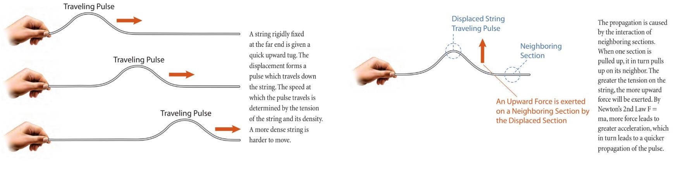
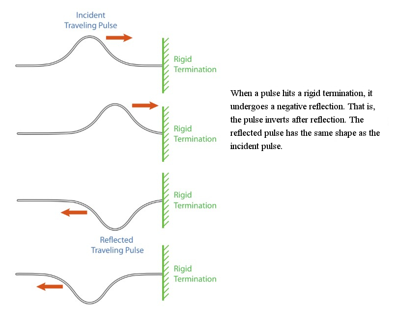
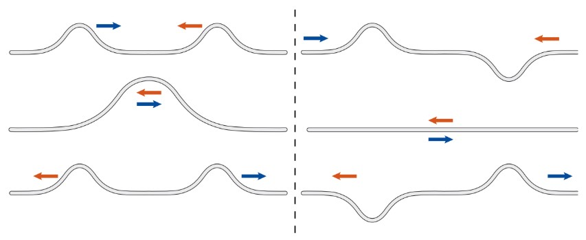
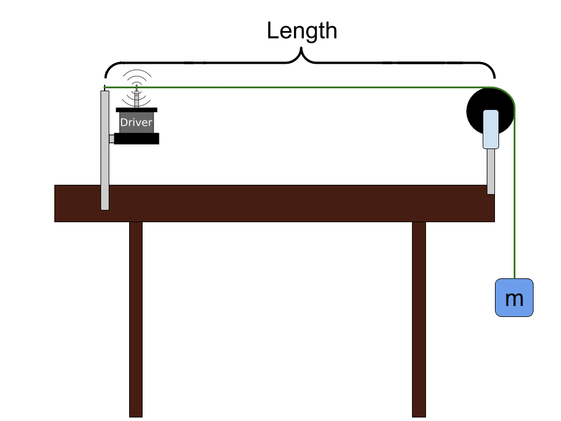

# Waves on a String

::::::Intro (This week..)
In this lab we will study **standing waves** on a string. A standing wave, also known as a stationary wave, is a wave which oscillates in time but whose peak amplitude profile does not move in space. Such waves occur when one or more ends of a string are fixed, or a string is periodically perturbed. Standing waves and their related mathematics are ubiquitous throughout science &mdash; they are even responsible for the formation of sound in musical instruments.
::::::

# Theory of Pulses
Before getting to steady state waves and the experiment description, we will look at the factors that determine the speed of waves traveling on a string (propagation velocity), we will see how waves reflect from boundaries and we will understand how multiple waves can overlap. We will study these concepts using pulses, which are localized disturbances, but all the conclusions will hold for sinusoidal waves.

## Propagation of Pulses

A pulse is a generic term describing a single disturbance that moves through a transmission medium &mdash; in our case, a string. You can generate a pulse in a string by snapping it's end up and back down once. This will create a pulse with an amplitude related to the height that you snapped the string. The pulse will propagate across the length of the string. We are interested in how this pulse propagates mathematically.

:::Figure (pulses|xxl)

:::

The propagation velocity of all waves on a particular string is determined by the properties of the string itself &mdash; the tension in the string, $T$, and the linear mass density of the string, $\mu$.  The linear mass density is the mass per unit length of string, which determines how heavy the string is per unit length.

:::Equation velocityTension
$$
\begin{aligned}
v =& \sqrt{\frac{\rm (Tension)}{\rm (String)\ (Density)}} \\\\
=&\sqrt{\frac{T}{\mu}}
\end{aligned}
$$
:::
 where $v$ is the velocity.

:::Exercise (|1 Point)
For a given tension, will a pulse on a denser string have greater or lesser propagation velocity than one on a less dense string? Justify your reasoning. (2-3 Sentences)
:::

## Reflection of Pulses from Boundaries

:::Figure (pulseReflections|l)

:::

 above illustrates what happens to a pulse when it is reflected from a rigid termination.

## Superposition of Pulses

Two waves can travel on a string &ndash; in opposite directions &ndash; and pass through each other, and retain their individual properties. This is called the principle of superposition. 

:::Figure (superposition|xxl)

:::

Consider two pulses of identical shape and amplitude traveling toward each other. If they are both positive (, left side) they will cross each other and, when they are exactly over each other, build in amplitude. The maximum height is the sum of both individual amplitudes. If one is positive and the other negative (, right side), they will sum to zero amplitude when they are exactly over each other. In either case, the two pulses retain their original shape and amplitude after they have passed each other.

# Theory of Oscillatory Motion

We just investigated how a single pulse, perhaps generated by quickly snapping the end of the string, leads to a single disturbance that travels down the length of the string. What happens if we continually snap the end of the string up and down?

If the string is instead driven by a source that moves up and down in a sinusoidal fashion, then a sine wave will propagate down the line instead of a pulse. The length of this waveform is determined by the frequency of oscillation and the propagation velocity of the wave. Note that every point on the string vibrates with the same frequency.

:::Figure (oscillator|l)

:::

A wave propagating on a string is described by the equation:

:::Equation (velocityWaves)
$$
v =  \lambda f
$$
:::
which reads: 
$$
\textrm{velocity} =\textrm{wavelength} \cdot \textrm{frequency} 
$$
As before, the propagation velocity, $v$, is the speed at which any disturbance (pulse or sinusoidal wave) propagates down the string. The wavelength, $\lambda$, is the distance that one sinusoidal oscillation covers on the string. The frequency, $f$, is the rate of periodic oscillation. To measure frequency we will use units of cycles per second, or hertz, abbreviated Hz.

:::Exercise (|1 Point)
1. Consider a very long string driven by a sinusoidal oscillator. The string is so long that there are no reflections. A wave travels at 5 m/s on this string, and the oscillator is set to 10 Hz. You can view the wavelength as how far a wave travels in one period of oscillation. What is the wavelength in this case?

2. If the velocity were instead 20 m/s, what would the wavelength be? Keep in mind that the frequency of the oscillation is the same as before, namely 10 Hz.

3. Is the sinusoidal pattern on the string longer or shorter with a greater propagation velocity?

:::

## Standing Waves

Let's fix the right end of the string and thus create a rigid termination. If we drive the left side of the string with a sinusoidal mechanical oscillator (which we will also consider a rigid termination), we generate a wave that will travel down the string. As a wave travels on the string, it is continually reflected back and forth between the two boundaries. At each boundary, the wave experiences a negative reflection. The left-moving and right-moving traveling waves superimpose at all points. 

For most wave frequencies created by the sinusoidal mechanical oscillator, the resulting shape of the string will exhibit a lot of random motion with no discernible pattern, as illustrated in  below.

:::Figure (randomMotion|xl)

:::

For certain special frequencies, however, the left-moving and right-moving waves line up so that there are areas of large motion called *antinodes*, and areas that don’t move at all, called *nodes*. These patterns of vibration are fixed on the string, and are referred to as sinusoidal standing waves or normal modes of the string.

:::Note
The distance between two consecutive nodes is $\lambda/2$. We will call the pattern between two consecutive nodes a "segment."
:::

:::Figure (nodes|xl)

:::

The mathematical condition for standing waves to occur is that the wavelength $\lambda$ of the wave obeys the following equation:

:::Equation wavelengthCondition
$$\lambda = 2\it L/n,$$
:::

where $n$ is a positive integer and $L$ is the length of the string. 

Alternatively, we can write the previous equation as:

:::Equation cavityCondition
$$L = n \cdot (\lambda/2)$$
:::

 is easier to interpret: any integer number of half wavelengths can fit on the string. Why does this happen? The ends of the string are fixed and cannot move up or down, so they must be nodes. Only if the length of the string is equal to an integer number of segments (which are half-wavelength long), will there be nodes at each end of the string. 

:::Figure (wavesOnAString|xl)

:::

The first three standing wave patterns that occur, for $n$ = 1, 2 and 3, in , are shown above in .

:::Exercise (|2 Points)
1. What wavelength is required to get 5 standing wave segments on a doubly fixed string of length 0.75 m?

2. If the velocity $v$ is 50 m/s, what will be the frequency of this wave?
:::

Using ,  and , we can find the wave frequencies that correspond to standing waves in terms of $n$, the tension $T$, the linear mass density $\mu$,  and the length of string $L$.

:::Equation (frequencyEquation)
$$
f _n=n \left (\frac{1}{2L}\sqrt{\frac{T}{\mu}} \right ),
$$
:::

where we indexed our frequencies by the number of segments, $n$.

From , we conclude that there are specific frequencies at which the mechanical oscillator can drive the string and create standing waves. We call these frequencies **harmonics**. A standing wave with one segment is called the **fundamental** or the the first harmonic. The frequency of the fundamental is  $f_1= \frac{1}{2L}\sqrt{\frac{T}{\mu}}$. 
The higher harmonics have frequencies that are multiples of the fundamental frequency (*e.g.*, the second harmonic has frequency $f_2=2\cdot f_1$)

# Preparing for the Experiment

We will now prepare our data tables and equations, as usual. At this point you should read through the rest of the lab to make sure that you fully understand the procedure and what data must be collected and processed.

::::::Activity (tables|Preparing our data tables)

**Instructions**:

1. Make a copy of the [template spreadsheet](https://docs.google.com/spreadsheets/d/1zkmmImLCSCsLOmQ_Ng28bg3KK-OoTGP1v2h73ATykZE/edit?usp=sharing) for this lab.

:::Card (|Spreadsheet Template| PHYS 6BL Lab 2)
<iframe width="100%" height = "350px"src="https://docs.google.com/spreadsheets/d/e/2PACX-1vTatSWHvZh4HBOWL2uZhjd1ap-enqQXfqRYgWt0u0Af6NDee-Q9zohXtcdoq48G5bumfWZf30aE4Ag2/pubhtml?widget=true&amp;headers=false"></iframe>
:::

2. As usual, make these tables [Good Tables](?linkfile=FAQ#QHowdoIreceivefullcreditonatableinmylabreport). **Linear Density** has units of $\text{kg}/\text{m}$ You will need to figure out the rest of the units.
3. In Table 1, set up a spreadsheet formula to calculate the **Tension** in the string for each system. Use the equation $\text{Tension} = T = mg$. ;;; You may want to check the functioning of the equation by inserting some dummy data;;;
4. In Table 1, set up a spreadsheet formula to calculate the **Velocity** of the wave for each system. Use  ;;; You may want to check the functioning of the equation by inserting some dummy data;;;
5. In Table 1, set up a spreadsheet formula to calculate the **Fundamental Frequency** for each system. Use . ;;; You may want to check the functioning of the equation by inserting some dummy data;;;
6. Link a copy of all Tables into your lab report under .
::::::

# The Experiment

In this part of the lab you will watch videos of different versions of the same setup. You can see a schematic of the basic setup in  below. (This is the same apparatus that appears in , above.) We have a string, anchored at one end, with an oscillator (driver) attached near that end. The string is then run over a pulley with a mass $m$ hanging off the end to create tension in the string. We can vary the frequency at which the oscillator vibrates, the length of the string (the spacing between the anchor and the pulley), and the amount of mass hanging off the end.

:::Figure (setup|l)

:::

We will start by setting up a system, System 1, and measure the physical characteristics of that system &ndash; length, tension (determined by the hanging mass), and linear mass density of the string. Then we will perform the experiment to make some initial **baseline** measurements. We will then repeat the same measurements with two additional systems. System 2 will have the same length as System 1, but the half the tension (hanging mass) as System 1. System 3 will have half the length as System 1 but the same tension (hanging mass) as System 1. We have measured the linear mass density of the string to be 3.0 g/m.

The goal of the experiment for each system is to observe the wave frequencies for which standing waves occur. Then we will compare and contrast our three runs to see how changing the tension and length of the string affect these frequencies.

For each system we will keep the mass and length constant throughout the experiment, but we will slowly sweep through a range of frequencies. The current frequency will be displayed on a large display in the video. You will notice that at particular frequencies, standing waves will form on the string, according to the patterns illustrated in  and , and described by  and . Between those frequencies, you may observe very little motion, random motion, or perhaps some motion that appears to have a pattern to it. As compared to the actual harmonics that you will be trying to find, these motions will be very small and short-lived.

You will be expected to turn in all plots and tables you are asked to make in the exercises, as well as all answers to questions.

## System 1
In this exercise we will establish our baseline system, System 1. In our Constant Values table, you will characterize the system, perform our experiment, and collect our data. We will drive the oscillator with a sine wave and slowly sweep through a range of frequencies. You can make the video pause, and step through it as slowly as you'd like.

:::::::::Activity (|Waves on a String: System 1)

In this exercise we will fill out the row labeled "System 1" in the "Constants Table."  To do this, you will use the system shown in  and used in . This setup can be called System 1.

**Instructions**:
1. In Table 1, record the following information about System 1.
    1. The linear density, $\mu$ (mass/length) is given in grams/meter. For the string we are using, the linear mass density is $3.0 \text{g}/\text{m}$. **This is the same for all three systems**
    2. The length of the string is about $1.70 \text{ m}$.
    3. The mass for the baseline measurement will be $400.0 \text{ g}$.

:::Note (|11 C)
Be sure that all of your units are compatible, *e.g.* all mass should be recorded in $\text{kg}$ because linear density should be in $\text{kg}/\text{m}$.
:::

::::::Exercise (|1 Point)

1. What is the tension in the string?

2. What is the speed of the wave you calculate from your observed values of tension ($T$) and linear mass density ($\mu$)? Record this value in the "Velocity (m/s)" column. Show your work.

3. What is the fundamental frequency of the system, based on the velocity and length? Record this value in the "Fundamental Frequency (Hz)" column. Show your work.

:::Note (|11 C)
This calculated fundamental frequency, and the ones you will calculate for System 2 and 3,  provide an idea of where to expect to see the first standing wave patterns in the videos.
:::
::::::

2. Now we will begin taking data points with System 1. These data points will fill in Table 2 of your spreadsheet. 
4.  shows a sweep through frequencies with System 1. Watch the video and determine the frequency at which you see one standing wave segment. 

5. Record the frequency for the standing wave with one segment in Table 2. 

:::Video (baseline)
<iframe width="100%" height="100%" src="https://www.youtube.com/embed/v-TwpVgjShs" title="YouTube video player" frameborder="0" allow="accelerometer; autoplay; clipboard-write; encrypted-media; gyroscope; picture-in-picture" allowfullscreen></iframe>
:::

3. Continue watching  and repeat Step 2 for standing waves of two, three, four and five segments. Do your best to identify a standing wave. You might notice something looking like a standing wave over a range of frequencies. You want the frequency where the amplitude of the string vibration looks the largest, <!--**the tongue of the oscillator is relatively stable,**--> and the whole wave looks fairly stable.

:::Note (|11 C)
It is fine if you don't measure the *exact* frequency of the wave. We won't grade you on how good you are at watching a video to make a challenging measurement. Just do your best to identify the standing wave and measure the frequency. What is interesting isn't the exact frequency at which a standing wave occurs. It is the *relationship* between frequency and the different standing waves that form. As long as you are close you should see the *relationship*.
:::

:::::::::

## System 2
We will now repeat this experiment with a new setup called System 2. This will have the **same length as System 1**, but will have **half the hanging mass**.

::::::Activity (|Waves on a String: System 2)

**Instructions**
1. The mass for System 2 is $200.0 \text{g}$. 

2. Add the values of $\mu$, $L$, and $m$  to your **Constant Values** table in the System 2 row. The Tension, Velocity, and  Fundamental Frequency should be automatically calculated if you inserted the correct spreadsheet function.

:::Video (halfMass)
<iframe width="100%" height="100%" src="https://www.youtube.com/embed/PHV0RSShpgI" title="YouTube video player" frameborder="0" allow="accelerometer; autoplay; clipboard-write; encrypted-media; gyroscope; picture-in-picture" allowfullscreen></iframe>
:::

3. Just as you did for System 1, go through  and find the frequencies for each number of standing wave segments. 
4. Fill out your System 2 table accordingly. You should be able to go up to at least five segments.
::::::

## System 3
We will now repeat this experiment with a new setup called System 3. This will have the **same mass as System 1**, but will have **half the length**.
::::::Activity (|Waves on a String: System 3)

**Instructions :** 

1. The length of the string in System 3 is $0.85 \text{m}$. 

2. Add the values of $\mu$ , $L$, and $m$ to your Constant Values table in the System 3 row. he Tension, Velocity, and  Fundamental Frequency should be automatically calculated if you inserted the correct spreadsheet function.

:::Video (halfLength)
<iframe width="100%" height="100%" src="https://www.youtube.com/embed/wiNSBAKnoLc" title="YouTube video player" frameborder="0" allow="accelerometer; autoplay; clipboard-write; encrypted-media; gyroscope; picture-in-picture" allowfullscreen></iframe>
:::

3. Just as you did for Systems 1 and 2, go through  and find the frequencies for each number of standing wave segments. Fill out your System 3 table accordingly. You should just barely be able to get five segments. 
::::::

:::Exercise (tables| 3 Points)
Please provide a copy of all your completed [Good Tables](?linkfile=FAQ#QHowdoIreceivefullcreditonatableinmylabreport) here. Make sure all data has been entered and that the tables have correct sigfigs, units and titles.
:::

# Analysis
We will now analyze the three systems and compare and contrast them to each other. Our goal is now to study the relationship between the frequency and the number of segments of the wave. Make sure your tables for Systems 1, 2 and 3 are completely filled out.

:::Exercise (|2 Points)
1.  How does halving the mass change the fundamental? Find the ratio of the fundamental frequency of System 2 to that of System 1.

2. What would you expect the ratio in the previous part to be from the theory? 
Remember that the frequency of the fundamental is  $f_1= \frac{1}{2L}\sqrt{\frac{T}{\mu}}$. 
:::

::::::Exercise (|2 Points)
1. How does halving the length change the fundamental? Find the ratio of the fundamental frequency of System 3 to that of System 1. 

2. What would you expect the ratio in the previous part to be, given the theory? Remember that the frequency of the fundamental is  $f_1= \frac{1}{2L}\sqrt{\frac{T}{\mu}}$. 

:::Note (|10 C)
The mass we are referring to in this question is the hanging mass, which determines the tension in the string.
:::
::::::

:::Exercise (|2 Points)
For all three systems, we expect the harmonics to be multiples of the fundamental frequency.
1. Find the ratios of the upper harmonic frequencies to the frequency of the fundamental for all three systems. This should give you a list of at least 12 numbers, depending on how many harmonic frequencies you found.

2. Does halving the length or halving the tension (mass) change the relationship (ratio) between the upper harmonics and the fundamental? Explain.
:::

::::::Exercise (|1 Point)
 Plot  your measured harmonic frequencies, $f_n$, versus the number of segments, $n$, for each system. Include their lines of best fit. Provide the resulting [Good Plot](?linkfile=FAQ#QHowdoIreceivefullcreditonaplotinmylabreport) here.

:::Note (|11 C)
It is more informative if you add all the three plots on one graph, in different colors, but you can also make three different graphs.
:::

::::::

::::::Exercise (|2 Points)
1. Combine ,  and  (from the Theory section), and derive  (show all your work):

::: Equation
$$
f _n= \left (\frac{1}{2L}\sqrt{\frac{T}{\mu}} \right )n
$$
:::
2. From , what is slope of your $f_n$ vs. $n$ graph in terms of $T$, $\mu$, and $L$?

3. What are the units of the slope, and what physical meaning does it have? Hint: To find the physical meaning, read the theory behind  again.

4. For each system, compare the value of the slope of your plot (for that system) to the fundamental frequency  observed  in the videos (of the corresponding system) by calculating the percent difference between the two values.
::::::

## Conclusion

:::Exercise (summary|2 Points)
Write a brief conclusion summarizing the important points of this lab.
:::

:::Summary
Make sure to include all tables, plots, pictures, drawings, screenshots or anything else asked of you in the exercises in your report, as well as answers to all the questions.

All responses and answers should contain the correct number of sig figs and should include units when needed.
:::