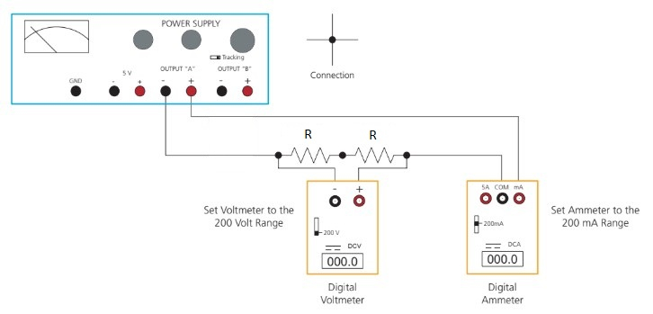
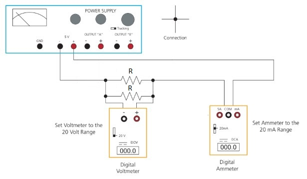
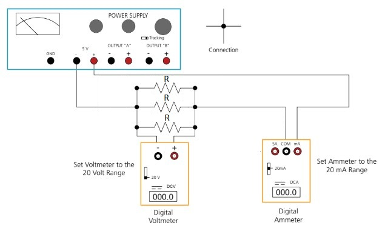

# Ohm's Law

:::Intro (This week)
This week, we will investigate the most fundamental relationship of electronic flow: **Ohm's Law**. Ohm's law states that the electronic current induced by a potential difference is inversely proportional to the total *resistance* of the medium it is travelling through. Ohm's law means that electronic systems cannot come to equilibrium instantaneously, and must do *work* by e.g. heating the medium while a current is present.

In this lab we will use Ohm's law to measure the resistance of various circuits in different geometries. 

:::

# Understanding Circuits and Resistance

:::Hider (|Historical Notes)

During the dawn of the age of electricity, an investigator named Georg Simon Ohm examined the relationship between an applied voltage and the resulting current in a conducting material. He found that for a given conductor the current in the wire was directly proportional to the voltage across it. When current (dependent axis) is plotted against the voltage (independent axis) across a given conductor, the data form a straight line. The reciprocal of the slope is the resistance of the conductor. This result was published in 1826. In recognition of Ohm’s work, this empirical relationship bears his name (Ohm's Law), as does the unit of resistance, the ohm, which is also symbolized by $\Omega$.
:::
A circuit is a closed loop of wires and components that allows electrons to flow through it. The flow of electrons is referred to as **current**, and it varies at different parts of a circuit, if the circuit is more than just a single loop, according to the characteristics of each part of the circuit. The unit of current is the ampere (after Andr&eacute; Marie Amp&egrave;re), sometimes shortened to "amp," abbreviated A. 

The flow of electrons is caused by differences in electrical potential between different parts of the circuit. The unit of electrical potential is the volt (after Alessandro Volta), abbreviated V, and potential difference is often referred to as **voltage**. Generators, power supplies and batteries provide such potential differences.

When such a power source is connected to a circuit, it converts electrical potential energy into electrical kinetic energy, and thus causes current to flow in the circuit. This leads to the draining of the power source over time. (An electrical power supply plugged into the wall will not drain, but it will consume fuel burned by the generator that provides its current.) If we place a particular voltage across a piece of conductive material, the current that flows is determined by the **resistance** of that material. The larger the resistance, the more difficult it is for electrons to flow, and thus the lower the current. As noted above, the unit of resistance is the ohm, which is also symbolized as $\Omega$. A component in a circuit designed to have a particular resistance is called a **resistor**.

A useful analogy for understanding current flow in circuits is the comparison to the flow of water in a system of pipes. Consider a loop of pipes filled with water, with a pump circulating the water through the loop. The pump is analogous to a battery or power supply, the difference in pressure between the outlet and the return like the potential difference between the terminals of the battery. The pipe is like the wire, with water taking the place of the electric current. The water flows from the high-pressure outlet of the pump (high electrical potential), through the pipe to the low-pressure inlet of the pump (low electrical potential). The characteristics of the pipe -- its length, cross-sectional area, and the presence and nature of any obstructions -- constitute its resistance.  Together with the pressure difference between the two ends of the pump, this determines the rate of water flow in the loop.  The greater the pressure difference between the outlet and inlet of the pump, the greater the flow. The greater the resistance of the pipes, the lesser the flow. 

 describes our pipe analogy to provide an introduction to the concept of electric current flow in a circuit. 

:::Video (hydro)
<iframe width="100%" height="100%" src="https://www.youtube.com/embed/Lvp_a_JkD2o" title="YouTube video player" frameborder="0" allow="accelerometer; autoplay; clipboard-write; encrypted-media; gyroscope; picture-in-picture" allowfullscreen></iframe>
:::

## Ohm's Law

Ohm's law is most simply expressed as the equation:

:::Equation ohmsLaw
$$
V = IR
$$
:::

where

**$V$** represents the voltage across the resistor, measured in volts, 

**$I$** is the current in the resistor, measured in amperes, and 

**$R$** is the resistance of the resistor measured, as noted above, in units called “ohms,” which are also symbolized by the upper-case Greek letter omega $(\Omega)$.

In words, Ohm's law states that “the voltage V across the ends of a resistor R, and the current I flowing through this resistor,
are proportional.” If the potential difference across a resistor is set at 1 volt, and if a current of 1 amp is measured in the
resistor, then its resistance is determined to be 1 ohm. 

:::Note (|8 C)
It is sometimes more convenient to use smaller units for current, and larger units for resistance:

$$
1 \textrm{ A} = 1000 \textrm{ mA}
$$

$$
1\textrm{ k} \Omega = 1000 \textrm{ }\Omega
$$
:::

Algebraic rearrangement of  above gives the current in terms of the voltage and resistance:

$$
I = V/R
$$

From this equation, it should be clear why the reciprocal of the slope of a plot of current vs. voltage is the resistance. Further algebraic rearrangement yields $R$ directly (instead of its reciprocal):

$$
R = V/I
$$

Note that if $V$ is in volts, for $R$ to be in ohms, $I$ must be in amperes. If $V$ is in volts and $I$ is in mA, then $R$ will be in k$\Omega$.

### Ohms Law in a Circuit
In  you will see a simple but effective demonstration of Ohm's Law. Use this simulation to gain understanding of Ohm's Law and how changing either the resistance of the resistor or the voltage across it changes the current. Notice that the size of each symbol changes to illustrate the change in magnitude of that value. In addition, the orange arrows on the the corners of the circuit change in size according to the magnitude of the current.

:::Simulation (ohmsSim|Ohm's Law Circuit)
<iframe src="https://phet.colorado.edu/sims/html/ohms-law/latest/ohms-law_en.html" width="100%" height="800px" scrolling="no" allowfullscreen></iframe>
:::

Use the equations above to answer the following questions. 

:::Exercise (|3 Point)
1. A 758-$\Omega$ resistor passes a current of 2.5 mA. What is the voltage across this resistor?

Use  to verify your result.

2. A 2,500-$\Omega$ resistor passes a current of 1.5 A. What is the voltage across this resistor? Notice the change in units of the current compared to those in part a.

3. What is the current through this 2,500 $\Omega$ resistor when a potential difference of 9 V is placed across it?
:::

# Preparing for the experiments

::::::Activity (tables|Prepping Data Tables)
For this lab, we will need four tables to record voltage and resistance values for four different circuits. We have provided a [template](https://docs.google.com/spreadsheets/d/1Ke3a2Z3FWeak8cSJ9mtFZ0RK3BqFaP6ZukMekqKYcic/copy).

Please make a copy of the provided template, and make the tables into [Good Tables](?linkfile=FAQ#QHowdoIreceivefullcreditonatableinmylabreport).

Please link these tables into , , , and  respectively.
::::::
# Experiments with Ohm's Law

## Empirically Determining Resistance 

In  we will examine the circuit shown in  and built in   (below).  shows the schematic representation of the circuit, which consists of a power supply and a resistor. We will use a voltmeter and an ammeter to measure, respectively, the voltage across, and the current passing through, a resistor.

::::::::::::Activity (empirical|Empirical Measurement of Resistance via Ohms Law)

:::::::::Figure (schematic|xl|Row)
::::::row
:::col (4)
 Schematic of a voltage source connected to a resistor")
:::

:::col (8)
A circuit with a single resistor of resistance R")
:::
::::::
:::::::::

**Instructions:**
1. Examine the circuit shown in a and the diagram in b. 
    - A resistor of resistance $R=2,200\ \Omega$ is wired in series with an ammeter and connected to the 0–20 volt power supply. 
    - The ammeter will measure the current (mA) flowing through the circuit. 
    - The voltmeter is connected across the resistor to measure the voltage drop.

 shows the construction of the circuit in .

<!-- Video 1 -->

:::Video (construction)
<iframe width="100%" height="100%" src="https://www.youtube.com/embed/6uP-mirlYSo" title="YouTube video player" frameborder="0" allow="accelerometer; autoplay; clipboard-write; encrypted-media; gyroscope; picture-in-picture" allowfullscreen></iframe>
:::

Some important features of the two measurement devices, the **ammeter** and the **voltmeter** are worth discussing here: The circuit consists of a single loop that goes from the power supply to the resistor and the ammeter, and then back to the power supply. *Current* must flow *through an ammeter*. The ammeter must be part of the circuit loop. Voltage is measured across circuit elements. Voltmeters are not part of the circuit loop, but must instead be *placed in parallel with the element* across which you want to measure the voltage. 

2. Watch .  shows the circuit from b with the voltage from the power supply being slowly changed from 0 volts to 20 volts.

3. As the voltage changes, you should make the video pause, and record the voltage and corresponding current for 10 data points. You should take measurements approximately every 2 volts. They do not, however, need to be exactly 2 volts apart, as long as the data points are fairly well spaced out.
:::Video (basicDataCollection)
<iframe width="100%" height="100%" src="https://www.youtube.com/embed/y6ZEXgQUqes" title="YouTube video player" frameborder="0" allow="accelerometer; autoplay; clipboard-write; encrypted-media; gyroscope; picture-in-picture" allowfullscreen></iframe>
:::
:::Note 
The voltmeter measures the voltage across the resistor **in units of volts** . The ammeter measures the amount of current flowing through the resistor **in units of milliamperes**.
:::

4. Record this data into Table 1

::::::::::::

:::Exercise (table1|1 Point)

Provide a copy of your completed [Good Table 1](?linkfile=FAQ#QHowdoIreceivefullcreditonatableinmylabreport) here.

:::
:::Exercise (|2 Point)
Plot your data with current on the $x$-axis and voltage on the $y$-axis. Find and plot the line of best fit.
1. Provide a copy of your [Good Plot](?linkfile=FAQ#QHowdoIreceivefullcreditonaplotinmylabreport) here.
2. What is the value of the slope of this line? Use units. Note the equivalence volts/amperes = ohms.

3. What is the physical meaning of the slope? Note the units.

4. Compare the value of the slope to the known resistor value of 2,200 $\Omega$.
:::

<!-- ### Series and Parallel Introductions -->

Now that you have seen a simple circuit with a single resistor, we can explore more complex ones. There are two ways in which components may be connected together -- in series and in parallel.

## Series Circuit Elements

In a simple series circuit, elements are connected end to end in a chain. Thus, in order for current to flow through a particular element, it must flow through the one that precedes it. Therefore, *the current through each element is the same*. The total circuit voltage, however, is divided among the individual elements, the voltage across each element being proportional to its resistance. The resistances of individual series resistors add to form the total resistance. Individual voltages in series circuits add to equal the total circuit voltage. The entire source voltage is dropped across the string of resistors.

**For series elements, the current through them is the same. The voltage across each element is proportional to its resistance.**

, in the next exercise, shows a circuit with two resistors connected in series.

::::::Activity (series| Resistors in Series)

1. Examine the circuit shown in . Two resistors of resistance **R** $=2,200\ \Omega$ are wired in series with an ammeter and connected to the 0–20-volt power supply. The ammeter will measure the current (mA) flowing through the circuit. The voltmeter is connected across the two resistors to measure the total voltage drop across them.

:::Figure seriesSetup

:::

2. Watch .  shows the circuit in , with the voltage across the pair of resistors being changed slowly from 0 to 20 volts. F

:::Video (seriesDataCollection)
<iframe width="100%" height="100%" src="https://www.youtube.com/embed/6Kj52kXYTyw" title="YouTube video player" frameborder="0" allow="accelerometer; autoplay; clipboard-write; encrypted-media; gyroscope; picture-in-picture" allowfullscreen></iframe>
:::

:::Note
The voltmeter is placed across two resistors, both of resistance $R$, chained end to end. The quantity measured by this device is the voltage across the pair of resistors. The ammeter measures the amount of current flowing through the series circuit. 
:::

3. For this exercise, we have taken the data, which we will provide to you ;;; You should watch the video, however, to see how the current changes with the applied voltage, as compared to the way it did in the last video;;;. Open the spreadsheet at this [link](https://docs.google.com/spreadsheets/d/1yo4mQZohXVGUwLKSBgQCl_pjaHFre1qS7MCPDOokjRc/edit?usp=sharing) to get your data. Copy the data to your Table 2. 

::::::

:::Exercise (table2|1 Point)
Provide a copy of your [Good Table 2](?linkfile=FAQ#QHowdoIreceivefullcreditonatableinmylabreport) here.

:::
:::Exercise (|2 Point)
Plot the data of Table 2 with current on the $x$-axis and voltage on the $y$-axis. Find and plot the line of best fit.
1. Provide a copy of your [Good Plot](?linkfile=FAQ#QHowdoIreceivefullcreditonaplotinmylabreport) here.
2. What is the slope of the line of your plot? Use units.

3. Compare the slope with the values of the individual resistors. What can you say about the equivalent resistance of resistors in series, in comparison to that of a single resistor?
:::
Your results should indicate that the resistances of resistors in series add linearly. Therefore, the equation for **equivalent resistance** of a network of series resistors is:

:::Equation series
$$
R_{Total} = R_{1} + R_{2} + R_{3}...
$$
:::

## Parallel Circuit Elements

You are now familiar with the relationships among current, voltage and resistance for a single resistor, and with the way resistors behave when you connect them in series. In a parallel configuration we have two or more elements connected to each other at both ends. Note that in circuits, any points connected by a wire are considered to be the same point. (That is, since they are connected by a wire, they are at the same potential.) Thus, for resistors in parallel, Ohm’s law applies to each resistor individually. Therefore, the current through each resistor is inversely proportional to its resistance. The total current flowing in the circuit is the sum of the currents flowing through the individual resistors.

### Two Parallel Resistors
The simplest circuit to explore the effects of having resistors in parallel is a two resistor circuit, given in  under. Like previous parts of this lab, you will watch the experiment as the voltage is varied and collect data.

**For resistors connected in parallel, the voltage across each resistor is the same. The current through each resistor is inversely proportional to its resistance.**

::::::Activity (parallel| Two Resistors in Parallel)
1. Examine the circuit shown in . Two resistors of resistance **R** $=2,200\ \Omega$, connected in parallel, are connected in series with the ammeter and the 0–20-volt power supply. The voltmeter is connected across the resistors to measure the voltage drop. The ammeter is in series with the circuit and measures total current in the circuit. 

In this circuit, the resistors sit next to each other with common points at each end. This provides two separate paths for current to flow. The voltage across each resistor is the same, but the current is split between them.

:::Figure (2parallelSetup)

:::

2. Watch .  shows the circuit in , with the voltage across the pair of resistors being changed slowly from 0 to 20 volts. 

:::Video (twoParallelDataCollection)
<iframe width="100%" height="100%" src="https://www.youtube.com/embed/8JM-5cI3zhM" title="YouTube video player" frameborder="0" allow="accelerometer; autoplay; clipboard-write; encrypted-media; gyroscope; picture-in-picture" allowfullscreen></iframe>
:::

3. As we did for the previous exercise, we will provide you with data that we took ;;;You should watch the video to see how the current changes with the applied voltage, as compared to the way it did in the last two experiments;;;. Open the spreadsheet at this [link](https://docs.google.com/spreadsheets/d/1j_oHZBVi7vsE31FO_DncADHoPzgAzTdiIqjItS4zJ6g/edit?usp=sharing) to get your data. Copy them to your Table 3.
::::::

:::Exercise (table3|1 Point)
Provide a copy of your [Good Table 3](?linkfile=FAQ#QHowdoIreceivefullcreditonatableinmylabreport) here.
:::

:::Exercise (|2 Point)
Plot the data of Table 3 with current on the $x$-axis and voltage on the $y$-axis. Find and plot the line of best fit.

1. Provide a copy of your [Good Plot](?linkfile=FAQ#QHowdoIreceivefullcreditonaplotinmylabreport) here.
2. What is the resistance you calculate from the slope of your plot? 
3. What does your answer indicate about the total resistance of a parallel circuit with two resistors, compared to the resistance of the circuit with a single resistor?
:::

### Three Parallel Resistors
We will now explore what happens when we place three resistors in parallel. , in , shows three resistors in a parallel configuration.

::::::Activity (three|Three Resistors in Parallel)
1. Now Examine the circuit shown in . Three resistors of resistance **R** $=2,200\ \Omega$, connected in parallel, are connected in series with the ammeter and the 0–20 volt power supply. The voltmeter is connected across the resistors to measure the voltage drop. The ammeter is in series with the circuit and measures total current in the circuit. There are now three paths for the current to take.

:::Figure 3parallelSetup

:::

2. Watch .  shows the circuit in , with the voltage across the set of three parallel resistors being changed slowly from 0 to 20 volts. 

:::Video (threeParallelDataCollection)
<iframe width="100%" height="100%" src="https://www.youtube.com/embed/P-kIiMwo7s0" title="YouTube video player" frameborder="0" allow="accelerometer; autoplay; clipboard-write; encrypted-media; gyroscope; picture-in-picture" allowfullscreen></iframe>
:::
 

3. As we did for the previous two exercises, we will provide you with data that we took.  Open the spreadsheet at this [link](https://docs.google.com/spreadsheets/d/1o2fZd6anXc9pIRaiSfBb0VD_9NnsVqA8wH5CUwHExfE/edit?usp=sharing) to get your data. Copy the data to Table 4.

::::::

:::Exercise (table4|1 Point)
Provide a copy of your [Good Table 4](?linkfile=FAQ#QHowdoIreceivefullcreditonatableinmylabreport) here.
:::

:::Exercise (|2 Point)
Plot the data of Table 4 with current on the $x$-axis and voltage on the $y$-axis. Find and plot the line of best fit.

1. Provide a copy of your [Good Plot](?linkfile=FAQ#QHowdoIreceivefullcreditonaplotinmylabreport) here.
2. What is the resistance you calculate from the slope of your plot? 
3. What does your answer indicate about the total resistance of a parallel circuit with three resistors, compared to the resistance of the circuit with a single resistor?

:::

You are now familiar with both series  and parallel circuits. As noted above,  in a circuit, two or more points that are connected by a wire are at the same potential, and are considered to be the same point. Thus, when we connect two or three resistors in parallel, they all have the same voltage across them. In this scenario, Ohm’s law applies to each resistor individually. If the resistance values are different, then the currents through them will also be different.

When the current reaches two or more resistors at the first junction, it splits among them, and then recombines at the junction at the other end. Because there are multiple paths on which current can flow, for a given voltage across the resistors, more current can flow than could flow through any of the resistors alone. Thus, the equivalent resistance is less than that of any one of the individual resistances.

The equation to determine the equivalent resistance of a network of parallel resistors is:

:::Equation parallel
$$
\frac{1}{R_{Total}} =  \frac{1}{R_{1}} + \frac{1}{R_{2}} + \frac{1}{R_{3}}...
$$
:::

We see that when resistors are in parallel, their resistances add reciprocally. So the more resistors we add, the lower the total resistance becomes.

:::Exercise (|2 Point)
1. If we had three resistors, each of 1.0 kΩ, how could we connect them so that the equivalent resistance of the combination is 1.5 kΩ? 
2. Draw a schematic of the three resistors.

**Hint:** Start by thinking about what values the simplest resistor combinations would yield. 
:::

:::Hider (fo|Further Observations)
You probably noticed that for each experiment, the change in current that a particular change in voltage produced, &Delta;*V*/&Delta;*I*, which equals *R*, was constant over the range of voltages applied to the circuit. That is, the circuits obeyed Ohm's law for all applied voltages. For this reason, resistors are often said to exhibit *ohmic* resistance.

The resistances that you calculated from the data should have been reasonably close to those you would expect for resistors having the nominal value given. Besides the usual sources of measurement error (instrument accuracy, for example), there is something else that might cause these values to differ. The resistances of carbon resistors such as those used in this lab, can differ from their nominal values according to a tolerance specified by the manufacturer.  These are usually &plusmn;5% or &plusmn;10%, but can be higher or lower. For applications in which it is necessary that the resistance be very close to the nominal value, resistors are available with tolerances of 1% or less, even down to 0.005%(!).
:::

# Conclusion

<!-- Add things -->
:::Exercise(|3 Points)
Write a brief conclusion (2-3 paragraphs) summarizing the important points of this lab.
:::

:::Summary
Make sure to include all tables, plots, pictures, drawings, screenshots or anything else asked of you in the exercises in your report, as well as answers to all the questions.

All responses and answers should contain the correct number of sig figs and should include units when needed.
:::

# Additional Information (Not Graded)

<!-- Move resistivity here -->
## Resistivity and Resistance

Resistance is primarily affected by two things. First is a material's intrinsic property known as resistivity, which varies from material to material. The greater the resistivity of a material, the greater the resistance of an object made of that material. Second is the geometry of the material, particularly the cross-sectional area and the length of the material. Since current flows through the cross-sectional area of the material, increasing this area is like adding resistors in parallel; the greater the cross-sectional area, the lower the resistance. The length of the material is analogous to a set of resistors in series; the longer the piece of material, the greater its resistance. These relationships are expressed by the equation below.

:::Equation
$$
R_{resistance}\ (\Omega) = \frac{ρ_{resistivity}\ (\Omega\cdot cm) \cdot L(cm)}{A(cm^2)}
$$
:::

To return to our plumbing analogy, resistivity is like obstructions in a pipe, such as rocks and other blockages. The more obstructions, the harder it is for the water to flow. The greater the cross-sectional area of the pipe, the more paths are available through the obstructions, and the lower the resistance to flow. The longer the pipe, the more obstructions the water encounters in going the length of the pipe, and the greater the resistance to flow.

Early resistors were made by coiling lengths of resistive wire around an insulating core. Resistors today are often made by taking carbon and mixing it with some kind of binding material, with such a density as to get the desired resistance.

Check out Simulation 3 to see how the values of $ρ,\ L$, and $A$ affect $R$. Please note the visual representation of the resistor and how it changes with these values.

:::Simulation
<iframe src="https://phet.colorado.edu/sims/html/resistance-in-a-wire/latest/resistance-in-a-wire_en.html" width="100%" height="800" scrolling="no" allowfullscreen></iframe>
:::

The resistivity of a material can be dependent on temperature. For fixed resistors, manufacturers choose their materials so as to minimize this effect. Materials whose resistance varies significantly with temperature, however, are useful for making devices called *thermistors*, which are often used as sensing elements in thermometers. We will not be working with such devices in this lab.
<!--
:::Activity

## Notice: This exercise is optional and does not provide extra credit.

Modern resistors are made with a carbon composite, in such a way that resistors of a given type are consistent in size. Earlier resistors, however, were made by winding resistive wire, such as nichrome, around an insulating core until the desired resistance was achieved.  

A typical modern resistor made of composite may be about 8.5 mm long and 3.2 mm in diameter. Nichrome has a resistivity, $\rho$, of approximately $10^{-6}\ \Omega\cdot\rm cm$. 

<!-- Image of a resistor? -->
<!--
:::Exercise (|1 Point)
a) What is the resistivity, $\rho$, of a 750-$\Omega$ resistor that is in the standardized package mentioned above?

b) What is the resistivity of a 3.2-k$\Omega$ resistor (in the same package)? 

c) Compare this resistivity with the resistivity of nichrome.

d) If you had a nichrome wire of the typical resistor diameter, 3.2 mm, what length would you need to have a resistance $R$ of 750 $\Omega$?
:::

You may have noticed the value of part d above is quite large. This would result in a very inconvenient resistor, as it would be huge compared to modern electronics. This large length is due to the large cross-sectional area of the resistor. A modern resistor made of nichrome wire might use wire approximately 0.1 mm in diameter wrapped around a core 2.5 mm in diameter. One loop of this wire around the core is approximately 7.85 mm long.

:::Exercise (|1 Point)
Use the resistivity of nichrome, the length per loop of wire, and diameter of modern nichrome wires in resistors, to find the number of turns of nichrome wire needed to make a 750-$\Omega$ resistor.
:::
:::
-->